Import data
-----------

``` r
# Import
data <- read.csv("./data/activity.data.csv", header = T)
```

Convert "data" to dplyr object and get an overview of the data before cleaning
------------------------------------------------------------------------------

``` r
# Convert data
data.1 <- tbl_df(data)
# Look at data
str(data.1)
```

    ## Classes 'tbl_df', 'tbl' and 'data.frame':    682561 obs. of  8 variables:
    ##  $ Pt.ID       : int  9 9 9 9 9 9 9 9 9 9 ...
    ##  $ Pain        : int  1 1 1 1 1 1 1 1 1 1 ...
    ##  $ Employed    : Factor w/ 2 levels "E","U": 2 2 2 2 2 2 2 2 2 2 ...
    ##  $ Time        : Factor w/ 109 levels "01-Dec-14","01-Feb-15",..: 12 12 12 12 12 12 12 12 12 12 ...
    ##  $ Day         : Factor w/ 1440 levels "00:00:00","00:01:00",..: 1 2 3 4 5 6 7 8 9 10 ...
    ##  $ Count       : int  0 0 0 0 0 0 0 0 0 0 ...
    ##  $ X..count    : int  0 0 0 0 0 0 0 0 0 0 ...
    ##  $ pcount.ptmax: int  0 0 0 0 0 0 0 0 0 0 ...

Basic data cleaning
-------------------

### Set column names

***(Units and definitions remain as described in the README.md file)***

``` r
# Set names: id  =  Pt ID; pain  =  Pain; employed  =  Employed; time  =  Time; day  =  Day; count  =  Count; pmax.count  =  % count; pptmax.count  =  pcount.ptmax 
# Pass result to "data.1"
names(data.1) <- c("id", "pain", "employed", "time", "day", "count", "pmax.count", "pptmax.count")
```

### Change $id and $pain to factors

``` r
data.1$id <- factor(data.1$id)
data.1$pain <- factor(data.1$pain, levels = c(0,1), labels = c("no.pain", "pain"))
# Pass "data.1" to "data.2"
data.2 <-data.1
```

### Add a new column ($date-time)

``` r
# Add column and pass to "data.3"
data.3 <- unite(data.2, "date", time, day, sep = " ")
data.3$date <- dmy_hms(data.3$date)
```

### Check the dataframe for duplicates

``` r
dim(data.3) 
```

    ## [1] 682561      7

``` r
# There should be (1440m/day * 7 days * 67 participants) + (1440 * 5 days * 1 participant)
(1440*7*67)+(1440*5*1)
```

    ## [1] 682560

``` r
# There is a duplicate, so remove it
data.3 <- distinct(data.3)
```

### Create repeating data/time factor to assist data sorting

``` r
# Create sequence from 1 to 136512 (the number of data rows)
# Pass it to "marker"
marker <- tbl_df(data.frame(factor(rep(seq(from = 1, to = 136512, 1), each = 5))))
names(marker) <- "marker"
str(marker)
```

    ## Classes 'tbl_df', 'tbl' and 'data.frame':    682560 obs. of  1 variable:
    ##  $ marker: Factor w/ 136512 levels "1","2","3","4",..: 1 1 1 1 1 2 2 2 2 2 ...

``` r
# Bind "marker" to "data.3", and convert to dplyr object
# Pass to "data.5"
data.5 <- bind_cols(marker, data.3) 
data.5 <- tbl_df(data.5)
```

Strip out inactive periods
--------------------------

### Find the average pmax.count for each 5-minute period

``` r
# Find mean pmax.count for each five-minute period, and pass to "marker.2"
marker.2 <- tapply(data.5$pmax.count, data.5$marker, mean)
# Repeat each marker 5 times (so marker and data.5 have the same number of rows)
# Pass to "marker.3" and then convert to a dplyr object
marker.3 <- rep(marker.2, each = 5)
marker.3 <- tbl_df(data.frame(marker.3))
# Column bind "marker.3" and "data.3", convert to a dplyr object, and pass to "data.6"
data.6 <- tbl_df(bind_cols(marker.3, data.5))
```

### Identify and sort active and inactive periods

***(mean pmax.count in a 5-minute period &gt; 2.5% = &gt; active)***

``` r
# Create new column $marker.4 containing logical of pmax.count > 2.5%
# Pass to "data.7"
data.7 <- mutate(data.6, marker.4 = data.6$marker.3>2.5)
# label days for the 67 with 7 days of data each by creating vector "days"
days <- c("d1", "d2", "d3", "d4", "d5", "d6", "d7") 
# Repeat "days" 1440 times (minutes per 24 hours)
# Pass to "days.2"
days.2 <- rep(days, each = 1440)
# Repeat "days.2" 67 times for the 67 participants with 7 days data
# Pass to "days.3", and name column
days.3 <- data.frame(rep(days.2, times = 67))
names(days.3) <- "days"
# Repeat process for the one paricuipant with 5 days of data
# Pass to "days.4"
days <- c("d1", "d2", "d3", "d4", "d5")
days.4 <- data.frame(rep(days, each = 1440))
names(days.4) <- "days"
# Row bind "days.4" and "days.3"
# Pass to days.5
days.5 <- tbl_df(rbind(days.3, days.4))
# Column bind "days.5" to "data.7"
data.8 <- tbl_df(bind_cols(days.5, data.7))
# Have a quick look at the new dplyr object
str(data.8)
```

    ## Classes 'tbl_df', 'tbl' and 'data.frame':    682560 obs. of  11 variables:
    ##  $ days        : Factor w/ 7 levels "d1","d2","d3",..: 1 1 1 1 1 1 1 1 1 1 ...
    ##  $ marker.3    : num  0 0 0 0 0 0 0 0 0 0 ...
    ##  $ marker      : Factor w/ 136512 levels "1","2","3","4",..: 1 1 1 1 1 2 2 2 2 2 ...
    ##  $ id          : Factor w/ 68 levels "9","10","11",..: 1 1 1 1 1 1 1 1 1 1 ...
    ##  $ pain        : Factor w/ 2 levels "no.pain","pain": 2 2 2 2 2 2 2 2 2 2 ...
    ##  $ employed    : Factor w/ 2 levels "E","U": 2 2 2 2 2 2 2 2 2 2 ...
    ##  $ date        : POSIXct, format: "2014-10-03 00:00:00" "2014-10-03 00:01:00" ...
    ##  $ count       : int  0 0 0 0 0 0 0 0 0 0 ...
    ##  $ pmax.count  : int  0 0 0 0 0 0 0 0 0 0 ...
    ##  $ pptmax.count: int  0 0 0 0 0 0 0 0 0 0 ...
    ##  $ marker.4    : logi  FALSE FALSE FALSE FALSE FALSE FALSE ...

``` r
# Choose the columns 
# Pass to "data.9"
data.9 <- select(data.8, id, date, days, pain, employed, count, pmax.count, pptmax.count, marker.4)
# Rename $marker.4 as $active
data.9 <- rename(data.9, active = marker.4)
# Change "?" for patient 90 to "U"
data.9$employed <- as.character(data.9$employed)
data.9$employed[data.9$employed == "?"] <- "U"
data.9$employed <- factor(data.9$employed)
# Have a quick look at "data.9"
str(data.9)
```

    ## Classes 'tbl_df', 'tbl' and 'data.frame':    682560 obs. of  9 variables:
    ##  $ id          : Factor w/ 68 levels "9","10","11",..: 1 1 1 1 1 1 1 1 1 1 ...
    ##  $ date        : POSIXct, format: "2014-10-03 00:00:00" "2014-10-03 00:01:00" ...
    ##  $ days        : Factor w/ 7 levels "d1","d2","d3",..: 1 1 1 1 1 1 1 1 1 1 ...
    ##  $ pain        : Factor w/ 2 levels "no.pain","pain": 2 2 2 2 2 2 2 2 2 2 ...
    ##  $ employed    : Factor w/ 2 levels "E","U": 2 2 2 2 2 2 2 2 2 2 ...
    ##  $ count       : int  0 0 0 0 0 0 0 0 0 0 ...
    ##  $ pmax.count  : int  0 0 0 0 0 0 0 0 0 0 ...
    ##  $ pptmax.count: int  0 0 0 0 0 0 0 0 0 0 ...
    ##  $ active      : logi  FALSE FALSE FALSE FALSE FALSE FALSE ...

``` r
# Group data for sorting
# Pass to "data.10"
data.10 <- group_by(data.9, id, days, date, pain, employed)
# divide into active and inactive periods according to whether the five-minute epochs had a mean pmax.count > 1%
active <- filter(data.10, active == "TRUE")
inactive <- filter(data.10, active == "FALSE")
```

Summary of pmax.count data
--------------------------

### 24-hour data (active and inactive periods)

#### Median and mean activity per day

``` r
# Extract median and mean data per participant, per day
med.1 <- data.3 %>%
    separate(date, c("day", "time"), sep = " ") %>%
    select(id, pain, employed, day, pmax.count) %>%
    group_by(id, day, pain, employed) %>%
    summarise(Median = median(pmax.count), Mean = round(mean(pmax.count), 1))
med.1
```

    ## Source: local data frame [474 x 6]
    ## Groups: id, day, pain [?]
    ## 
    ##        id        day    pain employed Median  Mean
    ##    (fctr)      (chr)  (fctr)   (fctr)  (dbl) (dbl)
    ## 1       9 2014-10-03    pain        U      0   2.7
    ## 2       9 2014-10-04    pain        U      0   2.0
    ## 3       9 2014-10-05    pain        U      0   0.1
    ## 4       9 2014-10-06    pain        U      0   2.0
    ## 5       9 2014-10-07    pain        U      0   2.2
    ## 6       9 2014-10-09    pain        U      0   1.4
    ## 7       9 2014-10-10    pain        U      0   0.5
    ## 8      10 2014-09-16 no.pain        E      0   0.2
    ## 9      10 2014-09-17 no.pain        E      0   1.3
    ## 10     10 2014-09-18 no.pain        E      0   1.3
    ## ..    ...        ...     ...      ...    ...   ...

#### Median and mean activity per week

``` r
# Extract median and mean data per participant for the week (or 5 days)
med.2 <- data.3 %>%
    separate(date, c("day", "time"), sep = " ") %>%
    select(id, pain, employed, day, pmax.count) %>%
    group_by(id, pain, employed) %>%
    summarise(Median = median(pmax.count), Mean = round(mean(pmax.count), 1))
```

### Active periods only

#### Median and mean activity per day

``` r
# Extract median and mean data per participant, per day
med.3 <- active %>%
    ungroup() %>%
    select(id, pain, employed, days, pmax.count) %>%
    group_by(id, days, pain, employed) %>%
    summarise(Median = round(median(as.numeric(pmax.count)),1), Mean = round(mean(as.numeric(pmax.count)),1))
```

#### Median and mean activity per week

``` r
# Extract median and mean data per participant for the week (or 5 days)
med.4 <- active %>%
    ungroup() %>%
    select(id, pain, employed, pmax.count) %>%
    group_by(id, pain, employed) %>%
    summarise(Median = round(median(as.numeric(pmax.count)),1), Mean = round(mean(as.numeric(pmax.count)),1))
```

Univariate analysis of the active period
----------------------------------------

### Median time (in minutes) active per day over the week

#### Process the data

``` r
# Group and pass to "active.1"
active.1 <- group_by(active, id, days, pain, employed)
# Summarise: Number of 5-minute time periods each person spent active per day
# Pass to "time.active"
time.active <- summarise(active.1, times = n())
# Group and pass to "time.1"
time.1 <- ungroup(time.active)
time.1 <- group_by(time.1, id, pain, employed)
# Summarise the median time spent active for each person across the 7 (or 5) days
time.2 <- summarise(time.1, data = median(times))
```

#### Pain vs no-pain

``` r
# Plot
qplot(x = pain, y = data, data = time.2, geom = "boxplot")
```

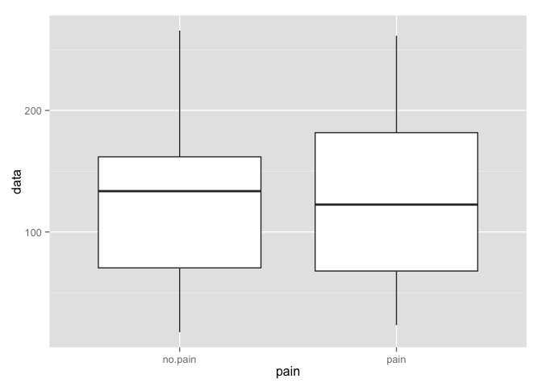<!-- -->

``` r
# Wilcoxon rank sum test
with(time.2, wilcox.exact(data~pain, paired = F, exact = T))
```

    ## 
    ##  Exact Wilcoxon rank sum test
    ## 
    ## data:  data by pain
    ## W = 595, p-value = 0.7948
    ## alternative hypothesis: true mu is not equal to 0

``` r
# N, Median, IQR, range
foo <- time.2 %>%
    group_by(pain) %>%
    select(pain,data) %>%
    rename(Group = pain) %>%
    summarise(N = n(), 
              Median = median(data), 
              IQR = IQR(data), 
              Min = min(data), 
              Max = max(data))
kable(foo, format = "markdown", align = "l", digits = 0)
```

| Group   | N   | Median | IQR | Min | Max |
|:--------|:----|:-------|:----|:----|:----|
| no.pain | 31  | 135    | 110 | 15  | 270 |
| pain    | 37  | 130    | 135 | 20  | 275 |

#### Employed vs unemployed

``` r
# Plot
qplot(x = employed, y = data, data = time.2, geom = "boxplot")
```

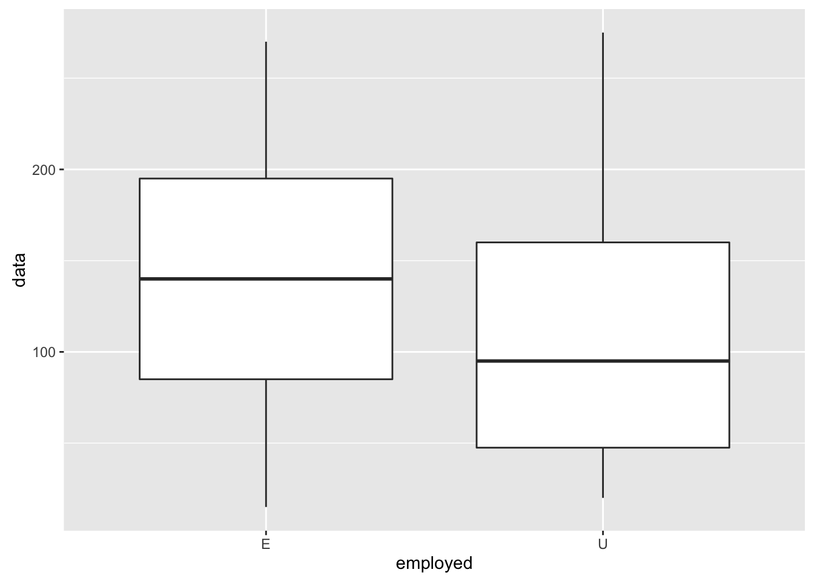<!-- -->

``` r
# Wilcoxon rank sum test
with(time.2, wilcox.exact(data~employed, paired = F, exact = T))
```

    ## 
    ##  Exact Wilcoxon rank sum test
    ## 
    ## data:  data by employed
    ## W = 689, p-value = 0.08997
    ## alternative hypothesis: true mu is not equal to 0

``` r
# N, Median, IQR, range
foo <- time.2 %>%
    group_by(employed) %>%
    select(employed,data) %>%
    rename(Group = employed) %>%
    summarise(N = n(), 
              Median = median(data), 
              IQR = IQR(data), 
              Min = min(data), 
              Max = max(data))
kable(foo, format = "markdown", align = "l", digits = 0)
```

| Group | N   | Median | IQR | Min | Max |
|:------|:----|:-------|:----|:----|:----|
| E     | 41  | 140    | 110 | 15  | 270 |
| U     | 27  | 95     | 112 | 20  | 275 |

#### Conditional plot of employment and pain status

``` r
# Plot
qplot(x = pain, y = data, data = time.2, facets = .~employed, color = pain, geom = "boxplot")
```

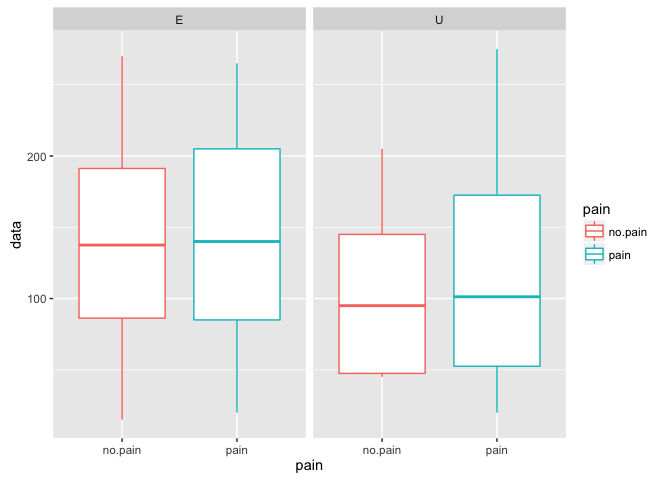<!-- -->

``` r
# N, Median, IQR, range
foo <- time.2 %>%
    group_by(pain, employed) %>%
    select(pain, employed,data) %>%
    rename(Group.Pain = pain, Group.Employed = employed) %>%
    summarise(N = n(), 
              Median = median(data), 
              IQR = IQR(data), 
              Min = min(data), 
              Max = max(data))
kable(foo, format = "markdown", align = "l", digits = 0)
```

| Group.Pain | Group.Employed | N   | Median | IQR | Min | Max |
|:-----------|:---------------|:----|:-------|:----|:----|:----|
| no.pain    | E              | 24  | 138    | 105 | 15  | 270 |
| no.pain    | U              | 7   | 95     | 98  | 45  | 205 |
| pain       | E              | 17  | 140    | 120 | 20  | 265 |
| pain       | U              | 20  | 101    | 120 | 20  | 275 |

### Percentage of actical maximum (pmax.count, %) active per day over the week

#### Process the data

``` r
pmax.count <- summarise(active.1, p.max = max(pmax.count))
pmax.count.1 <- ungroup(pmax.count)
pmax.count.1 <- group_by(pmax.count.1, id, pain, employed)
pmax.count.2 <- ungroup(pmax.count.1)
pmax.count.2 <- summarise(pmax.count.1, data = max(p.max))
pmax.count.2 <- ungroup(pmax.count.2)
```

#### Pain vs no-pain

``` r
# Plot
qplot(x = pain, y = data, data = pmax.count.2, geom = "boxplot")
```

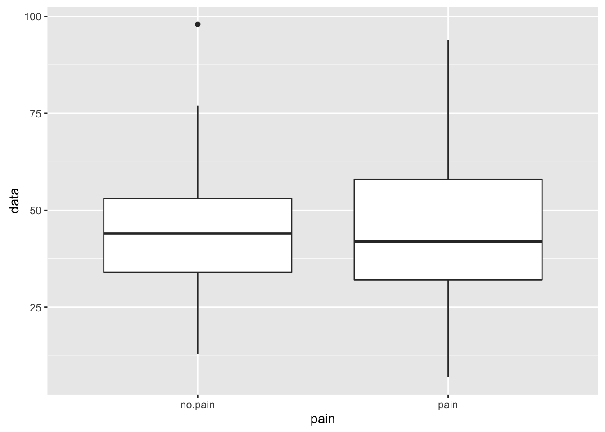<!-- -->

``` r
# Wilcoxon rank sum test
with(pmax.count.2, wilcox.exact(data~pain, paired = F, exact = T))
```

    ## 
    ##  Exact Wilcoxon rank sum test
    ## 
    ## data:  data by pain
    ## W = 599, p-value = 0.7573
    ## alternative hypothesis: true mu is not equal to 0

``` r
# N, Median, IQR, range
foo <- pmax.count.2 %>%
    group_by(pain) %>%
    select(pain, data) %>%
    rename(Group = pain) %>%
    summarise(N = n(), 
              Median = median(data), 
              IQR = IQR(data), 
              Min = min(data), 
              Max = max(data))
kable(foo, format = "markdown", align = "l", digits = 0)
```

| Group   | N   | Median | IQR | Min | Max |
|:--------|:----|:-------|:----|:----|:----|
| no.pain | 31  | 44     | 19  | 13  | 98  |
| pain    | 37  | 42     | 26  | 7   | 94  |

#### Employed vs unemployed

``` r
# Plot
qplot(x = employed, y = data, data = pmax.count.2, geom = "boxplot")
```

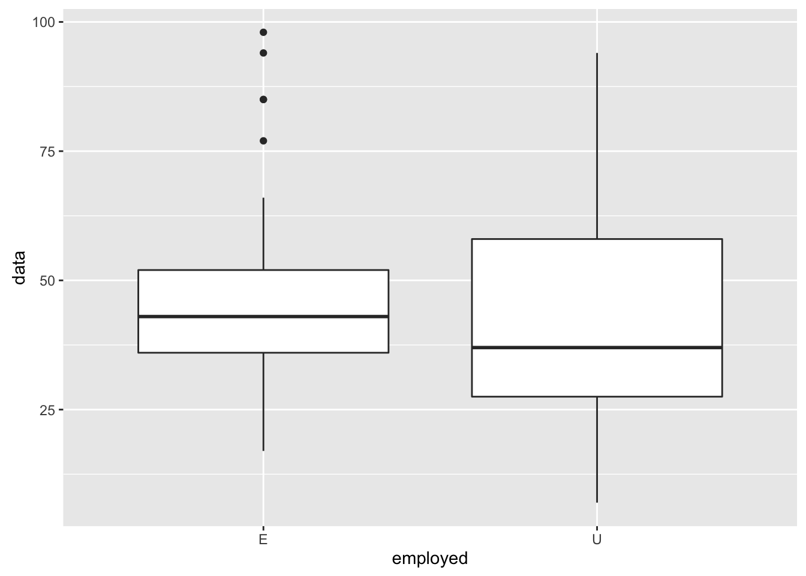<!-- -->

``` r
# Wilcoxon rank sum test
with(pmax.count.2, wilcox.exact(data~employed, paired = F, exact = T))
```

    ## 
    ##  Exact Wilcoxon rank sum test
    ## 
    ## data:  data by employed
    ## W = 642.5, p-value = 0.2677
    ## alternative hypothesis: true mu is not equal to 0

``` r
# N, Median, IQR, range
foo <- pmax.count.2 %>%
    group_by(employed) %>%
    select(employed,data) %>%
    rename(Group = employed) %>%
    summarise(N = n(), 
              Median = median(data), 
              IQR = IQR(data), 
              Min = min(data), 
              Max = max(data))
kable(foo, format = "markdown", align = "l", digits = 0)
```

| Group | N   | Median | IQR | Min | Max |
|:------|:----|:-------|:----|:----|:----|
| E     | 41  | 43     | 16  | 17  | 98  |
| U     | 27  | 37     | 30  | 7   | 94  |

#### Conditional plot of employment and pain status

``` r
# Plot
qplot(x = pain, y = data, data = pmax.count.2, facets = .~employed, color = pain, geom = "boxplot")
```

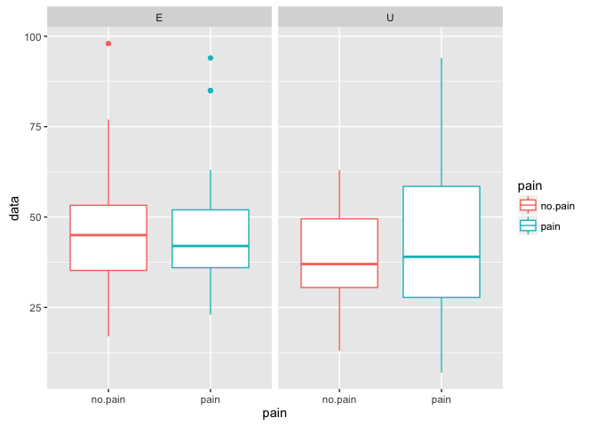<!-- -->

``` r
# N, Median, IQR, range
foo <- pmax.count.2 %>%
    group_by(pain, employed) %>%
    select(pain, employed,data) %>%
    rename(Group.Pain = pain, Group.Employed = employed) %>%
    summarise(N = n(), 
              Median = median(data), 
              IQR = IQR(data), 
              Min = min(data), 
              Max = max(data))
kable(foo, format = "markdown", align = "l", digits = 0)
```

| Group.Pain | Group.Employed | N   | Median | IQR | Min | Max |
|:-----------|:---------------|:----|:-------|:----|:----|:----|
| no.pain    | E              | 24  | 45     | 18  | 17  | 98  |
| no.pain    | U              | 7   | 37     | 19  | 13  | 63  |
| pain       | E              | 17  | 42     | 16  | 23  | 94  |
| pain       | U              | 20  | 39     | 31  | 7   | 94  |

### Mean sum of daily activity over the week

#### Process the data

``` r
activity.1 <- group_by(active.1, id, days, employed, pain)
activity.1 <- summarise(activity.1, data = sum(pmax.count))
activity.2 <- ungroup(activity.1)
activity.2 <- group_by(activity.2, id, employed, pain)
activity.2 <- summarise(activity.2, data = round(sum(data)/length(days),0))
activity.2 <- ungroup(activity.2)
```

#### Pain vs no pain

``` r
# Plot
qplot(x = pain, y = data, data = activity.2, geom = "boxplot")
```

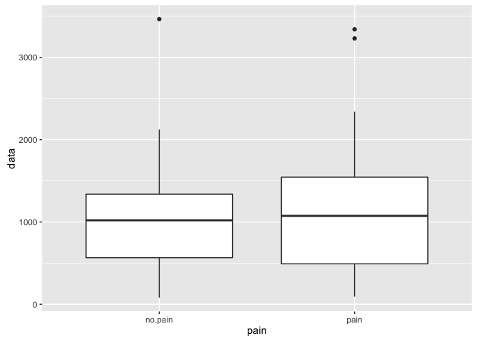<!-- -->

``` r
# Wicoxon rank sum test
with(activity.2, wilcox.exact(data~pain, paired = F, exact = T))
```

    ## 
    ##  Exact Wilcoxon rank sum test
    ## 
    ## data:  data by pain
    ## W = 549, p-value = 0.7691
    ## alternative hypothesis: true mu is not equal to 0

``` r
# N, Median, IQR, range
foo <- activity.2 %>%
    group_by(pain) %>%
    select(pain,data) %>%
    rename(Group = pain) %>%
    summarise(N = n(), 
              Median = median(data), 
              IQR = IQR(data), 
              Min = min(data), 
              Max = max(data))
kable(foo, format = "markdown", align = "l", digits = 0)
```

| Group   | N   | Median | IQR  | Min | Max  |
|:--------|:----|:-------|:-----|:----|:-----|
| no.pain | 31  | 1020   | 772  | 81  | 3465 |
| pain    | 37  | 1074   | 1054 | 92  | 3341 |

#### Employed vs unemployed

``` r
# Plot
qplot(x = employed, y = data, data = activity.2, geom = "boxplot")
```

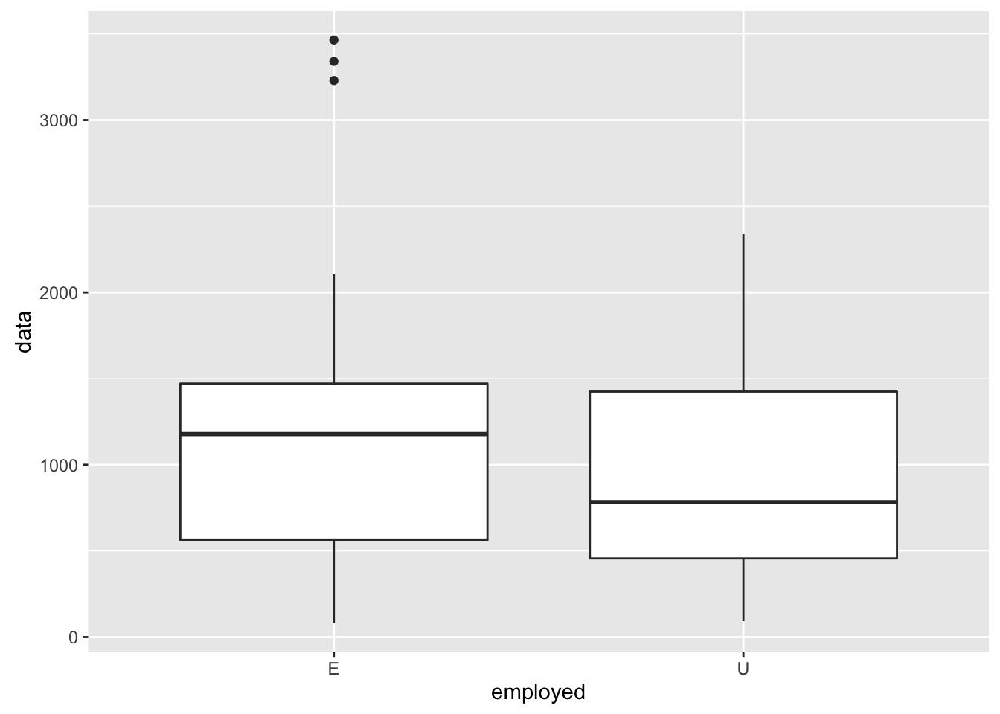<!-- -->

``` r
# Wicoxon rank sum test
with(activity.2, wilcox.exact(data~employed, paired = F, exact = T))
```

    ## 
    ##  Exact Wilcoxon rank sum test
    ## 
    ## data:  data by employed
    ## W = 647, p-value = 0.2456
    ## alternative hypothesis: true mu is not equal to 0

``` r
# N, Median, IQR, range
foo <- activity.2 %>%
    group_by(employed) %>%
    select(employed,data) %>%
    rename(Group = employed) %>%
    summarise(N = n(), 
              Median = median(data), 
              IQR = IQR(data), 
              Min = min(data), 
              Max = max(data))
kable(foo, format = "markdown", align = "l", digits = 0)
```

| Group | N   | Median | IQR | Min | Max  |
|:------|:----|:-------|:----|:----|:-----|
| E     | 41  | 1178   | 909 | 81  | 3465 |
| U     | 27  | 783    | 968 | 92  | 2340 |

#### Conditional plot of employment and pain status

``` r
# Plot
qplot(x = pain, y = data, data = activity.2, facets = .~employed, colour = pain, geom = "boxplot")
```

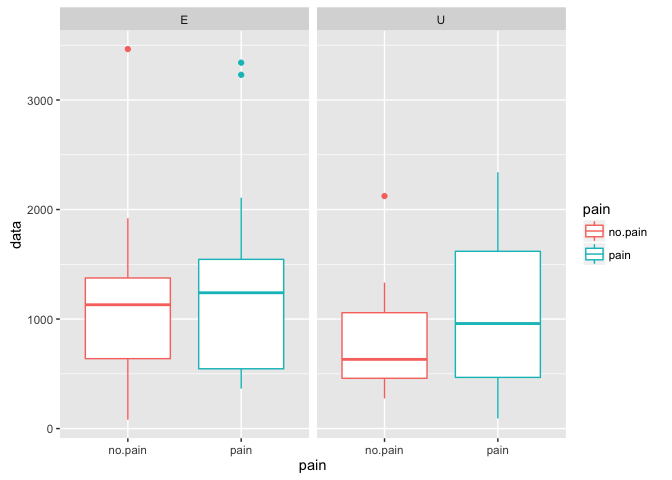<!-- -->

``` r
# N, Median, IQR, range
foo <- activity.2 %>%
    group_by(pain, employed) %>%
    select(pain, employed,data) %>%
    rename(Group.Pain = pain, Group.Employed = employed) %>%
    summarise(N = n(), 
              Median = median(data), 
              IQR = IQR(data), 
              Min = min(data), 
              Max = max(data))
kable(foo, format = "markdown", align = "l", digits = 0)
```

| Group.Pain | Group.Employed | N   | Median | IQR  | Min | Max  |
|:-----------|:---------------|:----|:-------|:-----|:----|:-----|
| no.pain    | E              | 24  | 1130   | 736  | 81  | 3465 |
| no.pain    | U              | 7   | 632    | 599  | 275 | 2123 |
| pain       | E              | 17  | 1240   | 999  | 365 | 3341 |
| pain       | U              | 20  | 959    | 1151 | 92  | 2340 |

Univariate analysis of complete data
------------------------------------

***(active and inactive periods, data.10)*** \#\#\# Time spent (minutes) in quartiles (\(\geq\) 75%, 50-74%, 25-49%, and 0-24%) of percent patient maximum activity count per day over the week \#\#\#\# Fourth quartile (\(\geq\) 75%)

``` r
fourth.q <- group_by(data.10, id, date, pain, employed) #> 75%
fourth.q.1 <- filter(fourth.q, pptmax.count>75)
fourth.q.2 <- ungroup(fourth.q.1)
fourth.q.2 <- group_by(fourth.q.2, id, pain, days, employed)
fourth.q.2 <- summarise(fourth.q.2, time = n())
fourth.q.2 <- group_by(fourth.q.2, id, pain, employed)
day <- data.frame(day = c(rep(7, 67), 5))
fourth.q.3 <- summarise(fourth.q.2, time = sum(time))
fourth.q.3 <- bind_cols(fourth.q.3, day)
fourth.q.3 <- mutate(fourth.q.3, time.2 = round(time/day, 2)) # number of minutes per day spent at > 75% patient max
# Save to csv
fq <- fourth.q.3 %>%
    rename("minutes per week" = time, "days of recording" = day, "minutes per day" = time.2)
write.csv(fq, "../activity.plot/data/time.active.4q.csv", row.names = F)
# Ungroup
fourth.q.3 <- ungroup(fourth.q.3)

# Plot
# Univariate
qplot(x = pain, y = time.2, data = fourth.q.3, geom = "boxplot")
```

<!-- -->

``` r
# Conditional (with employment status)
qplot(x = pain, y = time.2, data = fourth.q.3, facets = .~employed, colour = pain, geom = "boxplot")
```

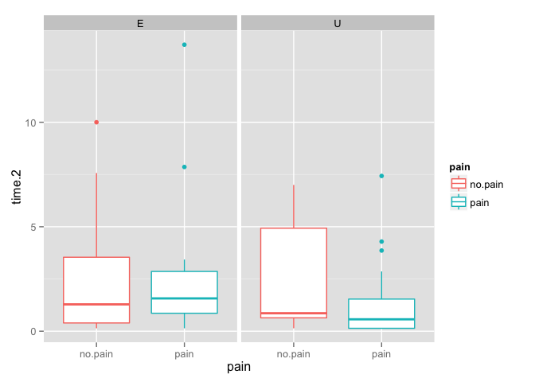<!-- -->

``` r
# Wilcoxon rank sum test
with(fourth.q.3, wilcox.exact(time.2~pain, exact = T, paired = F))
```

    ## 
    ##  Exact Wilcoxon rank sum test
    ## 
    ## data:  time.2 by pain
    ## W = 634, p-value = 0.4593
    ## alternative hypothesis: true mu is not equal to 0

``` r
# N, Median, IQR, range
foo <- fourth.q.3 %>%
    group_by(pain) %>%
    select(pain,time.2) %>%
    rename(Group = pain) %>%
    summarise(N = n(), 
              Median = median(time.2), 
              IQR = IQR(time.2), 
              Min = min(time.2), 
              Max = max(time.2))
kable(foo, format = "markdown", align = "l", digits = 0)
```

| Group   | N   | Median | IQR | Min | Max |
|:--------|:----|:-------|:----|:----|:----|
| no.pain | 31  | 1      | 4   | 0   | 10  |
| pain    | 37  | 1      | 2   | 0   | 14  |

``` r
foo <- fourth.q.3 %>%
    group_by(employed) %>%
    select(employed,time.2) %>%
    rename(Group = employed) %>%
    summarise(N = n(), 
              Median = median(time.2), 
              IQR = IQR(time.2), 
              Min = min(time.2), 
              Max = max(time.2))
kable(foo, format = "markdown", align = "l", digits = 0)
```

| Group | N   | Median | IQR | Min | Max |
|:------|:----|:-------|:----|:----|:----|
| E     | 41  | 1      | 3   | 0   | 14  |
| U     | 27  | 1      | 2   | 0   | 7   |

``` r
foo <- fourth.q.3 %>%
    group_by(pain, employed) %>%
    select(pain, employed, time.2) %>%
    rename(Group.Pain = pain, Group.Employed = employed) %>%
    summarise(N = n(), 
              Median = median(time.2), 
              IQR = IQR(time.2), 
              Min = min(time.2), 
              Max = max(time.2))
kable(foo, format = "markdown", align = "l", digits = 0)
```

| Group.Pain | Group.Employed | N   | Median | IQR | Min | Max |
|:-----------|:---------------|:----|:-------|:----|:----|:----|
| no.pain    | E              | 24  | 1      | 3   | 0   | 10  |
| no.pain    | U              | 7   | 1      | 4   | 0   | 7   |
| pain       | E              | 17  | 2      | 2   | 0   | 14  |
| pain       | U              | 20  | 1      | 1   | 0   | 7   |

#### Third quartile (50-74%)

``` r
third.q <- group_by(data.10, id, date, pain, employed) # 50-74%
third.q.1 <- filter(third.q, pptmax.count<= 75 & pptmax.count>50)
third.q.2 <- ungroup(third.q.1)
third.q.2 <- group_by(third.q.2, id, pain, days, employed)
third.q.2 <- summarise(third.q.2, time = n())
third.q.2 <- group_by(third.q.2, id, pain, employed)
third.q.3 <- summarise(third.q.2, time = sum(time))
day <- tbl_df(data.frame(id.1 = as.numeric(as.character(fourth.q.3$id)), days = c(rep(7, 67), 5)))
id <- tbl_df(data.frame(id.1 = as.numeric(as.character(third.q.3$id))))
day.2 <- semi_join(day,id, by = "id.1")
third.q.3 <- bind_cols(third.q.3, day.2)
third.q.3 <- select(third.q.3, id, pain, employed, time, days)
third.q.3 <- mutate(third.q.3, time.2 = round(time/days, 2)) # number of minutes per day spent between 50-74% of patient max
# Save to csv
tq <- third.q.3 %>%
    rename("minutes per week" = time, "days of recording" = days, "minutes per day" = time.2)
write.csv(tq, "../activity.plot/data/time.active.3q.csv", row.names = F)
# Ungroup
third.q.3 <- ungroup(third.q.3)

# Plot
# Univariate
qplot(x = pain, y = time.2, data = third.q.3, geom = "boxplot")
```

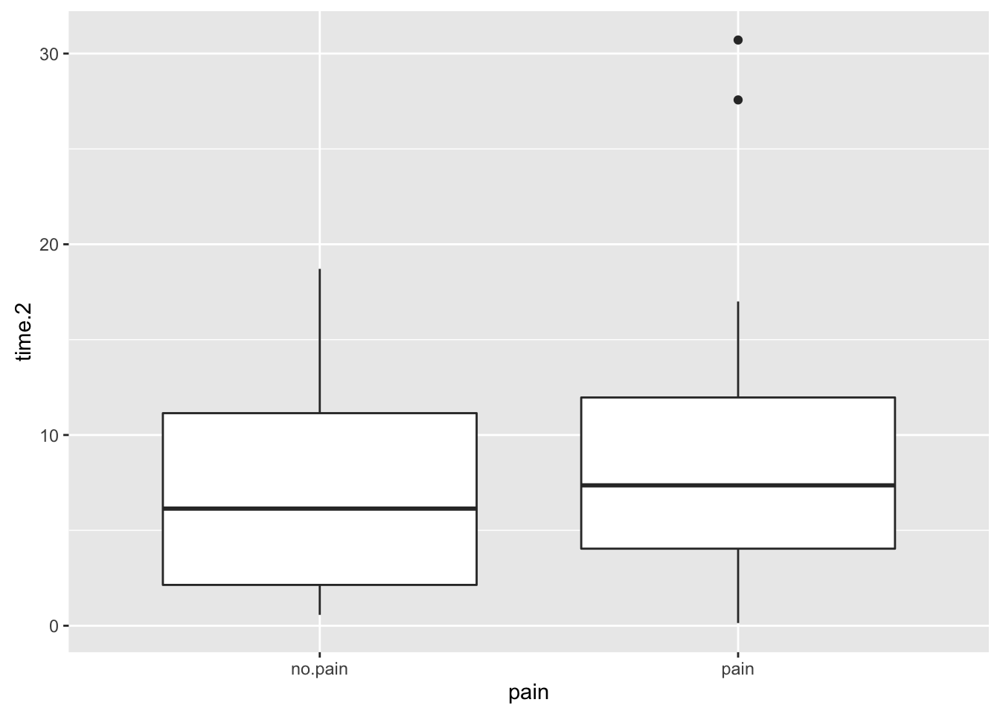<!-- -->

``` r
# Conditional (with employment status)
qplot(x = pain, y = time.2, data = third.q.3, facets = .~employed, colour = pain, geom = "boxplot")
```

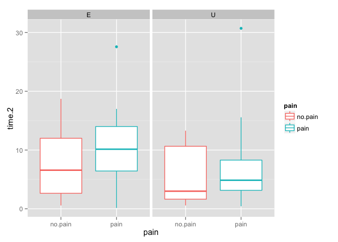<!-- -->

``` r
# Wilcoxon rank sum test
with(third.q.3, wilcox.exact(time.2~pain, exact = T, paired = F))
```

    ## 
    ##  Exact Wilcoxon rank sum test
    ## 
    ## data:  time.2 by pain
    ## W = 489.5, p-value = 0.52
    ## alternative hypothesis: true mu is not equal to 0

``` r
# N, Median, IQR, range
foo <- third.q.3 %>%
    group_by(pain) %>%
    select(pain,time.2) %>%
    rename(Group = pain) %>%
    summarise(N = n(), 
              Median = median(time.2), 
              IQR = IQR(time.2), 
              Min = min(time.2), 
              Max = max(time.2))
kable(foo, format = "markdown", align = "l", digits = 0)
```

| Group   | N   | Median | IQR | Min | Max |
|:--------|:----|:-------|:----|:----|:----|
| no.pain | 30  | 6      | 9   | 1   | 19  |
| pain    | 36  | 7      | 8   | 0   | 31  |

``` r
foo <- third.q.3 %>%
    group_by(employed) %>%
    select(employed,time.2) %>%
    rename(Group = employed) %>%
    summarise(N = n(), 
              Median = median(time.2), 
              IQR = IQR(time.2), 
              Min = min(time.2), 
              Max = max(time.2))
kable(foo, format = "markdown", align = "l", digits = 0)
```

| Group | N   | Median | IQR | Min | Max |
|:------|:----|:-------|:----|:----|:----|
| E     | 40  | 9      | 10  | 0   | 28  |
| U     | 26  | 5      | 7   | 0   | 31  |

``` r
foo <- third.q.3 %>%
    group_by(pain, employed) %>%
    select(pain, employed, time.2) %>%
    rename(Group.Pain = pain, Group.Employed = employed) %>%
    summarise(N = n(), 
              Median = median(time.2), 
              IQR = IQR(time.2), 
              Min = min(time.2), 
              Max = max(time.2))
kable(foo, format = "markdown", align = "l", digits = 0)
```

| Group.Pain | Group.Employed | N   | Median | IQR | Min | Max |
|:-----------|:---------------|:----|:-------|:----|:----|:----|
| no.pain    | E              | 23  | 7      | 9   | 1   | 19  |
| no.pain    | U              | 7   | 3      | 9   | 1   | 13  |
| pain       | E              | 17  | 10     | 8   | 0   | 28  |
| pain       | U              | 19  | 5      | 5   | 0   | 31  |

#### Second quartile (25-49%)

``` r
second.q <- group_by(data.10, id, date, pain, employed) # 25-49%
second.q.1 <- filter(second.q, pptmax.count<= 50 & pptmax.count>25)
second.q.2 <- ungroup(second.q.1)
second.q.2 <- group_by(second.q.2, id, pain, days, employed)
second.q.2 <- summarise(second.q.2, time = n())
second.q.2 <- group_by(second.q.2, id, pain, employed)
second.q.3 <- summarise(second.q.2, time = sum(time))
day <- tbl_df(data.frame(id.1 = as.numeric(as.character(fourth.q.3$id)), days = c(rep(7, 67), 5)))
id <- tbl_df(data.frame(id.1 = as.numeric(as.character(second.q.3$id))))
day.2 <- semi_join(day,id, by = "id.1")
second.q.3 <- bind_cols(second.q.3, day.2)
second.q.3 <- select(second.q.3, id, pain, employed, time, days)
second.q.3 <- mutate(second.q.3, time.2 = round(time/days, 2)) # number of minutes per day spent between 25-49% of patient max
# Save to csv
sq <- second.q.3 %>%
    rename("minutes per week" = time, "days of recording" = days, "minutes per day" = time.2)
write.csv(sq, "../activity.plot/data/time.active.2q.csv", row.names = F)
# Ungroup
second.q.3 <- ungroup(second.q.3)

# Plot
# Univariate
qplot(x = pain, y = time.2, data = second.q.3, geom = "boxplot")
```

<!-- -->

``` r
# Conditional (with employment status)
qplot(x = pain, y = time.2, data = second.q.3, facets = .~employed, colour = pain, geom = "boxplot")
```

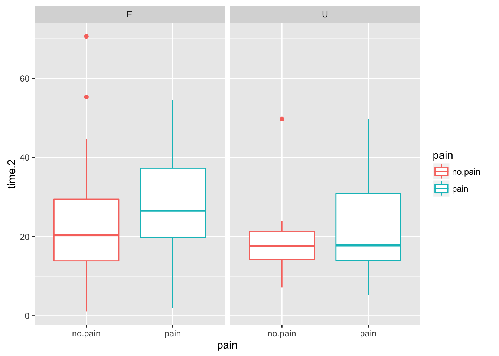<!-- -->

``` r
# Wilcoxon rank sum test
with(second.q.3, wilcox.exact(time.2~pain, exact = T, paired = F))
```

    ## 
    ##  Exact Wilcoxon rank sum test
    ## 
    ## data:  time.2 by pain
    ## W = 505.5, p-value = 0.4066
    ## alternative hypothesis: true mu is not equal to 0

``` r
# N, Median, IQR, range
foo <- second.q.3 %>%
    group_by(pain) %>%
    select(pain,time.2) %>%
    rename(Group = pain) %>%
    summarise(N = n(), 
              Median = median(time.2), 
              IQR = IQR(time.2), 
              Min = min(time.2), 
              Max = max(time.2))
kable(foo, format = "markdown", align = "l", digits = 0)
```

| Group   | N   | Median | IQR | Min | Max |
|:--------|:----|:-------|:----|:----|:----|
| no.pain | 31  | 19     | 13  | 1   | 71  |
| pain    | 37  | 25     | 20  | 2   | 54  |

``` r
foo <- second.q.3 %>%
    group_by(employed) %>%
    select(employed,time.2) %>%
    rename(Group = employed) %>%
    summarise(N = n(), 
              Median = median(time.2), 
              IQR = IQR(time.2), 
              Min = min(time.2), 
              Max = max(time.2))
kable(foo, format = "markdown", align = "l", digits = 0)
```

| Group | N   | Median | IQR | Min | Max |
|:------|:----|:-------|:----|:----|:----|
| E     | 41  | 22     | 18  | 1   | 71  |
| U     | 27  | 18     | 16  | 5   | 50  |

``` r
foo <- second.q.3 %>%
    group_by(pain, employed) %>%
    select(pain, employed, time.2) %>%
    rename(Group.Pain = pain, Group.Employed = employed) %>%
    summarise(N = n(), 
              Median = median(time.2), 
              IQR = IQR(time.2), 
              Min = min(time.2), 
              Max = max(time.2))
kable(foo, format = "markdown", align = "l", digits = 0)
```

| Group.Pain | Group.Employed | N   | Median | IQR | Min | Max |
|:-----------|:---------------|:----|:-------|:----|:----|:----|
| no.pain    | E              | 24  | 20     | 16  | 1   | 71  |
| no.pain    | U              | 7   | 18     | 7   | 7   | 50  |
| pain       | E              | 17  | 27     | 18  | 2   | 54  |
| pain       | U              | 20  | 18     | 17  | 5   | 50  |

#### First quartile (0-24%)

``` r
first.q <- group_by(data.10, id, date, pain, employed) # 0-24%
first.q.1 <- filter(first.q, pptmax.count<= 25 & pptmax.count>0)
first.q.2 <- ungroup(first.q.1)
first.q.2 <- group_by(first.q.2, id, pain, days, employed)
first.q.2 <- summarise(first.q.2, time = n())
first.q.2 <- group_by(first.q.2, id, pain, employed)
first.q.3 <- summarise(first.q.2, time = sum(time))
day <- tbl_df(data.frame(id.1 = as.numeric(as.character(fourth.q.3$id)), days = c(rep(7, 67), 5)))
id <- tbl_df(data.frame(id.1 = as.numeric(as.character(first.q.3$id))))
day.2 <- semi_join(day,id, by = "id.1")
first.q.3 <- bind_cols(first.q.3, day.2)
first.q.3 <- select(first.q.3, id, pain, employed, time, days)
first.q.3 <- mutate(first.q.3, time.2 = round(time/days, 2)) # number of minutes per day spent between 0-24% of patient max
# Save to csv
fstq <- first.q.3 %>%
    rename("minutes per week" = time, "days of recording" = days, "minutes per day" = time.2)
write.csv(fstq, "../activity.plot/data/time.active.1q.csv", row.names = F)
# Ungroup
first.q.3 <- ungroup(first.q.3)

# Plot
# Univariate
qplot(x = pain, y = time.2, data = first.q.3, geom = "boxplot")
```

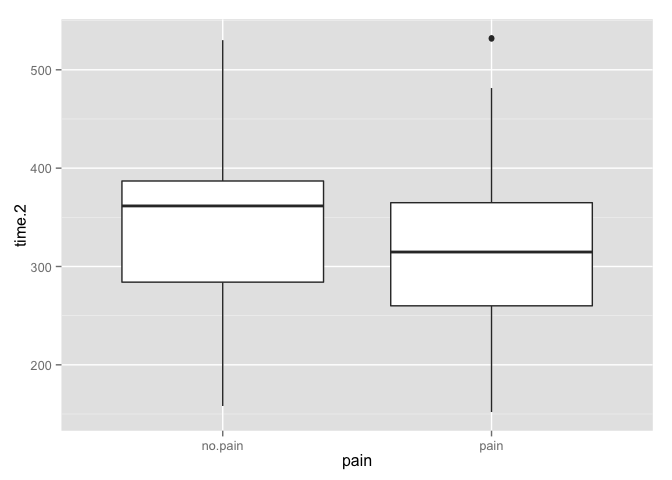<!-- -->

``` r
# Conditional (with employment status)
qplot(x = pain, y = time.2, data = first.q.3, facets = .~employed, colour = pain, geom = "boxplot")
```

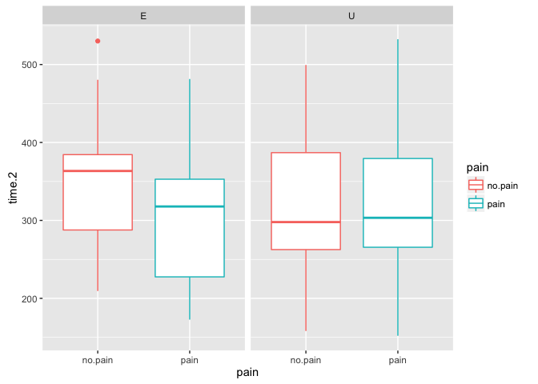<!-- -->

``` r
# Wilcoxon rank sum test
with(first.q.3, wilcox.exact(time.2~pain, exact = T, paired = F))
```

    ## 
    ##  Exact Wilcoxon rank sum test
    ## 
    ## data:  time.2 by pain
    ## W = 677, p-value = 0.2061
    ## alternative hypothesis: true mu is not equal to 0

``` r
# N, Median, IQR, range
foo <- first.q.3 %>%
    group_by(pain) %>%
    select(pain,time.2) %>%
    rename(Group = pain) %>%
    summarise(N = n(), 
              Median = median(time.2), 
              IQR = IQR(time.2), 
              Min = min(time.2), 
              Max = max(time.2))
kable(foo, format = "markdown", align = "l", digits = 0)
```

| Group   | N   | Median | IQR | Min | Max |
|:--------|:----|:-------|:----|:----|:----|
| no.pain | 31  | 362    | 103 | 158 | 530 |
| pain    | 37  | 315    | 105 | 152 | 532 |

``` r
foo <- first.q.3 %>%
    group_by(employed) %>%
    select(employed,time.2) %>%
    rename(Group = employed) %>%
    summarise(N = n(), 
              Median = median(time.2), 
              IQR = IQR(time.2), 
              Min = min(time.2), 
              Max = max(time.2))
kable(foo, format = "markdown", align = "l", digits = 0)
```

| Group | N   | Median | IQR | Min | Max |
|:------|:----|:-------|:----|:----|:----|
| E     | 41  | 327    | 102 | 173 | 530 |
| U     | 27  | 298    | 122 | 152 | 532 |

``` r
foo <- first.q.3 %>%
    group_by(pain, employed) %>%
    select(pain, employed, time.2) %>%
    rename(Group.Pain = pain, Group.Employed = employed) %>%
    summarise(N = n(), 
              Median = median(time.2), 
              IQR = IQR(time.2), 
              Min = min(time.2), 
              Max = max(time.2))
kable(foo, format = "markdown", align = "l", digits = 0)
```

| Group.Pain | Group.Employed | N   | Median | IQR | Min | Max |
|:-----------|:---------------|:----|:-------|:----|:----|:----|
| no.pain    | E              | 24  | 363    | 97  | 209 | 530 |
| no.pain    | U              | 7   | 298    | 124 | 158 | 499 |
| pain       | E              | 17  | 318    | 125 | 173 | 481 |
| pain       | U              | 20  | 303    | 114 | 152 | 532 |

#### Time spent at 0 count

``` r
zero.q <- group_by(data.10, id, date, pain, employed) #  = 0
zero.q.1 <- filter(zero.q, pptmax.count == 0)
zero.q.2 <- ungroup(zero.q.1)
zero.q.2 <- group_by(zero.q.2, id, pain, days, employed)
zero.q.2 <- summarise(zero.q.2, time = n())
zero.q.2 <- group_by(zero.q.2, id, pain, employed)
zero.q.3 <- summarise(zero.q.2, time = sum(time))
day <- tbl_df(data.frame(id.1 = as.numeric(as.character(fourth.q.3$id)), days = c(rep(7, 67), 5)))
id <- tbl_df(data.frame(id.1 = as.numeric(as.character(zero.q.3$id))))
day.2 <- semi_join(day,id, by = "id.1")
zero.q.3 <- bind_cols(zero.q.3, day.2)
zero.q.3 <- select(zero.q.3, id, pain, employed, time, days)
zero.q.3 <- mutate(zero.q.3, time.2 = round(time/days, 2)) # number of minutes per day spent at 0% of patient max
# Save to csv
zq <- zero.q.3 %>%
    rename("minutes per week" = time, "days of recording" = days, "minutes per day" = time.2)
write.csv(zq, "../activity.plot/data/time.active.zero.csv", row.names = F)
# Ungroup
zero.q.3 <- ungroup(zero.q.3)

# Plot
# Univariate
qplot(x = pain, y = time.2, data = zero.q.3, geom = "boxplot")
```

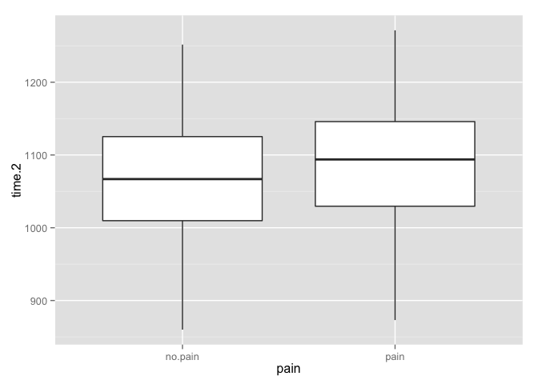<!-- -->

``` r
# Conditional (with employment status)
qplot(x = pain, y = time.2, data = zero.q.3, facets = .~employed, colour = pain, geom = "boxplot")
```

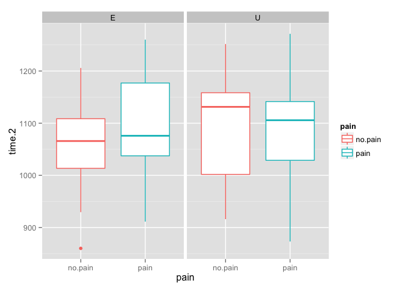<!-- -->

``` r
# Wilcoxon rank sum test
with(zero.q.3, wilcox.exact(time.2~pain, exact = T, paired = F))
```

    ## 
    ##  Exact Wilcoxon rank sum test
    ## 
    ## data:  time.2 by pain
    ## W = 492.5, p-value = 0.3223
    ## alternative hypothesis: true mu is not equal to 0

``` r
# N, Median, IQR, range
foo <- zero.q.3 %>%
    group_by(pain) %>%
    select(pain,time.2) %>%
    rename(Group = pain) %>%
    summarise(N = n(), 
              Median = median(time.2), 
              IQR = IQR(time.2), 
              Min = min(time.2), 
              Max = max(time.2))
kable(foo, format = "markdown", align = "l", digits = 0)
```

| Group   | N   | Median | IQR | Min | Max  |
|:--------|:----|:-------|:----|:----|:-----|
| no.pain | 31  | 1067   | 116 | 860 | 1252 |
| pain    | 37  | 1094   | 116 | 873 | 1271 |

``` r
foo <- zero.q.3 %>%
    group_by(employed) %>%
    select(employed,time.2) %>%
    rename(Group = employed) %>%
    summarise(N = n(), 
              Median = median(time.2), 
              IQR = IQR(time.2), 
              Min = min(time.2), 
              Max = max(time.2))
kable(foo, format = "markdown", align = "l", digits = 0)
```

| Group | N   | Median | IQR | Min | Max  |
|:------|:----|:-------|:----|:----|:-----|
| E     | 41  | 1071   | 94  | 860 | 1260 |
| U     | 27  | 1116   | 120 | 873 | 1271 |

``` r
foo <- zero.q.3 %>%
    group_by(pain, employed) %>%
    select(pain, employed, time.2) %>%
    rename(Group.Pain = pain, Group.Employed = employed) %>%
    summarise(N = n(), 
              Median = median(time.2), 
              IQR = IQR(time.2), 
              Min = min(time.2), 
              Max = max(time.2))
kable(foo, format = "markdown", align = "l", digits = 0)
```

| Group.Pain | Group.Employed | N   | Median | IQR | Min | Max  |
|:-----------|:---------------|:----|:-------|:----|:----|:-----|
| no.pain    | E              | 24  | 1066   | 95  | 860 | 1206 |
| no.pain    | U              | 7   | 1131   | 157 | 916 | 1252 |
| pain       | E              | 17  | 1076   | 140 | 911 | 1260 |
| pain       | U              | 20  | 1106   | 113 | 873 | 1271 |

Session information
-------------------

``` r
sessionInfo()
```

    ## R version 3.2.3 (2015-12-10)
    ## Platform: x86_64-apple-darwin13.4.0 (64-bit)
    ## Running under: OS X 10.11.3 (El Capitan)
    ## 
    ## locale:
    ## [1] en_GB.UTF-8/en_GB.UTF-8/en_GB.UTF-8/C/en_GB.UTF-8/en_GB.UTF-8
    ## 
    ## attached base packages:
    ## [1] stats     graphics  grDevices utils     datasets  methods   base     
    ## 
    ## other attached packages:
    ## [1] knitr_1.12.3          exactRankTests_0.8-28 scales_0.4.0         
    ## [4] ggplot2_2.1.0         lubridate_1.5.0       tidyr_0.4.1          
    ## [7] dplyr_0.4.3          
    ## 
    ## loaded via a namespace (and not attached):
    ##  [1] Rcpp_0.12.3      magrittr_1.5     munsell_0.4.3    colorspace_1.2-6
    ##  [5] R6_2.1.2         highr_0.5.1      stringr_1.0.0    plyr_1.8.3      
    ##  [9] tools_3.2.3      parallel_3.2.3   grid_3.2.3       gtable_0.2.0    
    ## [13] DBI_0.3.1        htmltools_0.3    yaml_2.1.13      lazyeval_0.1.10 
    ## [17] assertthat_0.1   digest_0.6.9     reshape2_1.4.1   formatR_1.2.1   
    ## [21] evaluate_0.8     rmarkdown_0.9.5  labeling_0.3     stringi_1.0-1
