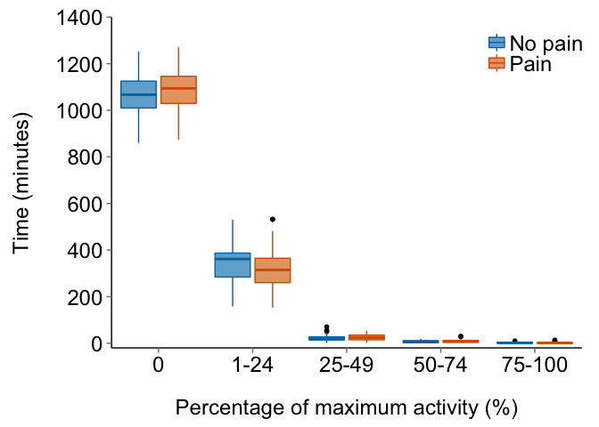

Description
-----------

This script plots a box-and-whisker plot of the time spent by HIV-positive individuals with chronic pain and without chronic pain at 0, 1-24, 25-49, 50-74 and \>75% of their maximum activity over a 7-day period.

Load required packages and set chunk options
--------------------------------------------

``` r
# Load packages
library(knitr)
library(readr)
library(dplyr)
```

    ## 
    ## Attaching package: 'dplyr'
    ## 
    ## The following objects are masked from 'package:stats':
    ## 
    ##     filter, lag
    ## 
    ## The following objects are masked from 'package:base':
    ## 
    ##     intersect, setdiff, setequal, union

``` r
library(ggplot2)
library(scales)
```

    ## 
    ## Attaching package: 'scales'
    ## 
    ## The following objects are masked from 'package:readr':
    ## 
    ##     col_factor, col_numeric

``` r
library(grid)

# knitr chunk options
opts_chunk$set(echo = FALSE,
               warning = FALSE,
               message = FALSE,
               fig.path = './figures/',
               dev = c('png', 'pdf'),
               tidy = TRUE, 
               tidy.opts = list(width.cutoff = 65))
```

Import data
===========

These data were generated by the Rmd script, *activity.analysis.Rmd*.

Process data for plotting
=========================

    ## Observations: 338
    ## Variables: 3
    ## $ quartile        (fctr) q0, q0, q0, q0, q0, q0, q0, q0, q0, q0, q0, q...
    ## $ pain            (chr) "pain", "no.pain", "no.pain", "no.pain", "pain...
    ## $ minutes per day (dbl) 1145.86, 1038.71, 1002.14, 1064.71, 1075.86, 1...

Create the plot
---------------



Session information
-------------------

    ## R version 3.2.2 (2015-08-14)
    ## Platform: x86_64-apple-darwin13.4.0 (64-bit)
    ## Running under: OS X 10.11.1 (El Capitan)
    ## 
    ## locale:
    ## [1] C
    ## 
    ## attached base packages:
    ## [1] grid      stats     graphics  grDevices utils     datasets  methods  
    ## [8] base     
    ## 
    ## other attached packages:
    ## [1] scales_0.3.0  ggplot2_1.0.1 dplyr_0.4.3   readr_0.2.2   knitr_1.11   
    ## 
    ## loaded via a namespace (and not attached):
    ##  [1] Rcpp_0.12.1      magrittr_1.5     MASS_7.3-44      munsell_0.4.2   
    ##  [5] colorspace_1.2-6 R6_2.1.1         stringr_1.0.0    plyr_1.8.3      
    ##  [9] tools_3.2.2      parallel_3.2.2   gtable_0.1.2     DBI_0.3.1       
    ## [13] htmltools_0.2.6  yaml_2.1.13      lazyeval_0.1.10  assertthat_0.1  
    ## [17] digest_0.6.8     reshape2_1.4.1   formatR_1.2.1    evaluate_0.8    
    ## [21] rmarkdown_0.8.1  stringi_1.0-1    proto_0.3-10
