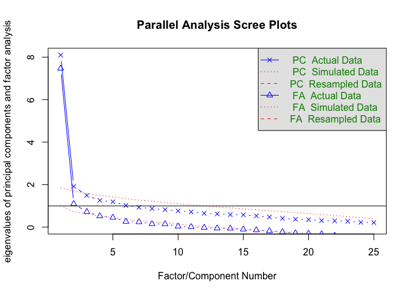
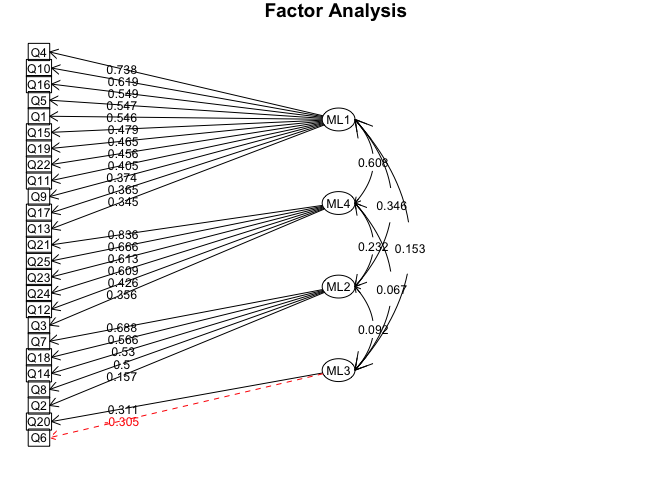
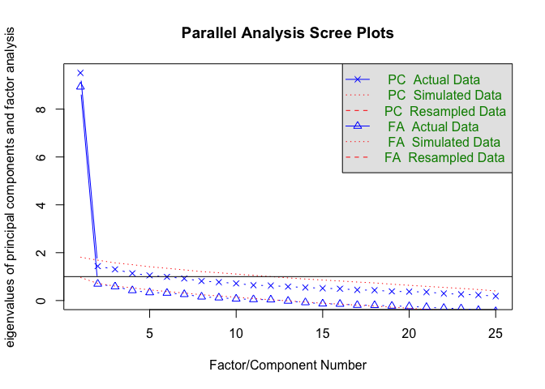

Load required packages and set chunk options
--------------------------------------------

``` r
# Load libraries
library(pander)
library(readr)
library(knitr)
library(dplyr)
```

    ## 
    ## Attaching package: 'dplyr'
    ## 
    ## The following objects are masked from 'package:stats':
    ## 
    ##     filter, lag
    ## 
    ## The following objects are masked from 'package:base':
    ## 
    ##     intersect, setdiff, setequal, union

``` r
library(tidyr)
library(ggplot2)
library(psych)
```

    ## 
    ## Attaching package: 'psych'
    ## 
    ## The following object is masked from 'package:ggplot2':
    ## 
    ##     %+%

``` r
library(GPArotation) # for fa function in 'psych'

# Set seed
set.seed(123)

# Set knitr chunk options
opts_chunk$set(echo = FALSE,
               warning = FALSE,
               message = FALSE,
               fig.path = './figures/',
               dev = c('png', 'pdf'),
               cache.extra = rand_seed,
               tidy = TRUE, 
               tidy.opts = list(width.cutoff = 65))
```

CD-RISC
-------

### Item coding

| Label | Key                                                                                             |
|:------|:------------------------------------------------------------------------------------------------|
| Q1    | I am able to adapt when changes occur                                                           |
| Q2    | I have at least one close and secure relationship that helps me when I'm stressed               |
| Q3    | When there are no clear solutions to my problems, sometimes fate or God can help                |
| Q4    | I can deal with whatever comes my way                                                           |
| Q5    | Past successes give me confidence in dealing with new challenges and difficulties               |
| Q6    | I try and see the humorous side of things when I'm faced with problems                          |
| Q7    | Having to cope with stress can make me stronger                                                 |
| Q8    | I tend to bounce back after illness, injury or other hardships                                  |
| Q9    | Good or bad, I believe that most things happen for a reason                                     |
| Q10   | I give my best effort no matter what the outcome may be                                         |
| Q11   | I believe I can achieve my goals, even if there are obstacles                                   |
| Q12   | Even when things look hopeless, I don't give up                                                 |
| Q13   | During times of stress/crisis, I know where to turn for help                                    |
| Q14   | Under pressure, I stay focused and think clearly                                                |
| Q15   | I prefer to take the lead in solving problems rather than letting others make all the decisions |
| Q16   | I am not easily discouraged by failure                                                          |
| Q17   | I think of myself as a strong person when dealing with life's challenges and difficulties       |
| Q18   | I can make unpopular or difficult decisions that affect other people, if it is necessary        |
| Q19   | I am able to handle unpleasant or painful feelings like sadness, fear, and anger                |
| Q20   | In dealing with life's problems, sometimes you have to act on a hunch without knowing why       |
| Q21   | I have a strong sense of purpose in life                                                        |
| Q22   | I feel in control of my life                                                                    |
| Q23   | I like challenges                                                                               |
| Q24   | I work to attain my goals no matter what roadblocks I encounter along the way                   |
| Q25   | I take pride in my achievements                                                                 |

### Import data

### Inspect and clean data

    ## Source: local data frame [6 x 26]
    ## 
    ##      ID    Q1    Q2    Q3    Q4    Q5    Q6    Q7    Q8    Q9   Q10   Q11
    ##   (int) (int) (int) (int) (int) (int) (int) (int) (int) (int) (int) (int)
    ## 1     1     2     0     4     4     4     4     4     4     4     4     3
    ## 2     2     2     4     4     2     4     2     0     2     0     2     2
    ## 3     3     4     4     4     4     4     3     2     4     4     4     4
    ## 4     4     4     4     4     3     3     3     4     4     4     3     1
    ## 5     5     2     2     4     2     4     2     2     4     2     4     4
    ## 6     6     2     2     4     0     1     3     3     2     4     3     2
    ## Variables not shown: Q12 (int), Q13 (int), Q14 (int), Q15 (int), Q16
    ##   (int), Q17 (int), Q18 (int), Q19 (int), Q20 (int), Q21 (int), Q22 (int),
    ##   Q23 (int), Q24 (int), Q25 (int)

    ## Source: local data frame [6 x 26]
    ## 
    ##      ID    Q1    Q2    Q3    Q4    Q5    Q6    Q7    Q8    Q9   Q10   Q11
    ##   (int) (int) (int) (int) (int) (int) (int) (int) (int) (int) (int) (int)
    ## 1   187     2     0     4     4     4     0     1     4     4     4     4
    ## 2   191     3     2     4     4     4     2     0     1     4     4     4
    ## 3   193     3     3     4     4     4     4     4     4     3     3     4
    ## 4   195     2     0     4     3     2     3     0     4     4     4     2
    ## 5   196     2     0     4     4     4     2     0     4     4     4     4
    ## 6   197     2     4     4     4     4     4     0     4     4     4     4
    ## Variables not shown: Q12 (int), Q13 (int), Q14 (int), Q15 (int), Q16
    ##   (int), Q17 (int), Q18 (int), Q19 (int), Q20 (int), Q21 (int), Q22 (int),
    ##   Q23 (int), Q24 (int), Q25 (int)

    ## Classes 'tbl_df', 'tbl' and 'data.frame':    154 obs. of  26 variables:
    ##  $ ID : int  1 2 3 4 5 6 7 8 9 10 ...
    ##  $ Q1 : int  2 2 4 4 2 2 2 2 2 4 ...
    ##  $ Q2 : int  0 4 4 4 2 2 4 3 2 4 ...
    ##  $ Q3 : int  4 4 4 4 4 4 4 4 2 4 ...
    ##  $ Q4 : int  4 2 4 3 2 0 4 3 2 4 ...
    ##  $ Q5 : int  4 4 4 3 4 1 4 2 4 4 ...
    ##  $ Q6 : int  4 2 3 3 2 3 1 3 2 4 ...
    ##  $ Q7 : int  4 0 2 4 2 3 0 0 2 4 ...
    ##  $ Q8 : int  4 2 4 4 4 2 2 0 2 4 ...
    ##  $ Q9 : int  4 0 4 4 2 4 2 2 4 4 ...
    ##  $ Q10: int  4 2 4 3 4 3 4 3 4 4 ...
    ##  $ Q11: int  3 2 4 1 4 2 4 3 4 4 ...
    ##  $ Q12: int  4 3 4 4 4 3 4 1 4 4 ...
    ##  $ Q13: int  4 4 4 0 4 2 4 2 2 4 ...
    ##  $ Q14: int  4 2 4 2 2 2 4 2 4 4 ...
    ##  $ Q15: int  4 2 4 2 2 2 2 3 4 4 ...
    ##  $ Q16: int  4 3 4 4 4 4 4 2 4 4 ...
    ##  $ Q17: int  4 2 4 2 4 3 4 3 4 4 ...
    ##  $ Q18: int  4 2 0 4 2 1 2 2 4 2 ...
    ##  $ Q19: int  4 3 4 4 2 0 2 1 4 4 ...
    ##  $ Q20: int  4 2 0 3 2 2 4 3 2 4 ...
    ##  $ Q21: int  4 4 4 4 4 2 4 1 4 4 ...
    ##  $ Q22: int  4 2 4 4 4 3 4 1 2 4 ...
    ##  $ Q23: int  4 0 4 3 4 3 2 1 4 4 ...
    ##  $ Q24: int  4 2 4 4 4 3 4 3 4 4 ...
    ##  $ Q25: int  4 3 4 4 4 4 4 4 2 4 ...

    ##  Factor w/ 154 levels "1","2","3","4",..: 1 2 3 4 5 6 7 8 9 10 ...

### Internal consistency

***Use polychoric correlation matrix because data are ordinal integers, and therefore Pearson's correlation matrix does not apply***

|     |  vars|    n|      mean|         sd|  median|   trimmed|     mad|  min|  max|  range|        skew|    kurtosis|         se|
|-----|-----:|----:|---------:|----------:|-------:|---------:|-------:|----:|----:|------:|-----------:|-----------:|----------:|
| Q1  |     1|  154|  2.772727|  0.9803476|       3|  2.814516|  1.4826|    0|    4|      4|  -0.1994095|  -0.7313042|  0.0789987|
| Q2  |     2|  154|  2.876623|  1.3543825|       3|  3.088710|  1.4826|    0|    4|      4|  -0.9378774|  -0.3904256|  0.1091393|
| Q3  |     3|  154|  3.733766|  0.7324612|       4|  3.943548|  0.0000|    0|    4|      4|  -3.0162455|   9.3388201|  0.0590234|
| Q4  |     4|  154|  3.136364|  1.0910700|       4|  3.298387|  0.0000|    0|    4|      4|  -0.9893935|   0.0085065|  0.0879209|
| Q5  |     5|  154|  3.279221|  0.9934212|       4|  3.443548|  0.0000|    0|    4|      4|  -1.2904579|   0.9805925|  0.0800522|
| Q6  |     6|  154|  2.746753|  1.1857635|       3|  2.887097|  1.4826|    0|    4|      4|  -0.6740373|  -0.3516725|  0.0955515|
| Q7  |     7|  154|  2.019480|  1.5188178|       2|  2.024193|  2.2239|    0|    4|      4|   0.0229307|  -1.4438701|  0.1223898|
| Q8  |     8|  154|  3.012987|  1.1935941|       4|  3.185484|  0.0000|    0|    4|      4|  -0.8954449|  -0.3447204|  0.0961826|
| Q9  |     9|  154|  3.448052|  0.9005605|       4|  3.629032|  0.0000|    0|    4|      4|  -1.7927449|   3.0490401|  0.0725692|
| Q10 |    10|  154|  3.285714|  0.9197491|       4|  3.427419|  0.0000|    0|    4|      4|  -1.1394656|   0.5353928|  0.0741155|
| Q11 |    11|  154|  3.324675|  0.9066430|       4|  3.467742|  0.0000|    0|    4|      4|  -1.2003997|   0.6871206|  0.0730594|
| Q12 |    12|  154|  3.519480|  0.8340842|       4|  3.701613|  0.0000|    0|    4|      4|  -1.8069500|   2.7954622|  0.0672124|
| Q13 |    13|  154|  2.935065|  1.2918818|       4|  3.137097|  0.0000|    0|    4|      4|  -0.8921068|  -0.3596341|  0.1041028|
| Q14 |    14|  154|  2.694805|  1.2489364|       3|  2.822581|  1.4826|    0|    4|      4|  -0.5336838|  -0.7720070|  0.1006422|
| Q15 |    15|  154|  3.376623|  0.8637804|       4|  3.491935|  0.0000|    1|    4|      3|  -0.9794281|  -0.4549191|  0.0696054|
| Q16 |    16|  154|  3.409091|  0.9118941|       4|  3.588710|  0.0000|    0|    4|      4|  -1.5044686|   1.4739548|  0.0734825|
| Q17 |    17|  154|  3.383117|  0.9372331|       4|  3.556452|  0.0000|    0|    4|      4|  -1.4838509|   1.5412965|  0.0755244|
| Q18 |    18|  154|  2.006493|  1.4796959|       2|  2.008065|  1.4826|    0|    4|      4|  -0.0110755|  -1.3433274|  0.1192373|
| Q19 |    19|  154|  3.071429|  1.1208490|       3|  3.250000|  1.4826|    0|    4|      4|  -0.9972035|   0.0482329|  0.0903206|
| Q20 |    20|  154|  2.935065|  1.0766404|       3|  3.088710|  1.4826|    0|    4|      4|  -0.9647129|   0.4474708|  0.0867582|
| Q21 |    21|  154|  3.623377|  0.7504066|       4|  3.798387|  0.0000|    1|    4|      3|  -1.8506190|   2.2865127|  0.0604695|
| Q22 |    22|  154|  3.558442|  0.8478116|       4|  3.758065|  0.0000|    0|    4|      4|  -1.9719607|   3.2167447|  0.0683186|
| Q23 |    23|  154|  3.266234|  1.0968893|       4|  3.491935|  0.0000|    0|    4|      4|  -1.4806859|   1.3260515|  0.0883899|
| Q24 |    24|  154|  3.668831|  0.6769327|       4|  3.814516|  0.0000|    0|    4|      4|  -2.5068251|   7.4022722|  0.0545488|
| Q25 |    25|  154|  3.727273|  0.6290643|       4|  3.870968|  0.0000|    0|    4|      4|  -2.8521252|   9.8069358|  0.0506914|

Reliability analysis
 raw\_alpha std.alpha G6(smc) average\_r S/N 0.9 0.9 0.93 0.28 9.5

| raw\_alpha | std.alpha | G6(smc) | average\_r | S/N  |
|:-----------|:----------|:--------|:-----------|:-----|
| 0.9        | 0.9       | 0.93    | 0.28       | 9.52 |

### Factor analysis - initial

***Use polychoric correlation matrix because data are ordinal integers, and therefore Pearson's correlation matrix does not apply*** 

    ## Parallel analysis suggests that the number of factors =  3  and the number of components =  2


    ## Factor Analysis using method =  ml
    ## Call: fa.poly(x = data.1.1, nfactors = 3, rotate = "oblimin", fm = "ml", 
    ##     global = F)
    ## Standardized loadings (pattern matrix) based upon correlation matrix
    ##        ML1    ML3    ML2     h2    u2  com
    ## Q1  -0.015  0.514  0.065 0.2808 0.719 1.03
    ## Q2   0.180  0.050  0.164 0.0918 0.908 2.15
    ## Q3   0.504  0.031 -0.065 0.2603 0.740 1.04
    ## Q4   0.068  0.565  0.004 0.3713 0.629 1.03
    ## Q5   0.325  0.348  0.139 0.4316 0.568 2.31
    ## Q6   0.275 -0.074  0.303 0.1750 0.825 2.11
    ## Q7  -0.213  0.130  0.682 0.4811 0.519 1.27
    ## Q8   0.199  0.071  0.505 0.3877 0.612 1.35
    ## Q9   0.438  0.157  0.137 0.3595 0.640 1.47
    ## Q10  0.229  0.430  0.142 0.4284 0.572 1.77
    ## Q11  0.254  0.433  0.082 0.4217 0.578 1.70
    ## Q12  0.481  0.292  0.043 0.5020 0.498 1.67
    ## Q13  0.011  0.491  0.242 0.3825 0.617 1.46
    ## Q14  0.283 -0.257  0.553 0.3510 0.649 1.96
    ## Q15 -0.026  0.720 -0.083 0.4663 0.534 1.03
    ## Q16  0.209  0.509 -0.016 0.4213 0.579 1.33
    ## Q17  0.215  0.492  0.144 0.4929 0.507 1.56
    ## Q18 -0.154  0.115  0.511 0.2763 0.724 1.29
    ## Q19  0.132  0.344  0.176 0.2692 0.731 1.82
    ## Q20  0.038  0.400  0.032 0.1886 0.811 1.03
    ## Q21  0.749 -0.006 -0.036 0.5449 0.455 1.00
    ## Q22  0.625  0.210 -0.023 0.5802 0.420 1.23
    ## Q23  0.397  0.358  0.022 0.4629 0.537 1.99
    ## Q24  0.736  0.071  0.000 0.6080 0.392 1.02
    ## Q25  0.709 -0.059  0.002 0.4582 0.542 1.01
    ## 
    ##                         ML1   ML3   ML2
    ## SS loadings           4.131 3.745 1.817
    ## Proportion Var        0.165 0.150 0.073
    ## Cumulative Var        0.165 0.315 0.388
    ## Proportion Explained  0.426 0.386 0.187
    ## Cumulative Proportion 0.426 0.813 1.000
    ## 
    ##  With factor correlations of 
    ##       ML1   ML3   ML2
    ## ML1 1.000 0.590 0.242
    ## ML3 0.590 1.000 0.319
    ## ML2 0.242 0.319 1.000
    ## 
    ## Mean item complexity =  1.5
    ## Test of the hypothesis that 3 factors are sufficient.
    ## 
    ## The degrees of freedom for the null model are  300  and the objective function was  10.386 with Chi Square of  1493.873
    ## The degrees of freedom for the model are 228  and the objective function was  2.389 
    ## 
    ## The root mean square of the residuals (RMSR) is  0.053 
    ## The df corrected root mean square of the residuals is  0.061 
    ## 
    ## The harmonic number of observations is  154 with the empirical chi square  264.365  with prob <  0.0494 
    ## The total number of observations was  154  with MLE Chi Square =  338.816  with prob <  2.58e-06 
    ## 
    ## Tucker Lewis Index of factoring reliability =  0.8757
    ## RMSEA index =  0.0628  and the 90 % confidence intervals are  0.0432 0.0684
    ## BIC =  -809.609
    ## Fit based upon off diagonal values = 0.97
    ## Measures of factor score adequacy             
    ##                                                  ML1   ML3   ML2
    ## Correlation of scores with factors             0.938 0.921 0.854
    ## Multiple R square of scores with factors       0.879 0.848 0.729
    ## Minimum correlation of possible factor scores  0.758 0.696 0.458



    ## Factor Analysis using method =  ml
    ## Call: fa.poly(x = data.1.1, nfactors = 4, rotate = "oblimin", fm = "ml", 
    ##     global = F)
    ## Standardized loadings (pattern matrix) based upon correlation matrix
    ##        ML1    ML4    ML2    ML3     h2    u2  com
    ## Q1   0.546 -0.086  0.053  0.089 0.2919 0.708 1.12
    ## Q2   0.100  0.147  0.157 -0.057 0.0942 0.906 2.99
    ## Q3   0.242  0.356 -0.102 -0.156 0.2757 0.724 2.39
    ## Q4   0.738 -0.111 -0.039  0.016 0.4441 0.556 1.05
    ## Q5   0.547  0.147  0.113 -0.093 0.4711 0.529 1.30
    ## Q6   0.218  0.070  0.255 -0.305 0.2388 0.761 2.93
    ## Q7   0.057 -0.173  0.688  0.030 0.4708 0.529 1.14
    ## Q8   0.125  0.149  0.500 -0.073 0.3831 0.617 1.36
    ## Q9   0.374  0.273  0.102 -0.165 0.3879 0.612 2.45
    ## Q10  0.619  0.048  0.108 -0.045 0.4746 0.525 1.08
    ## Q11  0.405  0.237  0.098  0.131 0.4247 0.575 2.00
    ## Q12  0.341  0.426  0.049  0.016 0.5001 0.500 1.94
    ## Q13  0.345  0.064  0.282  0.221 0.3913 0.609 2.77
    ## Q14 -0.113  0.200  0.530 -0.211 0.3390 0.661 1.73
    ## Q15  0.479  0.086 -0.034  0.398 0.4937 0.506 2.02
    ## Q16  0.549  0.133 -0.017  0.081 0.4213 0.579 1.16
    ## Q17  0.365  0.262  0.181  0.230 0.5128 0.487 3.14
    ## Q18 -0.062 -0.048  0.566  0.125 0.3185 0.682 1.14
    ## Q19  0.465  0.010  0.153 -0.030 0.2909 0.709 1.23
    ## Q20  0.164  0.172  0.089  0.311 0.2410 0.759 2.36
    ## Q21 -0.075  0.836 -0.006  0.034 0.6310 0.369 1.02
    ## Q22  0.456  0.436 -0.061 -0.153 0.6082 0.392 2.26
    ## Q23  0.052  0.613  0.097  0.372 0.6398 0.360 1.73
    ## Q24  0.240  0.609 -0.013 -0.103 0.5950 0.405 1.37
    ## Q25  0.020  0.666  0.010 -0.078 0.4624 0.538 1.03
    ## 
    ##                         ML1   ML4   ML2   ML3
    ## SS loadings           4.218 3.492 1.855 0.836
    ## Proportion Var        0.169 0.140 0.074 0.033
    ## Cumulative Var        0.169 0.308 0.383 0.416
    ## Proportion Explained  0.406 0.336 0.178 0.080
    ## Cumulative Proportion 0.406 0.741 0.920 1.000
    ## 
    ##  With factor correlations of 
    ##       ML1   ML4   ML2   ML3
    ## ML1 1.000 0.608 0.346 0.153
    ## ML4 0.608 1.000 0.232 0.067
    ## ML2 0.346 0.232 1.000 0.092
    ## ML3 0.153 0.067 0.092 1.000
    ## 
    ## Mean item complexity =  1.8
    ## Test of the hypothesis that 4 factors are sufficient.
    ## 
    ## The degrees of freedom for the null model are  300  and the objective function was  10.386 with Chi Square of  1493.873
    ## The degrees of freedom for the model are 206  and the objective function was  2.04 
    ## 
    ## The root mean square of the residuals (RMSR) is  0.047 
    ## The df corrected root mean square of the residuals is  0.057 
    ## 
    ## The harmonic number of observations is  154 with the empirical chi square  208.152  with prob <  0.445 
    ## The total number of observations was  154  with MLE Chi Square =  288.04  with prob <  0.000139 
    ## 
    ## Tucker Lewis Index of factoring reliability =  0.8975
    ## RMSEA index =  0.058  and the 90 % confidence intervals are  0.0361 0.0642
    ## BIC =  -749.572
    ## Fit based upon off diagonal values = 0.976
    ## Measures of factor score adequacy             
    ##                                                  ML1   ML4   ML2   ML3
    ## Correlation of scores with factors             0.933 0.934 0.858 0.775
    ## Multiple R square of scores with factors       0.870 0.872 0.737 0.600
    ## Minimum correlation of possible factor scores  0.739 0.743 0.473 0.200


    ## Factor Analysis using method =  ml
    ## Call: fa.poly(x = data.1.1, nfactors = 2, rotate = "oblimin", fm = "ml", 
    ##     global = F)
    ## Standardized loadings (pattern matrix) based upon correlation matrix
    ##        ML1    ML2     h2    u2  com
    ## Q1   0.367  0.233 0.2350 0.765 1.69
    ## Q2   0.231  0.123 0.0837 0.916 1.53
    ## Q3   0.526 -0.163 0.2568 0.743 1.19
    ## Q4   0.481  0.176 0.3086 0.691 1.26
    ## Q5   0.593  0.168 0.4343 0.566 1.16
    ## Q6   0.255  0.163 0.1139 0.886 1.70
    ## Q7  -0.043  0.639 0.3955 0.605 1.01
    ## Q8   0.301  0.394 0.3102 0.690 1.87
    ## Q9   0.571  0.070 0.3529 0.647 1.03
    ## Q10  0.560  0.216 0.4258 0.574 1.29
    ## Q11  0.579  0.164 0.4137 0.586 1.16
    ## Q12  0.702  0.029 0.5042 0.496 1.00
    ## Q13  0.388  0.382 0.3772 0.623 2.00
    ## Q14  0.153  0.298 0.1372 0.863 1.49
    ## Q15  0.487  0.169 0.3104 0.690 1.24
    ## Q16  0.578  0.110 0.3803 0.620 1.07
    ## Q17  0.586  0.245 0.4809 0.519 1.34
    ## Q18 -0.028  0.521 0.2645 0.735 1.01
    ## Q19  0.400  0.236 0.2671 0.733 1.62
    ## Q20  0.329  0.163 0.1638 0.836 1.47
    ## Q21  0.740 -0.198 0.5080 0.492 1.14
    ## Q22  0.782 -0.096 0.5805 0.420 1.03
    ## Q23  0.661  0.051 0.4574 0.543 1.01
    ## Q24  0.789 -0.143 0.5816 0.418 1.07
    ## Q25  0.664 -0.171 0.4084 0.592 1.13
    ## 
    ##                         ML1   ML2
    ## SS loadings           6.912 1.839
    ## Proportion Var        0.276 0.074
    ## Cumulative Var        0.276 0.350
    ## Proportion Explained  0.790 0.210
    ## Cumulative Proportion 0.790 1.000
    ## 
    ##  With factor correlations of 
    ##       ML1   ML2
    ## ML1 1.000 0.271
    ## ML2 0.271 1.000
    ## 
    ## Mean item complexity =  1.3
    ## Test of the hypothesis that 2 factors are sufficient.
    ## 
    ## The degrees of freedom for the null model are  300  and the objective function was  10.386 with Chi Square of  1493.873
    ## The degrees of freedom for the model are 251  and the objective function was  2.829 
    ## 
    ## The root mean square of the residuals (RMSR) is  0.063 
    ## The df corrected root mean square of the residuals is  0.069 
    ## 
    ## The harmonic number of observations is  154 with the empirical chi square  366.567  with prob <  2.59e-06 
    ## The total number of observations was  154  with MLE Chi Square =  403.166  with prob <  3.48e-09 
    ## 
    ## Tucker Lewis Index of factoring reliability =  0.8459
    ## RMSEA index =  0.0688  and the 90 % confidence intervals are  0.0512 0.0739
    ## BIC =  -861.109
    ## Fit based upon off diagonal values = 0.958
    ## Measures of factor score adequacy             
    ##                                                  ML1   ML2
    ## Correlation of scores with factors             0.961 0.846
    ## Multiple R square of scores with factors       0.923 0.716
    ## Minimum correlation of possible factor scores  0.847 0.431

### Outcome of initial factor analysis

The 3-factor structure produced the most parsimonious outcome. One item (Q2: 'I have at least one close and secure relationship that helps me when I'm stressed') had factor loading \< 0.3, and was removed and the data reanalysed with a 3-factor structure.

### Factor analysis - secondary

\*Item Q2 removed\*\*

Reliability analysis
 raw\_alpha std.alpha G6(smc) average\_r S/N 0.91 0.91 0.93 0.29 9.6 Quitting from lines 155-191 (factor.analysis.Rmd) Error in match.arg(style) : 'arg' should be one of "multiline", "grid", "simple", "rmarkdown" Calls: <Anonymous> ... pandoc.table -\> cat -\> pandoc.table.return -\> match.arg

    ## Parallel analysis suggests that the number of factors =  3  and the number of components =  2


    ## Factor Analysis using method =  ml
    ## Call: fa.poly(x = data.1.1b, nfactors = 3, rotate = "oblimin", fm = "ml", 
    ##     global = F)
    ## Standardized loadings (pattern matrix) based upon correlation matrix
    ##        ML1    ML3    ML2    h2    u2  com
    ## Q1  -0.033  0.532  0.050 0.283 0.717 1.03
    ## Q3   0.492  0.046 -0.075 0.258 0.742 1.06
    ## Q4   0.048  0.587 -0.015 0.376 0.624 1.01
    ## Q5   0.324  0.350  0.136 0.434 0.566 2.29
    ## Q6   0.276 -0.072  0.300 0.172 0.828 2.11
    ## Q7  -0.208  0.124  0.691 0.493 0.507 1.25
    ## Q8   0.213  0.054  0.524 0.407 0.593 1.34
    ## Q9   0.430  0.168  0.130 0.357 0.643 1.50
    ## Q10  0.219  0.443  0.131 0.429 0.571 1.66
    ## Q11  0.244  0.444  0.072 0.421 0.579 1.61
    ## Q12  0.472  0.299  0.038 0.500 0.500 1.71
    ## Q13  0.001  0.503  0.226 0.379 0.621 1.39
    ## Q14  0.286 -0.250  0.537 0.332 0.668 2.00
    ## Q15 -0.028  0.712 -0.075 0.456 0.544 1.03
    ## Q16  0.205  0.509 -0.014 0.420 0.580 1.32
    ## Q17  0.209  0.497  0.142 0.495 0.505 1.52
    ## Q18 -0.148  0.110  0.509 0.275 0.725 1.27
    ## Q19  0.127  0.349  0.168 0.268 0.732 1.74
    ## Q20  0.033  0.402  0.030 0.188 0.812 1.02
    ## Q21  0.742  0.001 -0.040 0.539 0.461 1.01
    ## Q22  0.627  0.205 -0.017 0.583 0.417 1.21
    ## Q23  0.391  0.360  0.022 0.462 0.538 1.99
    ## Q24  0.747  0.060  0.009 0.619 0.381 1.01
    ## Q25  0.704 -0.054 -0.002 0.453 0.547 1.01
    ## 
    ##                         ML1   ML3   ML2
    ## SS loadings           4.035 3.801 1.762
    ## Proportion Var        0.168 0.158 0.073
    ## Cumulative Var        0.168 0.327 0.400
    ## Proportion Explained  0.420 0.396 0.184
    ## Cumulative Proportion 0.420 0.816 1.000
    ## 
    ##  With factor correlations of 
    ##       ML1   ML3   ML2
    ## ML1 1.000 0.600 0.234
    ## ML3 0.600 1.000 0.326
    ## ML2 0.234 0.326 1.000
    ## 
    ## Mean item complexity =  1.4
    ## Test of the hypothesis that 3 factors are sufficient.
    ## 
    ## The degrees of freedom for the null model are  276  and the objective function was  9.911 with Chi Square of  1428.778
    ## The degrees of freedom for the model are 207  and the objective function was  1.996 
    ## 
    ## The root mean square of the residuals (RMSR) is  0.05 
    ## The df corrected root mean square of the residuals is  0.058 
    ## 
    ## The harmonic number of observations is  154 with the empirical chi square  215.156  with prob <  0.334 
    ## The total number of observations was  154  with MLE Chi Square =  283.719  with prob <  0.000317 
    ## 
    ## Tucker Lewis Index of factoring reliability =  0.9097
    ## RMSEA index =  0.0557  and the 90 % confidence intervals are  0.0339 0.0626
    ## BIC =  -758.93
    ## Fit based upon off diagonal values = 0.975
    ## Measures of factor score adequacy             
    ##                                                  ML1   ML3   ML2
    ## Correlation of scores with factors             0.937 0.923 0.854
    ## Multiple R square of scores with factors       0.879 0.852 0.729
    ## Minimum correlation of possible factor scores  0.757 0.703 0.458

Resilience Scale
----------------

### Item coding

| Label | Key                                                                            |
|:------|:-------------------------------------------------------------------------------|
| Q1    | When I make plans, I follow through with them                                  |
| Q2    | I usually manage one way or another                                            |
| Q3    | I am able to depend on myself more than anyone else                            |
| Q4    | Keeping interested in things is important to me                                |
| Q5    | I can be on my own if I have to                                                |
| Q6    | I feel proud that I have accomplished things in life                           |
| Q7    | I usually take things in my stride                                             |
| Q8    | I am friends with myself                                                       |
| Q9    | I feel that I can handle many things at a time                                 |
| Q10   | I am determined                                                                |
| Q11   | I seldom wonder what the point of it all is                                    |
| Q12   | I take things one day at a time                                                |
| Q13   | I can get through difficult times because I have experienced difficulty before |
| Q14   | I have self-discipline                                                         |
| Q15   | I keep interested in things                                                    |
| Q16   | I can usually find something to laugh about                                    |
| Q17   | My belief in myself gets me through hard times                                 |
| Q18   | In an emergency, I am someone people can general rely on                       |
| Q19   | I can usually look at a situation in a number of ways                          |
| Q20   | Sometimes I make myself do things whether I want to or not                     |
| Q21   | My life has meaning                                                            |
| Q22   | I do not dwell on things I cannot do anything about                            |
| Q23   | When I am in a difficult situation, I can usually find my way out of it        |
| Q24   | I have enough energy to do what I have to do                                   |
| Q25   | It is OK if there are people who do not like me                                |

### Import data

### Inspect and clean data

    ## Source: local data frame [6 x 26]
    ## 
    ##      ID    Q1    Q2    Q3    Q4    Q5    Q6    Q7    Q8    Q9   Q10   Q11
    ##   (int) (int) (int) (int) (int) (int) (int) (int) (int) (int) (int) (int)
    ## 1     1     6     6     6     7     7     7     4     6     2     6     7
    ## 2     2     5     4     6     6     3     6     6     6     3     6     4
    ## 3     3     7     7     7     7     4     7     5     7     6     7     7
    ## 4     4     4     6     5     7     7     5     2     7     4     7     1
    ## 5     5     7     6     7     7     7     7     6     7     6     7     3
    ## 6     6     6     2     2     1     1     4     3     4     1     5     2
    ## Variables not shown: Q12 (int), Q13 (int), Q14 (int), Q15 (int), Q16
    ##   (int), Q17 (int), Q18 (int), Q19 (int), Q20 (int), Q21 (int), Q22 (int),
    ##   Q23 (int), Q24 (int), Q25 (int)

    ## Source: local data frame [6 x 26]
    ## 
    ##      ID    Q1    Q2    Q3    Q4    Q5    Q6    Q7    Q8    Q9   Q10   Q11
    ##   (int) (int) (int) (int) (int) (int) (int) (int) (int) (int) (int) (int)
    ## 1   191     3     5     6     7     5     5     4     6     6     7     6
    ## 2   193     4     5     5     6     4     7     7     7     7     7     7
    ## 3   194     4     5     6     7     7     7     7     7     1     5     4
    ## 4   195     5     3     4     5     1     6     5     4     1     4     3
    ## 5   196     4     7     7     7     7     7     4     7     7     7     7
    ## 6   197     5     6     6     7     7     7     6     6     6     6     6
    ## Variables not shown: Q12 (int), Q13 (int), Q14 (int), Q15 (int), Q16
    ##   (int), Q17 (int), Q18 (int), Q19 (int), Q20 (int), Q21 (int), Q22 (int),
    ##   Q23 (int), Q24 (int), Q25 (int)

    ## Classes 'tbl_df', 'tbl' and 'data.frame':    151 obs. of  26 variables:
    ##  $ ID : int  1 2 3 4 5 6 7 8 9 10 ...
    ##  $ Q1 : int  6 5 7 4 7 6 5 5 7 6 ...
    ##  $ Q2 : int  6 4 7 6 6 2 5 4 6 7 ...
    ##  $ Q3 : int  6 6 7 5 7 2 4 3 7 7 ...
    ##  $ Q4 : int  7 6 7 7 7 1 5 4 7 7 ...
    ##  $ Q5 : int  7 3 4 7 7 1 4 3 7 6 ...
    ##  $ Q6 : int  7 6 7 5 7 4 6 5 6 7 ...
    ##  $ Q7 : int  4 6 5 2 6 3 7 2 7 7 ...
    ##  $ Q8 : int  6 6 7 7 7 4 7 6 7 7 ...
    ##  $ Q9 : int  2 3 6 4 6 1 4 4 5 7 ...
    ##  $ Q10: int  6 6 7 7 7 5 6 6 7 7 ...
    ##  $ Q11: int  7 4 7 1 3 2 7 5 6 7 ...
    ##  $ Q12: int  6 5 7 7 6 5 7 7 7 7 ...
    ##  $ Q13: int  6 4 7 7 7 3 7 6 7 7 ...
    ##  $ Q14: int  7 6 7 7 7 2 7 5 7 7 ...
    ##  $ Q15: int  6 6 7 5 7 1 5 6 6 7 ...
    ##  $ Q16: int  7 5 7 6 6 6 4 6 7 7 ...
    ##  $ Q17: int  7 5 7 7 7 4 4 5 6 7 ...
    ##  $ Q18: int  7 6 7 5 7 2 6 3 7 7 ...
    ##  $ Q19: int  6 5 7 6 7 5 7 6 7 7 ...
    ##  $ Q20: int  6 3 1 1 6 3 6 7 5 7 ...
    ##  $ Q21: int  7 6 7 7 7 2 7 2 7 7 ...
    ##  $ Q22: int  6 6 7 1 7 4 7 5 7 7 ...
    ##  $ Q23: int  7 4 7 5 7 4 6 4 7 7 ...
    ##  $ Q24: int  7 5 7 7 7 2 4 5 5 7 ...
    ##  $ Q25: int  3 1 1 1 7 1 5 1 7 7 ...

    ##  Factor w/ 151 levels "1","2","3","4",..: 1 2 3 4 5 6 7 8 9 10 ...

### Internal consistency

**Use polychoric correlation matrix because data are ordinal integers, and therefore Pearson's correlation matrix does not apply**

|     |  vars|    n|      mean|         sd|  median|   trimmed|     mad|  min|  max|  range|        skew|    kurtosis|         se|
|-----|-----:|----:|---------:|----------:|-------:|---------:|-------:|----:|----:|------:|-----------:|-----------:|----------:|
| Q1  |     1|  151|  5.218543|  1.4231141|       5|  5.347107|  1.4826|    1|    7|      6|  -0.5508833|  -0.2468192|  0.1158114|
| Q2  |     2|  151|  5.403974|  1.3524240|       6|  5.545454|  1.4826|    2|    7|      5|  -0.7053262|  -0.0859676|  0.1100587|
| Q3  |     3|  151|  6.086093|  1.2486814|       7|  6.314050|  0.0000|    1|    7|      6|  -1.6514282|   2.8724809|  0.1016163|
| Q4  |     4|  151|  6.105960|  1.1024356|       6|  6.280992|  1.4826|    1|    7|      6|  -1.3944850|   2.3948120|  0.0897149|
| Q5  |     5|  151|  4.860927|  2.2182267|       6|  5.074380|  1.4826|    1|    7|      6|  -0.6119941|  -1.1295753|  0.1805167|
| Q6  |     6|  151|  6.258278|  1.0860545|       7|  6.462810|  0.0000|    3|    7|      4|  -1.3580418|   0.9551860|  0.0883819|
| Q7  |     7|  151|  5.523179|  1.6606603|       6|  5.768595|  1.4826|    1|    7|      6|  -0.9860438|  -0.0086460|  0.1351426|
| Q8  |     8|  151|  6.205298|  1.2770689|       7|  6.504132|  0.0000|    2|    7|      5|  -1.7964297|   2.4497429|  0.1039264|
| Q9  |     9|  151|  5.000000|  1.8220867|       5|  5.214876|  1.4826|    1|    7|      6|  -0.7882218|  -0.3792080|  0.1482793|
| Q10 |    10|  151|  6.423841|  0.8751159|       7|  6.586777|  0.0000|    3|    7|      4|  -1.5767266|   2.2374051|  0.0712159|
| Q11 |    11|  151|  4.099338|  2.2113494|       4|  4.123967|  2.9652|    1|    7|      6|  -0.0145412|  -1.5496416|  0.1799571|
| Q12 |    12|  151|  5.642384|  1.3968745|       6|  5.834711|  1.4826|    1|    7|      6|  -0.9988057|   0.5290205|  0.1136760|
| Q13 |    13|  151|  6.516556|  0.8629740|       7|  6.727273|  0.0000|    3|    7|      4|  -2.0601326|   4.0628903|  0.0702278|
| Q14 |    14|  151|  6.562914|  0.7445460|       7|  6.710744|  0.0000|    2|    7|      5|  -2.3804343|   8.7190451|  0.0605903|
| Q15 |    15|  151|  6.132450|  1.3149170|       7|  6.413223|  0.0000|    1|    7|      6|  -2.0780871|   4.7105613|  0.1070064|
| Q16 |    16|  151|  6.026490|  1.2433665|       6|  6.256198|  1.4826|    1|    7|      6|  -1.6621155|   3.1019936|  0.1011837|
| Q17 |    17|  151|  6.450331|  0.9358685|       7|  6.644628|  0.0000|    3|    7|      4|  -1.6746989|   2.0530074|  0.0761599|
| Q18 |    18|  151|  6.192053|  1.2946826|       7|  6.487603|  0.0000|    1|    7|      6|  -1.9497943|   3.5243005|  0.1053598|
| Q19 |    19|  151|  6.092715|  1.0220958|       6|  6.231405|  1.4826|    2|    7|      5|  -1.1145808|   1.1539711|  0.0831770|
| Q20 |    20|  151|  5.086093|  1.8108576|       6|  5.305785|  1.4826|    1|    7|      6|  -0.7897476|  -0.4386284|  0.1473655|
| Q21 |    21|  151|  6.304636|  1.1831786|       7|  6.586777|  0.0000|    2|    7|      5|  -1.8479097|   2.6668798|  0.0962857|
| Q22 |    22|  151|  6.019868|  1.4718252|       7|  6.330578|  0.0000|    1|    7|      6|  -1.7787506|   2.8033864|  0.1197754|
| Q23 |    23|  151|  6.185430|  1.0795306|       7|  6.363636|  0.0000|    1|    7|      6|  -1.5066012|   2.8321696|  0.0878510|
| Q24 |    24|  151|  5.940397|  1.4479033|       7|  6.214876|  0.0000|    1|    7|      6|  -1.4284759|   1.3701123|  0.1178287|
| Q25 |    25|  151|  5.258278|  2.2104708|       6|  5.570248|  1.4826|    1|    7|      6|  -0.9255534|  -0.6953528|  0.1798856|

Reliability analysis
 raw\_alpha std.alpha G6(smc) average\_r S/N 0.93 0.93 0.94 0.34 13

| raw\_alpha | std.alpha | G6(smc) | average\_r | S/N   |
|:-----------|:----------|:--------|:-----------|:------|
| 0.93       | 0.93      | 0.94    | 0.34       | 12.78 |

### Factor analysis

**Use polychoric correlation matrix because data are ordinal integers, and therefore Pearson's correlation matrix does not apply** 

    ## Parallel analysis suggests that the number of factors =  1  and the number of components =  1


    ## Factor Analysis using method =  ml
    ## Call: fa.poly(x = data.2.1, nfactors = 1, rotate = "oblimin", fm = "ml", 
    ##     global = F)
    ## Standardized loadings (pattern matrix) based upon correlation matrix
    ##       ML1     h2    u2 com
    ## Q1  0.368 0.1355 0.865   1
    ## Q2  0.513 0.2628 0.737   1
    ## Q3  0.641 0.4113 0.589   1
    ## Q4  0.639 0.4084 0.592   1
    ## Q5  0.349 0.1217 0.878   1
    ## Q6  0.590 0.3484 0.652   1
    ## Q7  0.501 0.2514 0.749   1
    ## Q8  0.573 0.3283 0.672   1
    ## Q9  0.547 0.2997 0.700   1
    ## Q10 0.748 0.5592 0.441   1
    ## Q11 0.275 0.0757 0.924   1
    ## Q12 0.532 0.2833 0.717   1
    ## Q13 0.809 0.6551 0.345   1
    ## Q14 0.729 0.5317 0.468   1
    ## Q15 0.703 0.4944 0.506   1
    ## Q16 0.560 0.3135 0.687   1
    ## Q17 0.710 0.5036 0.496   1
    ## Q18 0.709 0.5028 0.497   1
    ## Q19 0.641 0.4114 0.589   1
    ## Q20 0.294 0.0862 0.914   1
    ## Q21 0.667 0.4454 0.555   1
    ## Q22 0.598 0.3577 0.642   1
    ## Q23 0.676 0.4568 0.543   1
    ## Q24 0.677 0.4577 0.542   1
    ## Q25 0.469 0.2204 0.780   1
    ## 
    ##                  ML1
    ## SS loadings    8.922
    ## Proportion Var 0.357
    ## 
    ## Mean item complexity =  1
    ## Test of the hypothesis that 1 factor is sufficient.
    ## 
    ## The degrees of freedom for the null model are  300  and the objective function was  11.64 with Chi Square of  1639.367
    ## The degrees of freedom for the model are 275  and the objective function was  2.743 
    ## 
    ## The root mean square of the residuals (RMSR) is  0.061 
    ## The df corrected root mean square of the residuals is  0.064 
    ## 
    ## The harmonic number of observations is  151 with the empirical chi square  337.587  with prob <  0.00591 
    ## The total number of observations was  151  with MLE Chi Square =  384.453  with prob <  1.4e-05 
    ## 
    ## Tucker Lewis Index of factoring reliability =  0.9103
    ## RMSEA index =  0.0575  and the 90 % confidence intervals are  0.0386 0.0631
    ## BIC =  -995.299
    ## Fit based upon off diagonal values = 0.971
    ## Measures of factor score adequacy             
    ##                                                  ML1
    ## Correlation of scores with factors             0.970
    ## Multiple R square of scores with factors       0.942
    ## Minimum correlation of possible factor scores  0.884


    ## Factor Analysis using method =  ml
    ## Call: fa.poly(x = data.2.1, nfactors = 2, rotate = "oblimin", fm = "ml", 
    ##     global = F)
    ## Standardized loadings (pattern matrix) based upon correlation matrix
    ##       ML1    ML2    h2    u2  com
    ## Q1  0.315  0.296 0.214 0.786 1.99
    ## Q2  0.432  0.460 0.456 0.544 1.99
    ## Q3  0.625  0.085 0.413 0.587 1.04
    ## Q4  0.630  0.041 0.406 0.594 1.01
    ## Q5  0.341  0.042 0.122 0.878 1.03
    ## Q6  0.627 -0.172 0.392 0.608 1.15
    ## Q7  0.546 -0.214 0.310 0.690 1.30
    ## Q8  0.575 -0.024 0.327 0.673 1.00
    ## Q9  0.493  0.298 0.374 0.626 1.64
    ## Q10 0.715  0.182 0.582 0.418 1.13
    ## Q11 0.280 -0.023 0.077 0.923 1.01
    ## Q12 0.510  0.123 0.293 0.707 1.11
    ## Q13 0.783  0.145 0.667 0.333 1.07
    ## Q14 0.698  0.158 0.545 0.455 1.10
    ## Q15 0.706 -0.023 0.494 0.506 1.00
    ## Q16 0.567 -0.039 0.316 0.684 1.01
    ## Q17 0.700  0.043 0.501 0.499 1.01
    ## Q18 0.716 -0.036 0.507 0.493 1.01
    ## Q19 0.692 -0.230 0.486 0.514 1.22
    ## Q20 0.335 -0.206 0.135 0.865 1.66
    ## Q21 0.674 -0.029 0.450 0.550 1.00
    ## Q22 0.666 -0.308 0.479 0.521 1.41
    ## Q23 0.706 -0.141 0.490 0.510 1.08
    ## Q24 0.649  0.148 0.471 0.529 1.10
    ## Q25 0.464  0.029 0.220 0.780 1.01
    ## 
    ##                         ML1   ML2
    ## SS loadings           8.887 0.841
    ## Proportion Var        0.355 0.034
    ## Cumulative Var        0.355 0.389
    ## Proportion Explained  0.914 0.086
    ## Cumulative Proportion 0.914 1.000
    ## 
    ##  With factor correlations of 
    ##       ML1   ML2
    ## ML1 1.000 0.145
    ## ML2 0.145 1.000
    ## 
    ## Mean item complexity =  1.2
    ## Test of the hypothesis that 2 factors are sufficient.
    ## 
    ## The degrees of freedom for the null model are  300  and the objective function was  11.64 with Chi Square of  1639.367
    ## The degrees of freedom for the model are 251  and the objective function was  2.35 
    ## 
    ## The root mean square of the residuals (RMSR) is  0.053 
    ## The df corrected root mean square of the residuals is  0.058 
    ## 
    ## The harmonic number of observations is  151 with the empirical chi square  257.883  with prob <  0.369 
    ## The total number of observations was  151  with MLE Chi Square =  327.756  with prob <  0.000797 
    ## 
    ## Tucker Lewis Index of factoring reliability =  0.9307
    ## RMSEA index =  0.0519  and the 90 % confidence intervals are  0.0299 0.058
    ## BIC =  -931.581
    ## Fit based upon off diagonal values = 0.978
    ## Measures of factor score adequacy             
    ##                                                  ML1   ML2
    ## Correlation of scores with factors             0.971 0.767
    ## Multiple R square of scores with factors       0.943 0.588
    ## Minimum correlation of possible factor scores  0.887 0.177

### Outcome of initial factor analysis

The 2-factor structure produced the most parsimonious outcome based on the empirical \(\chi\)<sup>2</sup> goodness of fit test, but the 1-factor solution was recommended by the parallel plot. On the 1-factor solution, two items (Q11: 'I seldom wonder what the point of it all is', and Q20: 'Sometimes I make myself do things whether I want to or not') had factor loadings \< 0.3, and were removed and the data reanalysed with a 1-factor structure (as per the original and revised parallel plots), and a 2-factor structure (based on the empirical \(\chi\)<sup>2</sup> goodness of fit test on the original 2-factor solution).On the 2-factor solution, only one item (Q11: 'I seldom wonder what the point of it all is') had factor loadings \< 0.3, and was removed and the data reanalysed with a 1-factor structure (as per the original and revised parallel plots), and a 2-factor structure (based on the empirical \(\chi\)<sup>2</sup> goodness of fit test on the original 2-factor solution).

### Factor analysis - secondary

\*Item Q11 and Q20 removed based on the outcome of the original 1-factor solution\*\*

Reliability analysis
 raw\_alpha std.alpha G6(smc) average\_r S/N 0.93 0.93 0.94 0.37 13

| raw\_alpha | std.alpha | G6(smc) | average\_r | S/N   |
|:-----------|:----------|:--------|:-----------|:------|
| 0.93       | 0.93      | 0.94    | 0.37       | 13.37 |


    ## Parallel analysis suggests that the number of factors =  1  and the number of components =  1


    ## Factor Analysis using method =  ml
    ## Call: fa.poly(x = data.2.1b1, nfactors = 1, rotate = "oblimin", fm = "ml", 
    ##     global = F)
    ## Standardized loadings (pattern matrix) based upon correlation matrix
    ##       ML1    h2    u2 com
    ## Q1  0.372 0.139 0.861   1
    ## Q2  0.513 0.263 0.737   1
    ## Q3  0.644 0.414 0.586   1
    ## Q4  0.641 0.411 0.589   1
    ## Q5  0.344 0.118 0.882   1
    ## Q6  0.591 0.349 0.651   1
    ## Q7  0.500 0.250 0.750   1
    ## Q8  0.571 0.326 0.674   1
    ## Q9  0.546 0.298 0.702   1
    ## Q10 0.752 0.566 0.434   1
    ## Q12 0.530 0.281 0.719   1
    ## Q13 0.811 0.658 0.342   1
    ## Q14 0.731 0.535 0.465   1
    ## Q15 0.702 0.493 0.507   1
    ## Q16 0.556 0.310 0.690   1
    ## Q17 0.709 0.502 0.498   1
    ## Q18 0.708 0.502 0.498   1
    ## Q19 0.640 0.410 0.590   1
    ## Q21 0.665 0.443 0.557   1
    ## Q22 0.596 0.355 0.645   1
    ## Q23 0.674 0.454 0.546   1
    ## Q24 0.679 0.461 0.539   1
    ## Q25 0.467 0.218 0.782   1
    ## 
    ##                  ML1
    ## SS loadings    8.755
    ## Proportion Var 0.381
    ## 
    ## Mean item complexity =  1
    ## Test of the hypothesis that 1 factor is sufficient.
    ## 
    ## The degrees of freedom for the null model are  253  and the objective function was  11.091 with Chi Square of  1569.331
    ## The degrees of freedom for the model are 230  and the objective function was  2.35 
    ## 
    ## The root mean square of the residuals (RMSR) is  0.059 
    ## The df corrected root mean square of the residuals is  0.062 
    ## 
    ## The harmonic number of observations is  151 with the empirical chi square  267.021  with prob <  0.0473 
    ## The total number of observations was  151  with MLE Chi Square =  330.944  with prob <  1.43e-05 
    ## 
    ## Tucker Lewis Index of factoring reliability =  0.9152
    ## RMSEA index =  0.0596  and the 90 % confidence intervals are  0.0404 0.0664
    ## BIC =  -823.03
    ## Fit based upon off diagonal values = 0.976
    ## Measures of factor score adequacy             
    ##                                                  ML1
    ## Correlation of scores with factors             0.970
    ## Multiple R square of scores with factors       0.941
    ## Minimum correlation of possible factor scores  0.883


    ## Factor Analysis using method =  ml
    ## Call: fa.poly(x = data.2.1b1, nfactors = 2, rotate = "oblimin", fm = "ml", 
    ##     global = F)
    ## Standardized loadings (pattern matrix) based upon correlation matrix
    ##       ML1    ML2    h2    u2  com
    ## Q1  0.287  0.295 0.208 0.792 2.00
    ## Q2  0.373  0.489 0.461 0.539 1.87
    ## Q3  0.616  0.094 0.415 0.585 1.05
    ## Q4  0.627  0.047 0.408 0.592 1.01
    ## Q5  0.306  0.126 0.127 0.873 1.33
    ## Q6  0.649 -0.173 0.400 0.600 1.14
    ## Q7  0.558 -0.177 0.298 0.702 1.20
    ## Q8  0.563  0.025 0.324 0.676 1.00
    ## Q9  0.444  0.351 0.391 0.609 1.90
    ## Q10 0.702  0.172 0.578 0.422 1.12
    ## Q12 0.483  0.163 0.296 0.704 1.23
    ## Q13 0.762  0.173 0.670 0.330 1.10
    ## Q14 0.680  0.170 0.544 0.456 1.12
    ## Q15 0.697  0.013 0.491 0.509 1.00
    ## Q16 0.556  0.000 0.310 0.690 1.00
    ## Q17 0.694  0.051 0.500 0.500 1.01
    ## Q18 0.717 -0.025 0.507 0.493 1.00
    ## Q19 0.714 -0.218 0.487 0.513 1.18
    ## Q21 0.676 -0.024 0.450 0.550 1.00
    ## Q22 0.697 -0.297 0.479 0.521 1.35
    ## Q23 0.720 -0.133 0.493 0.507 1.07
    ## Q24 0.637  0.145 0.469 0.531 1.10
    ## Q25 0.450  0.061 0.218 0.782 1.04
    ## 
    ##                         ML1   ML2
    ## SS loadings           8.581 0.943
    ## Proportion Var        0.373 0.041
    ## Cumulative Var        0.373 0.414
    ## Proportion Explained  0.901 0.099
    ## Cumulative Proportion 0.901 1.000
    ## 
    ##  With factor correlations of 
    ##       ML1   ML2
    ## ML1 1.000 0.227
    ## ML2 0.227 1.000
    ## 
    ## Mean item complexity =  1.2
    ## Test of the hypothesis that 2 factors are sufficient.
    ## 
    ## The degrees of freedom for the null model are  253  and the objective function was  11.091 with Chi Square of  1569.331
    ## The degrees of freedom for the model are 208  and the objective function was  1.982 
    ## 
    ## The root mean square of the residuals (RMSR) is  0.051 
    ## The df corrected root mean square of the residuals is  0.056 
    ## 
    ## The harmonic number of observations is  151 with the empirical chi square  195.955  with prob <  0.715 
    ## The total number of observations was  151  with MLE Chi Square =  277.779  with prob <  0.00087 
    ## 
    ## Tucker Lewis Index of factoring reliability =  0.9348
    ## RMSEA index =  0.0535  and the 90 % confidence intervals are  0.0311 0.0611
    ## BIC =  -765.815
    ## Fit based upon off diagonal values = 0.983
    ## Measures of factor score adequacy             
    ##                                                  ML1   ML2
    ## Correlation of scores with factors             0.970 0.777
    ## Multiple R square of scores with factors       0.941 0.604
    ## Minimum correlation of possible factor scores  0.883 0.207

\*Only item Q11 removed based on the outcome of the original 2-factor solution\*\*


    ## Parallel analysis suggests that the number of factors =  1  and the number of components =  1


    ## Factor Analysis using method =  ml
    ## Call: fa.poly(x = data.2.1b2, nfactors = 1, rotate = "oblimin", fm = "ml", 
    ##     global = F)
    ## Standardized loadings (pattern matrix) based upon correlation matrix
    ##       ML1     h2    u2 com
    ## Q1  0.371 0.1374 0.863   1
    ## Q2  0.512 0.2619 0.738   1
    ## Q3  0.643 0.4138 0.586   1
    ## Q4  0.640 0.4100 0.590   1
    ## Q5  0.348 0.1212 0.879   1
    ## Q6  0.590 0.3479 0.652   1
    ## Q7  0.502 0.2524 0.748   1
    ## Q8  0.572 0.3269 0.673   1
    ## Q9  0.546 0.2978 0.702   1
    ## Q10 0.749 0.5612 0.439   1
    ## Q12 0.531 0.2816 0.718   1
    ## Q13 0.811 0.6576 0.342   1
    ## Q14 0.730 0.5326 0.467   1
    ## Q15 0.704 0.4950 0.505   1
    ## Q16 0.559 0.3129 0.687   1
    ## Q17 0.708 0.5014 0.499   1
    ## Q18 0.709 0.5026 0.497   1
    ## Q19 0.642 0.4117 0.588   1
    ## Q20 0.291 0.0849 0.915   1
    ## Q21 0.665 0.4428 0.557   1
    ## Q22 0.598 0.3577 0.642   1
    ## Q23 0.675 0.4552 0.545   1
    ## Q24 0.677 0.4584 0.542   1
    ## Q25 0.468 0.2190 0.781   1
    ## 
    ##                  ML1
    ## SS loadings    8.844
    ## Proportion Var 0.368
    ## 
    ## Mean item complexity =  1
    ## Test of the hypothesis that 1 factor is sufficient.
    ## 
    ## The degrees of freedom for the null model are  276  and the objective function was  11.374 with Chi Square of  1605.615
    ## The degrees of freedom for the model are 252  and the objective function was  2.55 
    ## 
    ## The root mean square of the residuals (RMSR) is  0.061 
    ## The df corrected root mean square of the residuals is  0.063 
    ## 
    ## The harmonic number of observations is  151 with the empirical chi square  306.662  with prob <  0.0105 
    ## The total number of observations was  151  with MLE Chi Square =  358.276  with prob <  1.2e-05 
    ## 
    ## Tucker Lewis Index of factoring reliability =  0.912
    ## RMSEA index =  0.0588  and the 90 % confidence intervals are  0.0397 0.0649
    ## BIC =  -906.079
    ## Fit based upon off diagonal values = 0.973
    ## Measures of factor score adequacy             
    ##                                                  ML1
    ## Correlation of scores with factors             0.970
    ## Multiple R square of scores with factors       0.942
    ## Minimum correlation of possible factor scores  0.883


    ## Factor Analysis using method =  ml
    ## Call: fa.poly(x = data.2.1b2, nfactors = 2, rotate = "oblimin", fm = "ml", 
    ##     global = F)
    ## Standardized loadings (pattern matrix) based upon correlation matrix
    ##       ML1    ML2    h2    u2  com
    ## Q1  0.317  0.291 0.212 0.788 1.99
    ## Q2  0.429  0.463 0.457 0.543 1.99
    ## Q3  0.627  0.081 0.415 0.585 1.03
    ## Q4  0.631  0.038 0.407 0.593 1.01
    ## Q5  0.339  0.047 0.122 0.878 1.04
    ## Q6  0.627 -0.171 0.391 0.609 1.15
    ## Q7  0.549 -0.216 0.313 0.687 1.30
    ## Q8  0.573 -0.019 0.326 0.674 1.00
    ## Q9  0.489  0.302 0.374 0.626 1.67
    ## Q10 0.716  0.179 0.582 0.418 1.12
    ## Q12 0.507  0.126 0.292 0.708 1.12
    ## Q13 0.784  0.145 0.669 0.331 1.07
    ## Q14 0.698  0.158 0.545 0.455 1.10
    ## Q15 0.706 -0.023 0.495 0.505 1.00
    ## Q16 0.566 -0.038 0.316 0.684 1.01
    ## Q17 0.698  0.047 0.499 0.501 1.01
    ## Q18 0.716 -0.037 0.507 0.493 1.01
    ## Q19 0.694 -0.232 0.487 0.513 1.22
    ## Q20 0.333 -0.200 0.131 0.869 1.64
    ## Q21 0.672 -0.026 0.447 0.553 1.00
    ## Q22 0.668 -0.309 0.481 0.519 1.41
    ## Q23 0.706 -0.139 0.488 0.512 1.08
    ## Q24 0.649  0.148 0.472 0.528 1.10
    ## Q25 0.462  0.033 0.219 0.781 1.01
    ## 
    ##                         ML1   ML2
    ## SS loadings           8.803 0.845
    ## Proportion Var        0.367 0.035
    ## Cumulative Var        0.367 0.402
    ## Proportion Explained  0.912 0.088
    ## Cumulative Proportion 0.912 1.000
    ## 
    ##  With factor correlations of 
    ##       ML1   ML2
    ## ML1 1.000 0.147
    ## ML2 0.147 1.000
    ## 
    ## Mean item complexity =  1.2
    ## Test of the hypothesis that 2 factors are sufficient.
    ## 
    ## The degrees of freedom for the null model are  276  and the objective function was  11.374 with Chi Square of  1605.615
    ## The degrees of freedom for the model are 229  and the objective function was  2.158 
    ## 
    ## The root mean square of the residuals (RMSR) is  0.052 
    ## The df corrected root mean square of the residuals is  0.057 
    ## 
    ## The harmonic number of observations is  151 with the empirical chi square  227.466  with prob <  0.516 
    ## The total number of observations was  151  with MLE Chi Square =  301.703  with prob <  0.000896 
    ## 
    ## Tucker Lewis Index of factoring reliability =  0.9333
    ## RMSEA index =  0.0525  and the 90 % confidence intervals are  0.0303 0.0594
    ## BIC =  -847.254
    ## Fit based upon off diagonal values = 0.98
    ## Measures of factor score adequacy             
    ##                                                  ML1   ML2
    ## Correlation of scores with factors             0.971 0.768
    ## Multiple R square of scores with factors       0.943 0.590
    ## Minimum correlation of possible factor scores  0.886 0.179

Session information
-------------------

    ## R version 3.2.2 (2015-08-14)
    ## Platform: x86_64-apple-darwin13.4.0 (64-bit)
    ## Running under: OS X 10.11.1 (El Capitan)
    ## 
    ## locale:
    ## [1] C
    ## 
    ## attached base packages:
    ## [1] stats     graphics  grDevices utils     datasets  methods   base     
    ## 
    ## other attached packages:
    ## [1] GPArotation_2014.11-1 psych_1.5.8           ggplot2_1.0.1        
    ## [4] tidyr_0.3.1           dplyr_0.4.3           knitr_1.11           
    ## [7] readr_0.2.2           pander_0.5.2         
    ## 
    ## loaded via a namespace (and not attached):
    ##  [1] Rcpp_0.12.1      magrittr_1.5     MASS_7.3-44      mnormt_1.5-3    
    ##  [5] munsell_0.4.2    colorspace_1.2-6 R6_2.1.1         highr_0.5.1     
    ##  [9] stringr_1.0.0    plyr_1.8.3       tools_3.2.2      parallel_3.2.2  
    ## [13] grid_3.2.2       gtable_0.1.2     DBI_0.3.1        htmltools_0.2.6 
    ## [17] yaml_2.1.13      assertthat_0.1   digest_0.6.8     reshape2_1.4.1  
    ## [21] formatR_1.2.1    evaluate_0.8     rmarkdown_0.8.1  stringi_1.0-1   
    ## [25] scales_0.3.0     proto_0.3-10
