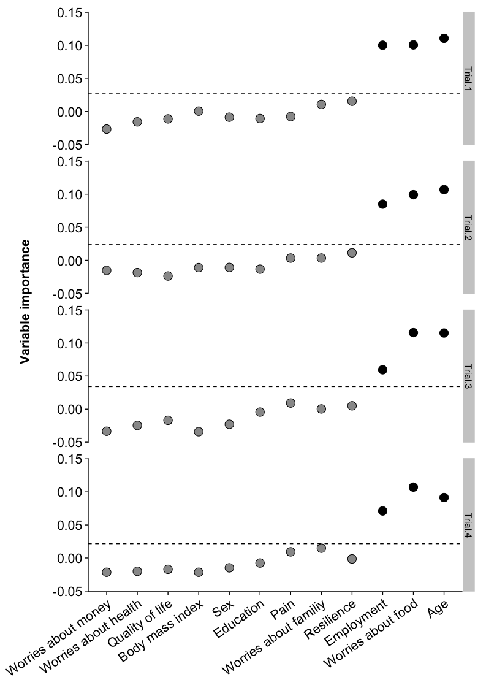
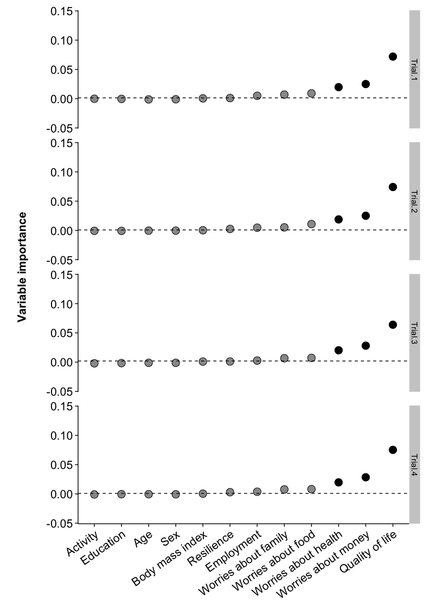

Load packages and set chunk options
-----------------------------------

Import data
-----------

``` r
# Read csv
data <- read_csv("./data/random.forest.csv")
# Remove patient ID column
data <- data[2:14]
```

Inspect and clean data
----------------------

    ## Source: local data frame [6 x 13]
    ## 
    ##   Median.Activity  Pain   Age Female Education   BMI Employment
    ##             (dbl) (int) (int)  (int)     (int) (dbl)      (int)
    ## 1               9     1    34      0         1  26.6          0
    ## 2               6     0    49      1         1  28.3          1
    ## 3               7     0    32      1         1  25.5          1
    ## 4               5     0    51      0         1  23.2          1
    ## 5               5     1    34      1         2  30.1          1
    ## 6               6     1    47      0         2  16.0          0
    ## Variables not shown: RS.Prop.Score (int), EQ5D.vas (int), Worry.Money
    ##   (int), Worry.Family (int), Worry.Food (int), Worry.Health (int)

    ## Source: local data frame [6 x 13]
    ## 
    ##   Median.Activity  Pain   Age Female Education   BMI Employment
    ##             (dbl) (int) (int)  (int)     (int) (dbl)      (int)
    ## 1               8     1    46      1         2  36.4          0
    ## 2               6     1    42      1         2  34.6          1
    ## 3               6     1    45      1         1  28.6          1
    ## 4               4     0    49      1         2  26.1          1
    ## 5               6     0    44      1         2  24.5          1
    ## 6               6     0    44      0         1    NA          1
    ## Variables not shown: RS.Prop.Score (int), EQ5D.vas (int), Worry.Money
    ##   (int), Worry.Family (int), Worry.Food (int), Worry.Health (int)

    ##  Median.Activity       Pain             Age            Female      
    ##  Min.   : 3.000   Min.   :0.0000   Min.   :18.00   Min.   :0.0000  
    ##  1st Qu.: 4.000   1st Qu.:0.0000   1st Qu.:35.00   1st Qu.:0.0000  
    ##  Median : 5.500   Median :1.0000   Median :41.00   Median :1.0000  
    ##  Mean   : 5.846   Mean   :0.5441   Mean   :41.28   Mean   :0.7059  
    ##  3rd Qu.: 7.000   3rd Qu.:1.0000   3rd Qu.:47.25   3rd Qu.:1.0000  
    ##  Max.   :12.000   Max.   :1.0000   Max.   :58.00   Max.   :1.0000  
    ##                                                                    
    ##    Education          BMI         Employment     RS.Prop.Score  
    ##  Min.   :0.000   Min.   :16.0   Min.   :0.0000   Min.   :107.0  
    ##  1st Qu.:1.000   1st Qu.:22.6   1st Qu.:0.0000   1st Qu.:143.0  
    ##  Median :1.500   Median :26.5   Median :1.0000   Median :155.5  
    ##  Mean   :1.545   Mean   :27.0   Mean   :0.5735   Mean   :152.5  
    ##  3rd Qu.:2.000   3rd Qu.:30.9   3rd Qu.:1.0000   3rd Qu.:163.0  
    ##  Max.   :3.000   Max.   :43.2   Max.   :1.0000   Max.   :173.0  
    ##  NA's   :2       NA's   :3                                      
    ##     EQ5D.vas       Worry.Money     Worry.Family     Worry.Food   
    ##  Min.   : 10.00   Min.   :0.000   Min.   :0.000   Min.   :0.000  
    ##  1st Qu.: 50.00   1st Qu.:3.000   1st Qu.:2.000   1st Qu.:0.000  
    ##  Median : 70.00   Median :4.000   Median :4.000   Median :2.000  
    ##  Mean   : 64.12   Mean   :3.397   Mean   :3.074   Mean   :2.147  
    ##  3rd Qu.: 80.00   3rd Qu.:4.000   3rd Qu.:4.000   3rd Qu.:4.000  
    ##  Max.   :100.00   Max.   :4.000   Max.   :4.000   Max.   :4.000  
    ##                                                                  
    ##   Worry.Health  
    ##  Min.   :0.000  
    ##  1st Qu.:2.000  
    ##  Median :2.000  
    ##  Mean   :2.294  
    ##  3rd Qu.:4.000  
    ##  Max.   :4.000  
    ## 

    ## Classes 'tbl_df' and 'data.frame':   68 obs. of  13 variables:
    ##  $ Median.Activity: num  9 6 7 5 5 6 4 4 3 4 ...
    ##  $ Pain           : int  1 0 0 0 1 1 0 0 0 0 ...
    ##  $ Age            : int  34 49 32 51 34 47 53 37 40 40 ...
    ##  $ Female         : int  0 1 1 0 1 0 1 1 1 1 ...
    ##  $ Education      : int  1 1 1 1 2 2 2 2 3 3 ...
    ##  $ BMI            : num  26.6 28.3 25.5 23.2 30.1 16 25 26.8 19.3 22.2 ...
    ##  $ Employment     : int  0 1 1 1 1 0 1 1 1 1 ...
    ##  $ RS.Prop.Score  : int  166 173 151 154 143 167 134 150 166 148 ...
    ##  $ EQ5D.vas       : int  60 100 70 95 70 50 90 60 100 70 ...
    ##  $ Worry.Money    : int  4 2 2 2 2 4 2 4 4 2 ...
    ##  $ Worry.Family   : int  4 4 0 3 3 4 4 0 2 3 ...
    ##  $ Worry.Food     : int  2 3 0 3 2 4 0 2 0 1 ...
    ##  $ Worry.Health   : int  2 2 0 0 3 4 0 3 2 3 ...

Clean
-----

``` r
# Convert data classes as required
data$Pain <- factor(data$Pain, levels = c(0, 1), labels = c("No", 
    "Yes"))
data$Female <- factor(data$Female, levels = c(0, 1), labels = c("Male", 
    "Female"))
data$Education <- factor(data$Education, levels = c(0, 1, 2, 3), labels = c("None", 
    "Primary", "Secondary", "Tertiary"))
data$Employment <- factor(data$Employment, levels = c(0, 1), labels = c("No", 
    "Yes"))
data$Worry.Money <- factor(data$Worry.Money, levels = c(0, 1, 2, 3, 
    4), labels = c("Not at all", "Rarely", "Sometimes", "Often", "Nearly all the time"), 
    ordered = T)
data$Worry.Family <- factor(data$Worry.Family, levels = c(0, 1, 2, 
    3, 4), labels = c("Not at all", "Rarely", "Sometimes", "Often", 
    "Nearly all the time"), ordered = T)
data$Worry.Food <- factor(data$Worry.Food, levels = c(0, 1, 2, 3, 
    4), labels = c("Not at all", "Rarely", "Sometimes", "Often", "Nearly all the time"), 
    ordered = T)
data$Worry.Health <- factor(data$Worry.Health, levels = c(0, 1, 2, 
    3, 4), labels = c("Not at all", "Rarely", "Sometimes", "Often", 
    "Nearly all the time"), ordered = T)

# Remove incomplete cases
data.2 <- data[complete.cases(data), ]

# dim data
dim(data)
```

    ## [1] 68 13

``` r
dim(data.2)
```

    ## [1] 63 13

Activity
--------

### Random Forest

<!-- -->

|                             | Trial 1 | Trial 2 | Trial 3 | Trial 4 |
|:----------------------------|:--------|:--------|:--------|:--------|
| Seed                        | 123     | 123     | 345     | 345     |
| Number of trees grown       | 500     | 2000    | 500     | 2000    |
| Number of variables sampled | 3       | 3       | 3       | 3       |

Pain
----

### Random Forest

    ## Source: local data frame [68 x 13]
    ## 
    ##    Median.Activity   Pain   Age Female Education   BMI Employment
    ##              (dbl) (fctr) (int) (fctr)    (fctr) (dbl)     (fctr)
    ## 1                9    Yes    34   Male   Primary  26.6         No
    ## 2                6     No    49 Female   Primary  28.3        Yes
    ## 3                7     No    32 Female   Primary  25.5        Yes
    ## 4                5     No    51   Male   Primary  23.2        Yes
    ## 5                5    Yes    34 Female Secondary  30.1        Yes
    ## 6                6    Yes    47   Male Secondary  16.0         No
    ## 7                4     No    53 Female Secondary  25.0        Yes
    ## 8                4     No    37 Female Secondary  26.8        Yes
    ## 9                3     No    40 Female  Tertiary  19.3        Yes
    ## 10               4     No    40 Female  Tertiary  22.2        Yes
    ## ..             ...    ...   ...    ...       ...   ...        ...
    ## Variables not shown: RS.Prop.Score (int), EQ5D.vas (int), Worry.Money
    ##   (fctr), Worry.Family (fctr), Worry.Food (fctr), Worry.Health (fctr)

<!-- -->

|                             | Trial 1 | Trial 2 | Trial 3 | Trial 4 |
|:----------------------------|:--------|:--------|:--------|:--------|
| Seed                        | 123     | 123     | 345     | 345     |
| Number of trees grown       | 500     | 2000    | 500     | 2000    |
| Number of variables sampled | 3       | 3       | 3       | 3       |
