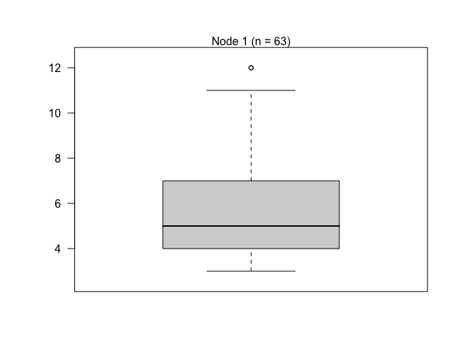
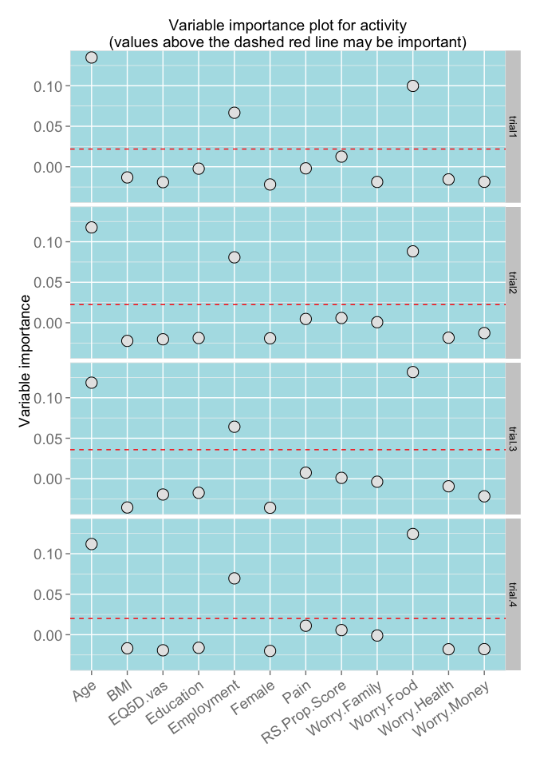
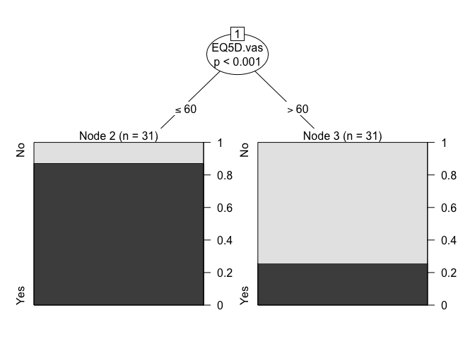
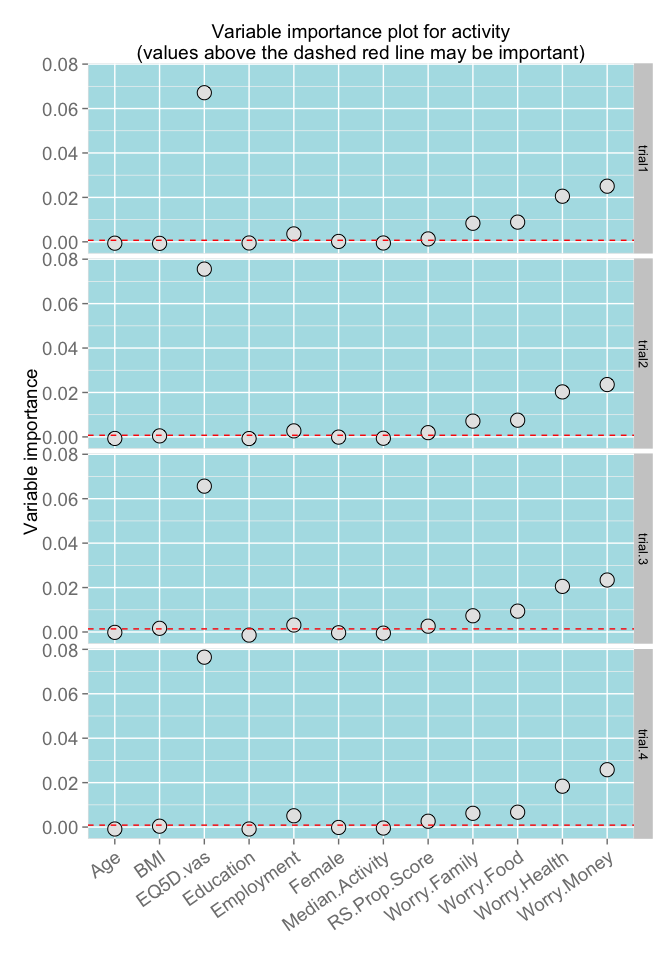

# Regression tree analysis
Antonia Wadley, Duncan Mitchell, Peter Kamerman  
`r format(Sys.time(), "%d %B %Y")`  
# Overview

# Data analysis
## Miscellaneous


### R version used
- R version 3.1.2 (2014-10-31) -- "Pumpkin Helmet" [@R_Core_Team_2015]

### Packages used
- library(*pander*) [@Dar'oczi_2015]
- library(*knitr*) [@Xie_2015; @Xie_2015a; @Xie_2014]
- library(*knitcitations*) [@Boettiger_2015]
- library(*dplyr*) [@Wickham_2015]  
- library(*tidyr*) [@Wickham_2015a]
- library(*ggplot2*) [@Wickham_2009]
- library(*ggthemes*) [@Arnold_2015]
- library(*grid*) [@R_Core_Team_2015]
- library(*scales*) [@Wickham_2015ab]
- library(*party*) [@Hothorn_2006; @Zeileis_2008; @Hothorn_2006a; @Strobl_2007; @Strobl_2008]


## Import data

```r
# Read csv
data <- read.csv("MultivariateData291015.csv", header = T)
# Remove patient ID column
data <- data[2:14]
```

## Inspect and clean data

```r
# Convert to dplyr object
data.2 <- tbl_df(data)
# Inspect the data
str(data.2)
```

```
## Classes 'tbl_df', 'tbl' and 'data.frame':	68 obs. of  13 variables:
##  $ Median.Activity: num  9 6 7 5 5 6 4 4 3 4 ...
##  $ Pain           : int  1 0 0 0 1 1 0 0 0 0 ...
##  $ Age            : int  34 49 32 51 34 47 53 37 40 40 ...
##  $ Female         : int  0 1 1 0 1 0 1 1 1 1 ...
##  $ Education      : int  1 1 1 1 2 2 2 2 3 3 ...
##  $ BMI            : num  26.6 28.3 25.5 23.2 30.1 16 25 26.8 19.3 22.2 ...
##  $ Employment     : int  0 1 1 1 1 0 1 1 1 1 ...
##  $ RS.Prop.Score  : int  166 173 151 154 143 167 134 150 166 148 ...
##  $ EQ5D.vas       : int  60 100 70 95 70 50 90 60 100 70 ...
##  $ Worry.Money    : int  4 2 2 2 2 4 2 4 4 2 ...
##  $ Worry.Family   : int  4 4 0 3 3 4 4 0 2 3 ...
##  $ Worry.Food     : int  2 3 0 3 2 4 0 2 0 1 ...
##  $ Worry.Health   : int  2 2 0 0 3 4 0 3 2 3 ...
```

```r
# Convert data classes as nessesary
data.2$Pain <- factor(data.2$Pain, levels = c(0, 1), labels = c("No", "Yes"))
data.2$Female <- factor(data.2$Female, levels = c(0, 1), labels = c("Male", 
    "Female"))
data.2$Education <- factor(data.2$Education, levels = c(0, 1, 2, 3), labels = c("None", 
    "Primary", "Secondary", "Tertiary"))
data.2$Employment <- factor(data.2$Employment, levels = c(0, 1), labels = c("No", 
    "Yes"))
data.2$Worry.Money <- factor(data.2$Worry.Money, levels = c(0, 1, 2, 3, 4), 
    labels = c("Not at all", "Rarely", "Sometimes", "Often", "Nearly all the time"), 
    ordered = T)
data.2$Worry.Family <- factor(data.2$Worry.Family, levels = c(0, 1, 2, 3, 4), 
    labels = c("Not at all", "Rarely", "Sometimes", "Often", "Nearly all the time"), 
    ordered = T)
data.2$Worry.Food <- factor(data.2$Worry.Food, levels = c(0, 1, 2, 3, 4), labels = c("Not at all", 
    "Rarely", "Sometimes", "Often", "Nearly all the time"), ordered = T)
data.2$Worry.Health <- factor(data.2$Worry.Health, levels = c(0, 1, 2, 3, 4), 
    labels = c("Not at all", "Rarely", "Sometimes", "Often", "Nearly all the time"), 
    ordered = T)
# Inspect the data
str(data.2)
```

```
## Classes 'tbl_df', 'tbl' and 'data.frame':	68 obs. of  13 variables:
##  $ Median.Activity: num  9 6 7 5 5 6 4 4 3 4 ...
##  $ Pain           : Factor w/ 2 levels "No","Yes": 2 1 1 1 2 2 1 1 1 1 ...
##  $ Age            : int  34 49 32 51 34 47 53 37 40 40 ...
##  $ Female         : Factor w/ 2 levels "Male","Female": 1 2 2 1 2 1 2 2 2 2 ...
##  $ Education      : Factor w/ 4 levels "None","Primary",..: 2 2 2 2 3 3 3 3 4 4 ...
##  $ BMI            : num  26.6 28.3 25.5 23.2 30.1 16 25 26.8 19.3 22.2 ...
##  $ Employment     : Factor w/ 2 levels "No","Yes": 1 2 2 2 2 1 2 2 2 2 ...
##  $ RS.Prop.Score  : int  166 173 151 154 143 167 134 150 166 148 ...
##  $ EQ5D.vas       : int  60 100 70 95 70 50 90 60 100 70 ...
##  $ Worry.Money    : Ord.factor w/ 5 levels "Not at all"<"Rarely"<..: 5 3 3 3 3 5 3 5 5 3 ...
##  $ Worry.Family   : Ord.factor w/ 5 levels "Not at all"<"Rarely"<..: 5 5 1 4 4 5 5 1 3 4 ...
##  $ Worry.Food     : Ord.factor w/ 5 levels "Not at all"<"Rarely"<..: 3 4 1 4 3 5 1 3 1 2 ...
##  $ Worry.Health   : Ord.factor w/ 5 levels "Not at all"<"Rarely"<..: 3 3 1 1 4 5 1 4 3 4 ...
```

```r
# Remove incomplete cases
data.3 <- data.2[complete.cases(data.2), ]
# dim data
dim(data.3)
```

```
## [1] 63 13
```

## Activity
### Regression tree

```r
active.tree <- ctree(Median.Activity ~ ., data = data.3, controls = ctree_control(testtype = "Bonferroni", 
    maxsurrogate = 3))
plot(active.tree, drop_terminal = T)
```

 

### Random Forest

```r
# Trial 1 (ntree=500, mtry=3, seed=seed.12) Set seed
seed.12 <- sample(1:10000, 1)
seed.12
```

[1] 5787

```r
set.seed(seed.12)
## Set parameters (ntree=500, mtry=3) 'mtry' estimated to be sqrt of
## variables
active.controls.1 <- cforest_unbiased(ntree = 500, mtry = 3)
## Forest
active.forest.1 <- cforest(Median.Activity ~ ., data = data.3, controls = active.controls.1)
## Extract variable importance
active.varimp.1 <- varimp(active.forest.1, conditional = TRUE)
active.trial.1 <- active.varimp.1

# Trial 2 (ntree=2000, mtry=3, seed=seed.12)
set.seed(seed.12)
## Set parameters (ntree=2000, mtry=3) 'mtry' estimated to be sqrt of
## variables
active.controls.2 <- cforest_unbiased(ntree = 2000, mtry = 3)
## Forest
active.forest.2 <- cforest(Median.Activity ~ ., data = data.3, controls = active.controls.2)
## Extract variable importance
active.varimp.2 <- varimp(active.forest.2, conditional = TRUE)
active.trial.2 <- active.varimp.2

# Trial 3 (ntree=500, mtry=3, seed=seed.34) Set seed
seed.34 <- sample(1:10000, 1)
seed.34
```

[1] 4675

```r
set.seed(seed.34)
## Set parameters (ntree=500, mtry=3) 'mtry' estimated to be sqrt of
## variables
active.controls.3 <- cforest_unbiased(ntree = 500, mtry = 3)
## Forest
active.forest.3 <- cforest(Median.Activity ~ ., data = data.3, controls = active.controls.3)
## Extract variable importance
active.varimp.3 <- varimp(active.forest.3, conditional = TRUE)
active.trial.3 <- active.varimp.3

# Trial 4 (ntree=2000, mtry=3, seed=seed.34)
set.seed(seed.34)
## Set parameters (ntree=2000, mtry=3) 'mtry' estimated to be sqrt of
## variables
active.controls.4 <- cforest_unbiased(ntree = 2000, mtry = 3)
## Forest
active.forest.4 <- cforest(Median.Activity ~ ., data = data.3, controls = active.controls.4)
## Extract variable importance
active.varimp.4 <- varimp(active.forest.4, conditional = TRUE)
active.trial.4 <- active.varimp.4

## make a dataframe (active.df) of variable importance models
active.df <- data.frame(ID = names(active.trial.1), trial1 = active.trial.1, 
    trial2 = active.trial.2, trial.3 = active.trial.3, trial.4 = active.trial.4)
write.csv(active.df, "active.varimp.csv", row.names = F)

## make a dataframe (active.df2) of control parameters
active.df2 <- data.frame(ID = c("Seed", "ntree", "mtry"), trial1 = c(seed.12, 
    500, 3), trial2 = c(seed.12, 2000, 3), trial3 = c(seed.34, 500, 3), trial4 = c(seed.34, 
    2000, 3))
write.csv(active.df2, "active.control.csv", row.names = F)

# Plot data
active.plot <- tbl_df(active.df)
active.plot <- melt(active.plot)
# create df with data to plot abs(min(variable_importance))
MinVarImp <- active.plot %>% group_by(variable) %>% summarise(minimum = abs(min(value)))
# ggplot
gg.active <- ggplot(data = active.plot, aes(x = ID, y = value)) + geom_point(shape = 21, 
    size = 5, colour = "black", fill = "gray90") + facet_grid(variable ~ .) + 
    geom_hline(data = MinVarImp, aes(yintercept = minimum), linetype = 2, colour = "red") + 
    labs(y = "Variable importance", title = "Variable importance plot for activity\n(values above the dashed red line may be important)") + 
    scale_x_discrete() + theme(plot.margin = unit(c(1, 1, 1, 1), "lines"), axis.title.x = element_blank(), 
    axis.text.x = element_text(angle = 35, hjust = 1, size = 14), axis.text.y = element_text(size = 14), 
    axis.title.y = element_text(size = 14), panel.background = element_rect(colour = "gray90", 
        fill = "#b0e0e6"))
gg.active
```

 

```r
# Report random forest settings for each plot
c("Seed", "Number of trees grown", "Number of variables sampled") %>% data.frame(Variable = .) %>% 
    tbl_df() %>% bind_cols(., active.df2) %>% select(Variable, trial1, trial2, 
    trial3, trial4) %>% kable(., format = "markdown", align = "l", caption = "Random forest condition settings", 
    col.names = c("", "Trial 1", "Trial 2", "Trial 3", "Trial 4"))
```


|                            |Trial 1 |Trial 2 |Trial 3 |Trial 4 |
|:---------------------------|:-------|:-------|:-------|:-------|
|Seed                        |5787    |5787    |4675    |4675    |
|Number of trees grown       |500     |2000    |500     |2000    |
|Number of variables sampled |3       |3       |3       |3       |

## Pain
### Regression tree

```r
pain.tree <- ctree(Pain ~ ., data = data.3, controls = ctree_control(testtype = "Bonferroni", 
    maxsurrogate = 3))
plot(pain.tree, drop_terminal = T)
```

 

### Random Forest

```r
# Trial 1 (ntree=500, mtry=3, seed=seed.12) Set seed
seed.12 <- sample(1:10000, 1)
seed.12
```

[1] 3795

```r
set.seed(seed.12)
## Set parameters (ntree=500, mtry=3) 'mtry' estimated to be sqrt of
## variables
pain.controls.1 <- cforest_unbiased(ntree = 500, mtry = 3)
## Forest
pain.forest.1 <- cforest(Pain ~ ., data = data.3, controls = pain.controls.1)
## Extract variable importance
pain.varimp.1 <- varimp(pain.forest.1, conditional = TRUE)
pain.trial.1 <- pain.varimp.1

# Trial 2 (ntree=2000, mtry=3, seed=seed.12)
set.seed(seed.12)
## Set parameters (ntree=2000, mtry=3) 'mtry' estimated to be sqrt of
## variables
pain.controls.2 <- cforest_unbiased(ntree = 2000, mtry = 3)
## Forest
pain.forest.2 <- cforest(Pain ~ ., data = data.3, controls = pain.controls.2)
## Extract variable importance
pain.varimp.2 <- varimp(pain.forest.2, conditional = TRUE)
pain.trial.2 <- pain.varimp.2

# Trial 3 (ntree=500, mtry=3, seed=seed.34) Set seed
seed.34 <- sample(1:10000, 1)
seed.34
```

[1] 9292

```r
set.seed(seed.34)
## Set parameters (ntree=500, mtry=3) 'mtry' estimated to be sqrt of
## variables
pain.controls.3 <- cforest_unbiased(ntree = 500, mtry = 3)
## Forest
pain.forest.3 <- cforest(Pain ~ ., data = data.3, controls = pain.controls.3)
## Extract variable importance
pain.varimp.3 <- varimp(pain.forest.3, conditional = TRUE)
pain.trial.3 <- pain.varimp.3

# Trial 4 (ntree=2000, mtry=3, seed=seed.34)
set.seed(seed.34)
## Set parameters (ntree=2000, mtry=3) 'mtry' estimated to be sqrt of
## variables
pain.controls.4 <- cforest_unbiased(ntree = 2000, mtry = 3)
## Forest
pain.forest.4 <- cforest(Pain ~ ., data = data.3, controls = pain.controls.4)
## Extract variable importance
pain.varimp.4 <- varimp(pain.forest.4, conditional = TRUE)
pain.trial.4 <- pain.varimp.4

## make a dataframe (active.df) of variable importance models
pain.df <- data.frame(names = names(pain.trial.1), trial1 = pain.trial.1, trial2 = pain.trial.2, 
    trial.3 = pain.trial.3, trial.4 = pain.trial.4)
write.csv(pain.df, "pain.varimp.csv", row.names = F)

## make a dataframe (pain.df2) of control parameters
pain.df2 <- data.frame(ID = c("Seed", "ntree", "mtry"), trial1 = c(seed.12, 
    500, 3), trial2 = c(seed.12, 2000, 3), trial3 = c(seed.34, 500, 3), trial4 = c(seed.34, 
    2000, 3))
write.csv(pain.df2, "pain.control.csv", row.names = F)

# Plot data
pain.plot <- tbl_df(pain.df)
pain.plot <- melt(pain.plot)
# create df with data to plot abs(min(variable_importance))
MinVarImp.pain <- pain.plot %>% group_by(variable) %>% summarise(minimum = abs(min(value)))
# ggplot
gg.active <- ggplot(data = pain.plot, aes(x = names, y = value)) + geom_point(shape = 21, 
    size = 5, colour = "black", fill = "gray90") + facet_grid(variable ~ .) + 
    geom_hline(data = MinVarImp.pain, aes(yintercept = minimum), linetype = 2, 
        colour = "red") + labs(y = "Variable importance", title = "Variable importance plot for activity\n(values above the dashed red line may be important)") + 
    scale_x_discrete() + theme(plot.margin = unit(c(1, 1, 1, 1), "lines"), axis.title.x = element_blank(), 
    axis.text.x = element_text(angle = 35, hjust = 1, size = 14), axis.text.y = element_text(size = 14), 
    axis.title.y = element_text(size = 14), panel.background = element_rect(colour = "gray90", 
        fill = "#b0e0e6"))
gg.active
```

 

```r
# Report random forest settings for each plot
c("Seed", "Number of trees grown", "Number of variables sampled") %>% data.frame(Variable = .) %>% 
    tbl_df() %>% bind_cols(., pain.df2) %>% select(Variable, trial1, trial2, 
    trial3, trial4) %>% kable(., format = "markdown", align = "l", caption = "Random forest condition settings", 
    col.names = c("", "Trial 1", "Trial 2", "Trial 3", "Trial 4"))
```


|                            |Trial 1 |Trial 2 |Trial 3 |Trial 4 |
|:---------------------------|:-------|:-------|:-------|:-------|
|Seed                        |3795    |3795    |9292    |9292    |
|Number of trees grown       |500     |2000    |500     |2000    |
|Number of variables sampled |3       |3       |3       |3       |

# References

