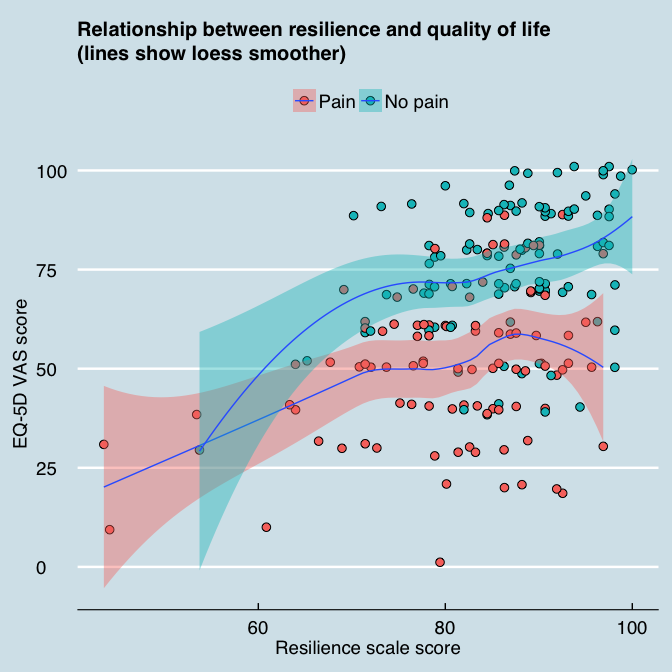

# Correlation between resilience and quality of life
Peter Kamerman  
`r format(Sys.time(), "%d %B %Y")`  
``

# Overview

# Data analysis
## Miscellaneous


### R version used
- R version 3.1.2 (2014-10-31) -- "Pumpkin Helmet" [@R_Core_Team_2015]

### Packages used
- library(*pander*) [@Dar'oczi_2015]
- library(*knitr*) [@Xie_2015; @Xie_2015a; @Xie_2014]
- library(*knitcitations*) [@Boettiger_2015]
- library(*readxl*) [@Wickham_2015]
- library(*dplyr*) [@Wickham_2015a]  
- library(*tidyr*) [@Wickham_2014]
- library(*ggplot2*) [@Wickham_2009]
- library(*ggthemes*) [@Arnold_2015]
- library(*grid*) [@R_Core_Team_2015]
- library(*scales*) [@Wickham_2015ab]
- library(*coin*) [@Hothorn_2006; @Hothorn_2008]


## Import data

```r
# Read csv
data <- read_excel("data.xlsx", sheet = 1, col_names = T)
```

## Inspect and clean data

```r
# Inspect the data
str(data)
```

```
## Classes 'tbl_df', 'tbl' and 'data.frame':	197 obs. of  3 variables:
##  $ PainState: chr  "Pain" "Pain" "Pain" "Pain" ...
##  $ eq5d     : num  90 60 90 50 80 30 20 40 60 100 ...
##  $ RSS      : num  86.3 71.4 92.5 77.6 96.9 ...
```

```r
# Convert data classes as nessesary
data$PainState <- factor(data$PainState, levels = c("Pain", "No pain"))
# Inspect the data
str(data)
```

```
## Classes 'tbl_df', 'tbl' and 'data.frame':	197 obs. of  3 variables:
##  $ PainState: Factor w/ 2 levels "Pain","No pain": 1 1 1 1 1 1 1 1 1 2 ...
##  $ eq5d     : num  90 60 90 50 80 30 20 40 60 100 ...
##  $ RSS      : num  86.3 71.4 92.5 77.6 96.9 ...
```

```r
pander(summary(data), justify = "left", style = "rmarkdown")
```


| PainState   | eq5d           | RSS            |
|:------------|:---------------|:---------------|
| Pain   :98  | Min.   :  0.00 | Min.   : 43.48 |
| No pain:99  | 1st Qu.: 50.00 | 1st Qu.: 78.86 |
| NA          | Median : 70.00 | Median : 85.71 |
| NA          | Mean   : 63.91 | Mean   : 84.07 |
| NA          | 3rd Qu.: 80.00 | 3rd Qu.: 90.68 |
| NA          | Max.   :100.00 | Max.   :100.00 |

## Plot

```r
# All data
gg.all <- ggplot(data = data, aes(x = RSS, y = eq5d, fill = PainState)) + geom_jitter(shape = 21, 
    size = 3, colour = "black") + geom_smooth() + labs(x = "Resilience scale score", 
    y = "EQ-5D VAS score", title = "Relationship between resilience and quality of life\n(lines show loess smoother)") + 
    theme_economist() + theme(axis.text = element_text(size = 14), axis.title.y = element_text(size = 14, 
    vjust = 1), axis.title.x = element_text(size = 14, vjust = 0.3), legend.text = element_text(size = 14), 
    legend.title = element_blank())
gg.all
```



## Spearman's correlation
### All data

```r
corr.all <- spearman_test(eq5d ~ RSS, data = data)
corr.all
```

```
## 
## 	Asymptotic Spearman Correlation Test
## 
## data:  eq5d by RSS
## Z = 5.3431, p-value = 9.138e-08
## alternative hypothesis: true rho is not equal to 0
```

### Stratified by pain state

```r
corr.pain <- spearman_test(eq5d ~ RSS | PainState, data = data)
corr.pain
```

```
## 
## 	Asymptotic Spearman Correlation Test
## 
## data:  eq5d by RSS 
## 	 stratified by PainState
## Z = 3.6135, p-value = 0.0003021
## alternative hypothesis: true rho is not equal to 0
```

## References
