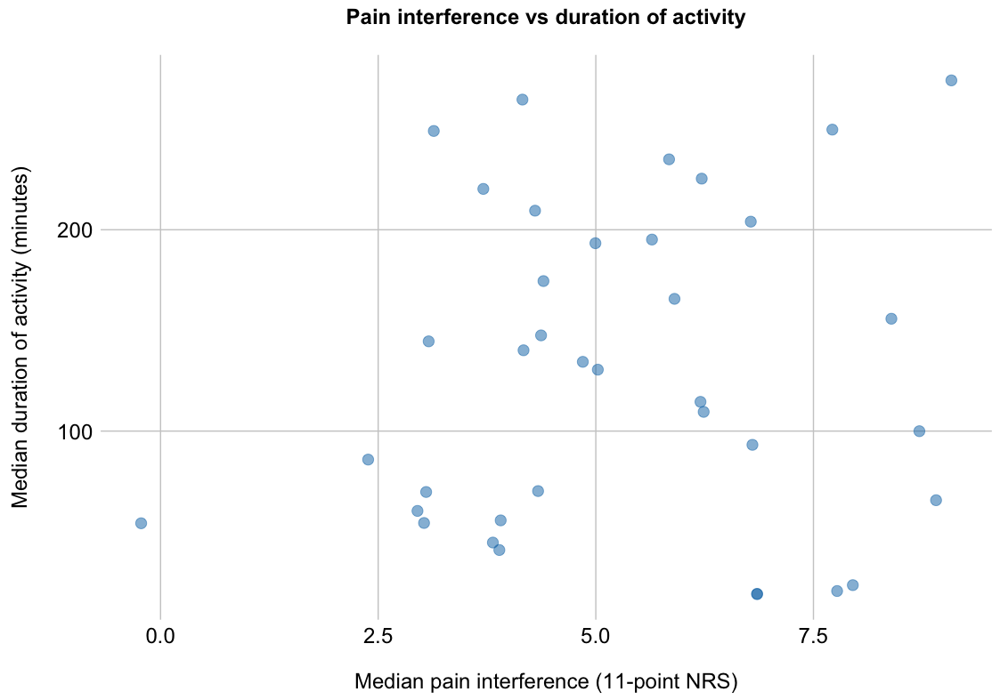
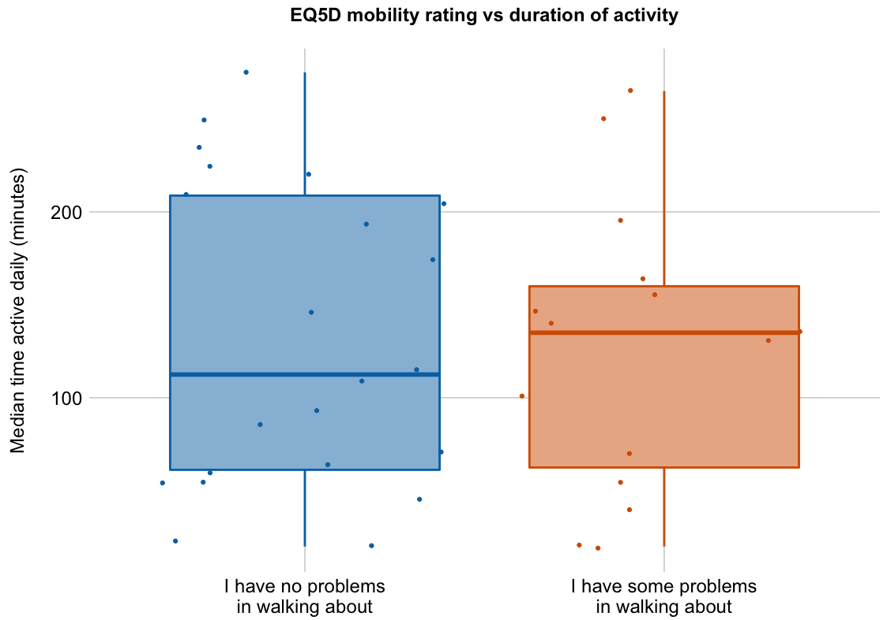
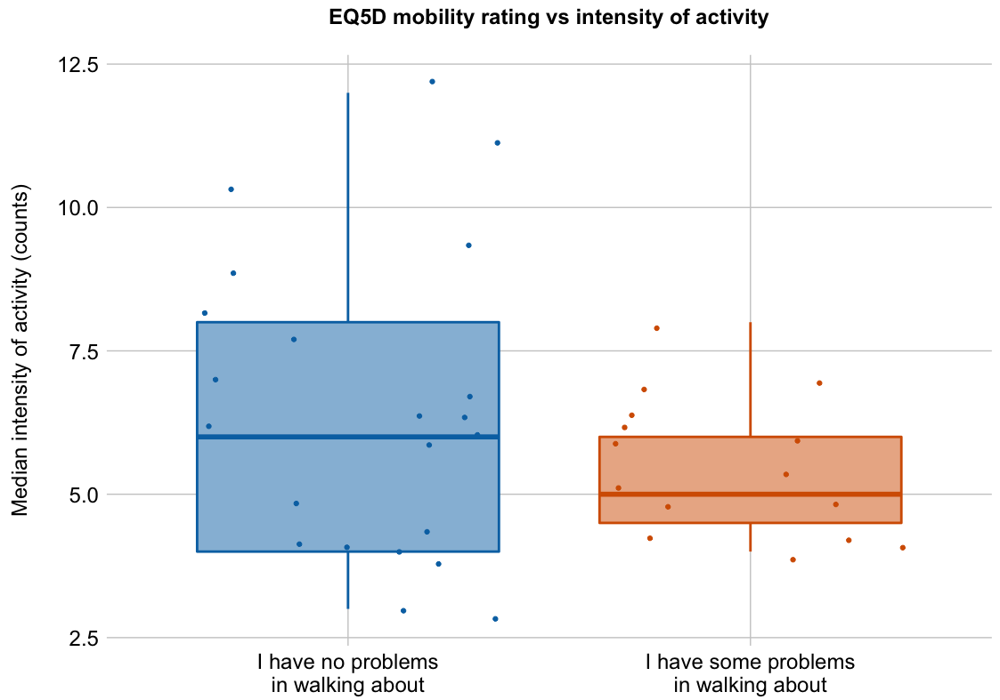

Load required packages and set chunk options
--------------------------------------------

``` r
# Load packages
library(knitr)
library(readr)
library(dplyr)
```

    ## 
    ## Attaching package: 'dplyr'

    ## The following objects are masked from 'package:stats':
    ## 
    ##     filter, lag

    ## The following objects are masked from 'package:base':
    ## 
    ##     intersect, setdiff, setequal, union

``` r
library(tidyr)
library(coin)
```

    ## Loading required package: survival

``` r
library(ggplot2)
library(scales)
```

    ## 
    ## Attaching package: 'scales'

    ## The following objects are masked from 'package:readr':
    ## 
    ##     col_factor, col_numeric

``` r
library(grid)
library(cowplot)
```

    ## 
    ## Attaching package: 'cowplot'

    ## The following object is masked from 'package:ggplot2':
    ## 
    ##     ggsave

``` r
# Load palette
cb8.categorical <- c("#0072B2", "#D55E00", "#009E73", "#F0E442", "#56B4E9", "#E69F00", "#CC79A7", "#999999")


# knitr chunk options
opts_chunk$set(echo = FALSE,
               warning = FALSE,
               message = FALSE,
               fig.path = './figures/',
               fig.width = 11.7,
               fig.height = 8.2,
               dev = c('png', 'pdf'),
               tidy = FALSE, 
               tidy.opts = list(width.cutoff = 65))
```

Process data
------------

### Import

### Quick look

    ## Source: local data frame [6 x 6]
    ## 
    ##      ID  Pain bpi_interference Median_activity_duration Median_activity
    ##   (int) (chr)            (int)                    (dbl)           (int)
    ## 1     9  Pain                6                    235.0               9
    ## 2    21  Pain                4                    140.0               5
    ## 3    23  Pain                8                    250.0               6
    ## 4    40  Pain                7                     92.5              12
    ## 5    67  Pain                3                     70.0               6
    ## 6    69  Pain                4                    147.5               4
    ## Variables not shown: eq5d_mobility (chr)

    ## Source: local data frame [6 x 6]
    ## 
    ##      ID  Pain bpi_interference Median_activity_duration Median_activity
    ##   (int) (chr)            (int)                    (dbl)           (int)
    ## 1   161  Pain                4                       40               7
    ## 2   163  Pain                6                      195               4
    ## 3   164  Pain                8                       20               3
    ## 4   165  Pain                6                      110               8
    ## 5   167  Pain                4                      175               6
    ## 6   168  Pain                5                      135               6
    ## Variables not shown: eq5d_mobility (chr)

    ## Observations: 37
    ## Variables: 6
    ## $ ID                       (int) 9, 21, 23, 40, 67, 69, 71, 72, 73, 74...
    ## $ Pain                     (chr) "Pain", "Pain", "Pain", "Pain", "Pain...
    ## $ bpi_interference         (int) 6, 4, 8, 7, 3, 4, 5, 8, 3, 4, 3, 2, 4...
    ## $ Median_activity_duration (dbl) 235.0, 140.0, 250.0, 92.5, 70.0, 147....
    ## $ Median_activity          (int) 9, 5, 6, 12, 6, 4, 5, 6, 4, 3, 4, 4, ...
    ## $ eq5d_mobility            (chr) "I have no problems in walking about"...

### Clean

Analyses
--------

### Correlation between BPI interference and duration of activity

**(median daily duration of activity over the past week)** <!-- -->

    ## 
    ##  Asymptotic Spearman Correlation Test
    ## 
    ## data:  bpi_interference by Median_activity_duration
    ## Z = 0.30772, p-value = 0.7583
    ## alternative hypothesis: true rho is not equal to 0

### EQ5D mobility rating vs duration of activity

**(median duration of activity over the past week)** <!-- -->

    ## 
    ##  Asymptotic Wilcoxon-Mann-Whitney Test
    ## 
    ## data:  Median_activity_duration by
    ##   eq5d_mobility (I have no problems in walking about, I have some problems in walking about)
    ## Z = 0.27857, p-value = 0.7806
    ## alternative hypothesis: true mu is not equal to 0

### EQ5D mobility rating vs intensity of activity

**(median intenisty of activity over the past week)** <!-- -->

    ## 
    ##  Asymptotic Wilcoxon-Mann-Whitney Test
    ## 
    ## data:  Median_activity by
    ##   eq5d_mobility (I have no problems in walking about, I have some problems in walking about)
    ## Z = 0.97505, p-value = 0.3295
    ## alternative hypothesis: true mu is not equal to 0

Session information
-------------------

    ## R version 3.2.3 (2015-12-10)
    ## Platform: x86_64-apple-darwin13.4.0 (64-bit)
    ## Running under: OS X 10.11.3 (El Capitan)
    ## 
    ## locale:
    ## [1] en_GB.UTF-8/en_GB.UTF-8/en_GB.UTF-8/C/en_GB.UTF-8/en_GB.UTF-8
    ## 
    ## attached base packages:
    ## [1] grid      stats     graphics  grDevices utils     datasets  methods  
    ## [8] base     
    ## 
    ## other attached packages:
    ## [1] cowplot_0.6.0   scales_0.4.0    ggplot2_2.1.0   coin_1.1-2     
    ## [5] survival_2.38-3 tidyr_0.4.1     dplyr_0.4.3     readr_0.2.2    
    ## [9] knitr_1.12.3   
    ## 
    ## loaded via a namespace (and not attached):
    ##  [1] Rcpp_0.12.3       formatR_1.2.1     plyr_1.8.3       
    ##  [4] tools_3.2.3       digest_0.6.9      evaluate_0.8     
    ##  [7] gtable_0.2.0      lattice_0.20-33   DBI_0.3.1        
    ## [10] yaml_2.1.13       parallel_3.2.3    mvtnorm_1.0-5    
    ## [13] stringr_1.0.0     stats4_3.2.3      R6_2.1.2         
    ## [16] rmarkdown_0.9.5   multcomp_1.4-4    TH.data_1.0-7    
    ## [19] magrittr_1.5      codetools_0.2-14  htmltools_0.3    
    ## [22] modeltools_0.2-21 splines_3.2.3     MASS_7.3-45      
    ## [25] assertthat_0.1    colorspace_1.2-6  labeling_0.3     
    ## [28] sandwich_2.3-4    stringi_1.0-1     lazyeval_0.1.10  
    ## [31] munsell_0.4.3     zoo_1.7-12
