Load required packages and set chunk options
--------------------------------------------

``` r
# Load packages
library(knitr)
library(readr)
library(dplyr)
```

    ## 
    ## Attaching package: 'dplyr'

    ## The following objects are masked from 'package:stats':
    ## 
    ##     filter, lag

    ## The following objects are masked from 'package:base':
    ## 
    ##     intersect, setdiff, setequal, union

``` r
library(tidyr)
library(ggplot2)
library(scales)
```

    ## 
    ## Attaching package: 'scales'

    ## The following objects are masked from 'package:readr':
    ## 
    ##     col_factor, col_numeric

``` r
library(grid)
library(cowplot)
```

    ## 
    ## Attaching package: 'cowplot'

    ## The following object is masked from 'package:ggplot2':
    ## 
    ##     ggsave

``` r
# Load palette
cb8.categorical <- c("#0072B2", "#D55E00", "#009E73", "#F0E442", "#56B4E9", "#E69F00", "#CC79A7", "#999999")

# knitr chunk options
opts_chunk$set(echo = FALSE,
               warning = FALSE,
               message = FALSE,
               fig.path = './figures/',
               fig.width = 11.7,
               fig.height = 8.2,
               dev = c('png', 'pdf'),
               tidy = FALSE, 
               tidy.opts = list(width.cutoff = 65))
```

Resilience vs activity dot-plots
--------------------------------

***68 participants, 37 with pain and 31 without pain*** \#\#\# Import data

### Quick look

    ## Source: local data frame [6 x 9]
    ## 
    ##      ID    Pain Median_activity RS_corrected Minutes_at_0_activity
    ##   (int)   (chr)           (dbl)        (int)                 (dbl)
    ## 1     9    pain               9          166               1145.86
    ## 2    10 no.pain               6          173               1038.71
    ## 3    11 no.pain               7          151               1002.14
    ## 4    13 no.pain               5          154               1064.71
    ## 5    21    pain               5          143               1075.86
    ## 6    23    pain               6          167               1064.71
    ## Variables not shown: Minutes_at_q1 (dbl), Minutes_at_q2 (dbl),
    ##   Minutes_at_q3 (dbl), Minutes_at_q4 (dbl)

    ## Source: local data frame [6 x 9]
    ## 
    ##      ID    Pain Median_activity RS_corrected Minutes_at_0_activity
    ##   (int)   (chr)           (dbl)        (int)                 (dbl)
    ## 1   165    pain               8          156               1051.57
    ## 2   167    pain               6          159                981.43
    ## 3   168    pain               6          159                911.29
    ## 4   172 no.pain               4          145                999.14
    ## 5   174 no.pain               6          151               1048.43
    ## 6   176 no.pain               6          137               1167.60
    ## Variables not shown: Minutes_at_q1 (dbl), Minutes_at_q2 (dbl),
    ##   Minutes_at_q3 (dbl), Minutes_at_q4 (dbl)

    ## Observations: 68
    ## Variables: 9
    ## $ ID                    (int) 9, 10, 11, 13, 21, 23, 24, 28, 32, 33, 3...
    ## $ Pain                  (chr) "pain", "no.pain", "no.pain", "no.pain",...
    ## $ Median_activity       (dbl) 9, 6, 7, 5, 5, 6, 4, 4, 3, 4, 10, 5, 12,...
    ## $ RS_corrected          (int) 166, 173, 151, 154, 143, 167, 134, 150, ...
    ## $ Minutes_at_0_activity (dbl) 1145.86, 1038.71, 1002.14, 1064.71, 1075...
    ## $ Minutes_at_q1         (dbl) 276.57, 361.57, 381.14, 365.29, 323.14, ...
    ## $ Minutes_at_q2         (dbl) 16.43, 16.14, 44.57, 8.71, 26.29, 11.71,...
    ## $ Minutes_at_q3         (dbl) 1.00, 16.00, 10.71, 0.86, 13.57, 0.43, 3...
    ## $ Minutes_at_q4         (dbl) 0.14, 7.57, 1.43, 0.43, 1.14, 0.71, 0.29...

    ## Observations: 68
    ## Variables: 8
    ## $ activity (dbl) 9, 6, 7, 5, 5, 6, 4, 4, 3, 4, 10, 5, 12, 4, 8, 5, 5, ...
    ## $ rs.score (int) 166, 173, 151, 154, 143, 167, 134, 150, 166, 148, 172...
    ## $ zero     (dbl) 1145.86, 1038.71, 1002.14, 1064.71, 1075.86, 1064.71,...
    ## $ q1       (dbl) 276.57, 361.57, 381.14, 365.29, 323.14, 362.43, 394.1...
    ## $ q2       (dbl) 16.43, 16.14, 44.57, 8.71, 26.29, 11.71, 25.14, 20.14...
    ## $ q3       (dbl) 1.00, 16.00, 10.71, 0.86, 13.57, 0.43, 3.14, 4.29, 2....
    ## $ q4       (dbl) 0.14, 7.57, 1.43, 0.43, 1.14, 0.71, 0.29, 0.86, 0.86,...
    ## $ pain     (fctr) Pain, No pain, No pain, No pain, Pain, Pain, No pain...

Create resilience plots
-----------------------

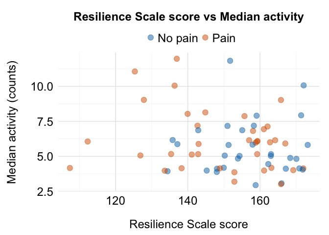<!-- -->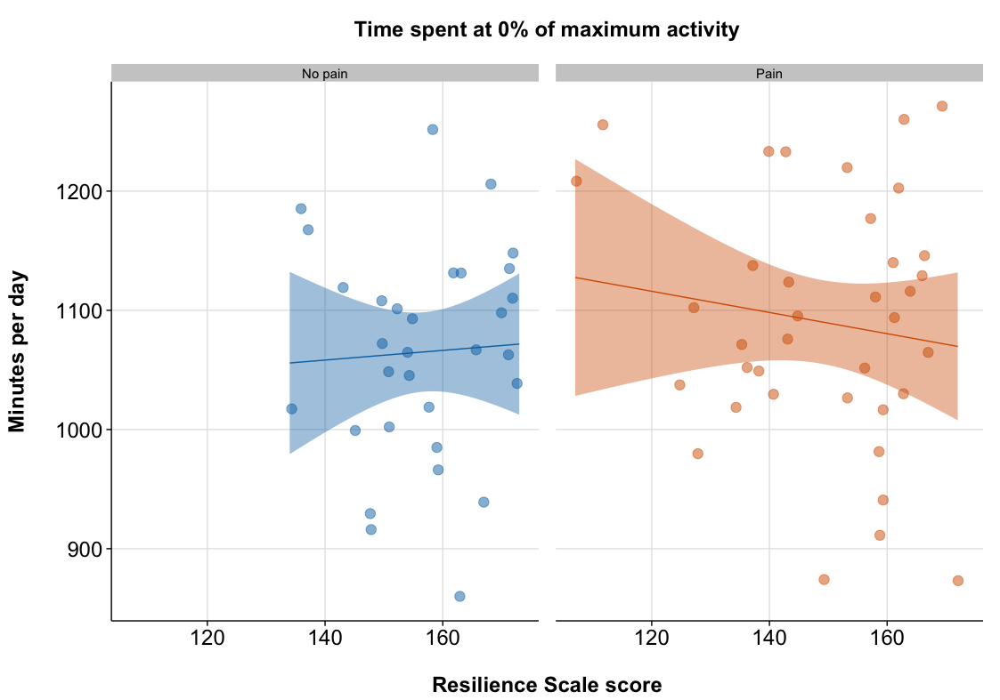<!-- -->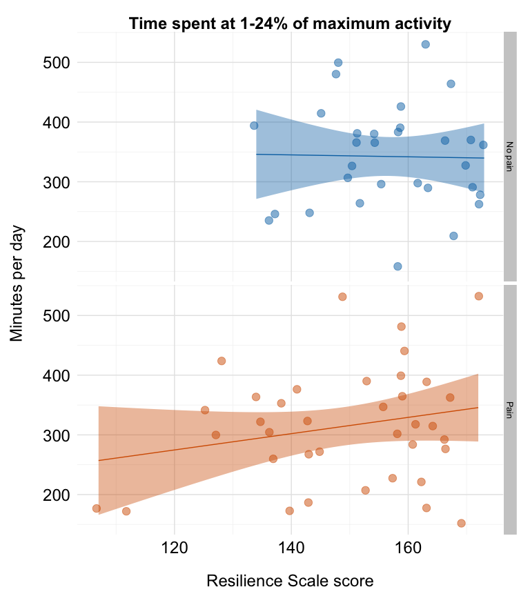<!-- -->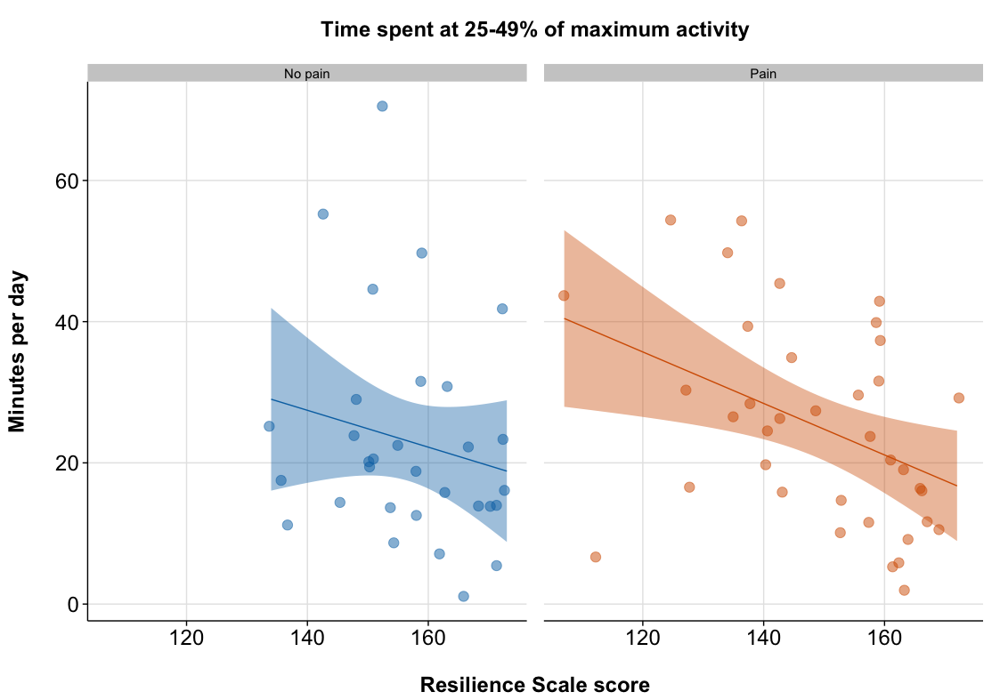<!-- --><!-- -->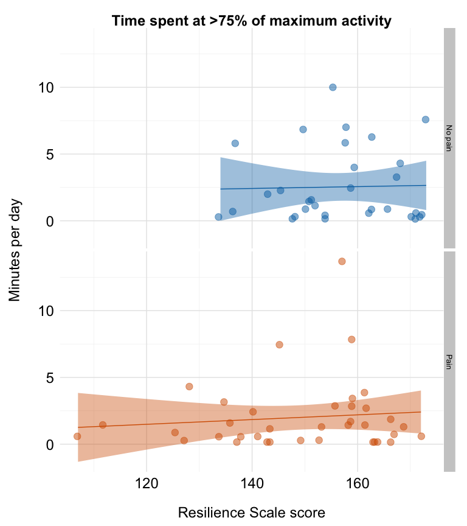<!-- -->

Brief Pain Inventory vs activity dot-plots
------------------------------------------

***37 participants with pain, only*** \#\#\# Import data

### Quick look

    ## Source: local data frame [6 x 6]
    ## 
    ##      ID  Pain Median_activity BPI_interference Worst_pain Least_pain
    ##   (int) (chr)           (int)            (int)      (int)      (int)
    ## 1     9  Pain               9                6          7          2
    ## 2    21  Pain               5                4          3          0
    ## 3    23  Pain               6                8         10          4
    ## 4    40  Pain              12                7          9          6
    ## 5    67  Pain               6                3          8          0
    ## 6    69  Pain               4                4          4          2

    ## Source: local data frame [6 x 6]
    ## 
    ##      ID  Pain Median_activity BPI_interference Worst_pain Least_pain
    ##   (int) (chr)           (int)            (int)      (int)      (int)
    ## 1   161  Pain               7                4          7          5
    ## 2   163  Pain               4                6          8          4
    ## 3   164  Pain               3                8          9          3
    ## 4   165  Pain               8                6         10          5
    ## 5   167  Pain               6                4          8          2
    ## 6   168  Pain               6                5          8          3

    ## Observations: 37
    ## Variables: 6
    ## $ ID               (int) 9, 21, 23, 40, 67, 69, 71, 72, 73, 74, 75, 76...
    ## $ Pain             (chr) "Pain", "Pain", "Pain", "Pain", "Pain", "Pain...
    ## $ Median_activity  (int) 9, 5, 6, 12, 6, 4, 5, 6, 4, 3, 4, 4, 7, 4, 6,...
    ## $ BPI_interference (int) 6, 4, 8, 7, 3, 4, 5, 8, 3, 4, 3, 2, 4, 9, 6, ...
    ## $ Worst_pain       (int) 7, 3, 10, 9, 8, 4, 10, 8, 7, 7, 5, 8, 8, 10, ...
    ## $ Least_pain       (int) 2, 0, 4, 6, 0, 2, 3, 0, 3, 5, 0, 4, 2, 0, 0, ...

    ## Observations: 37
    ## Variables: 5
    ## $ activity         (int) 9, 5, 6, 12, 6, 4, 5, 6, 4, 3, 4, 4, 7, 4, 6,...
    ## $ bpi_interference (int) 6, 4, 8, 7, 3, 4, 5, 8, 3, 4, 3, 2, 4, 9, 6, ...
    ## $ worst_pain       (int) 7, 3, 10, 9, 8, 4, 10, 8, 7, 7, 5, 8, 8, 10, ...
    ## $ least_pain       (int) 2, 0, 4, 6, 0, 2, 3, 0, 3, 5, 0, 4, 2, 0, 0, ...
    ## $ pain             (fctr) Pain, Pain, Pain, Pain, Pain, Pain, Pain, Pa...

Create bpi plots
----------------

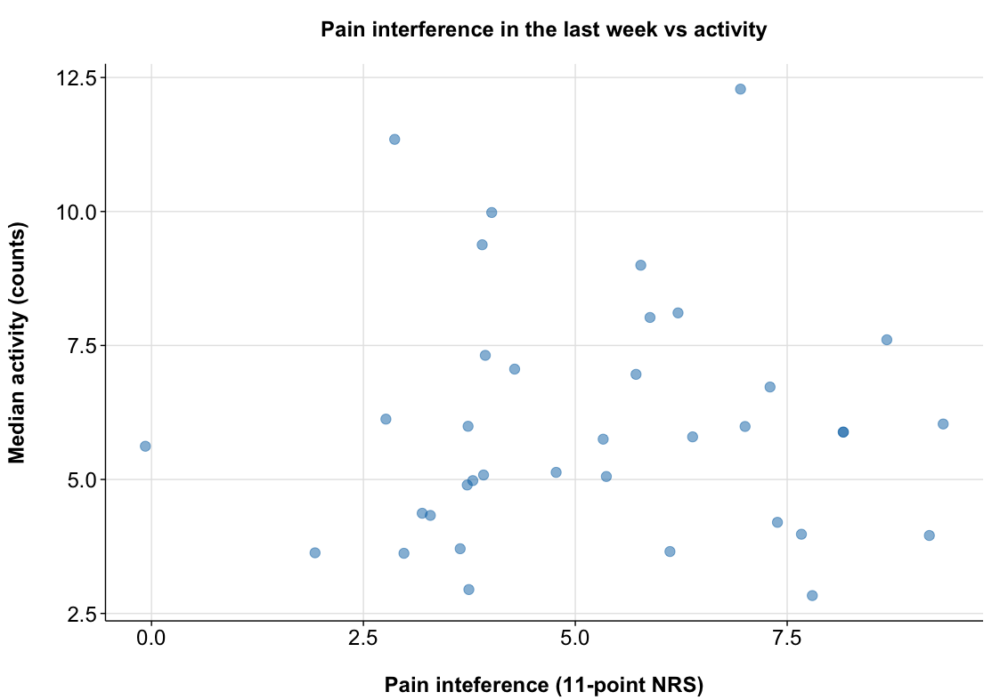<!-- -->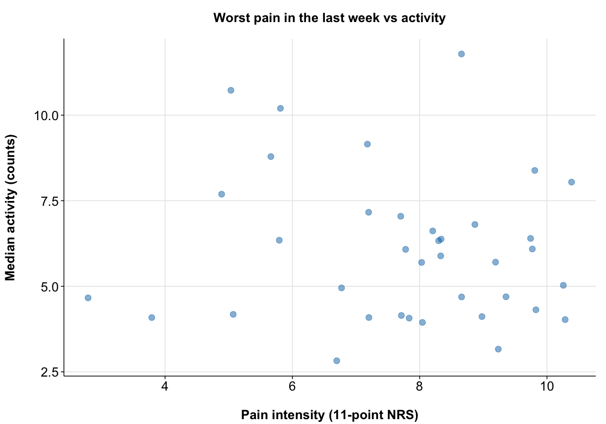<!-- -->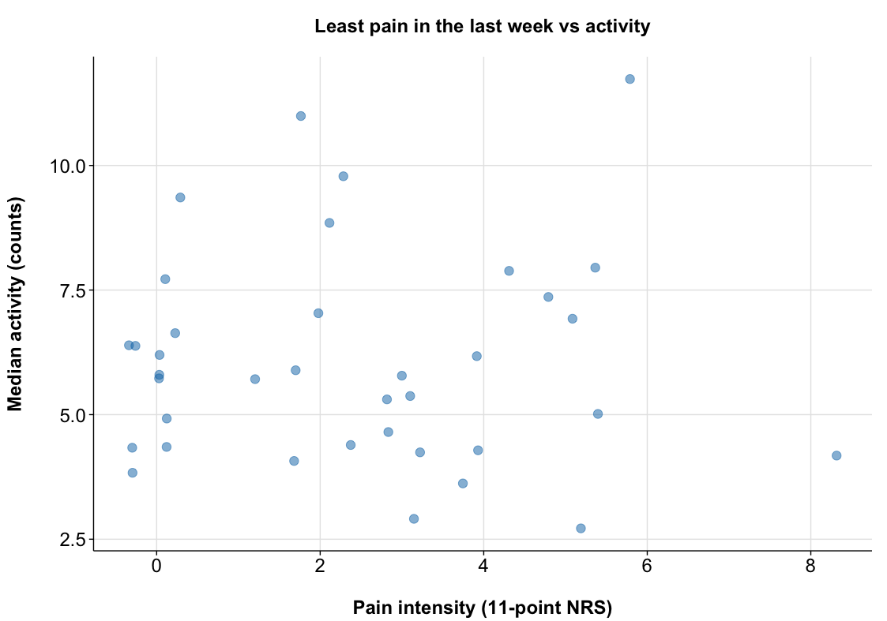<!-- -->

Activity vs predictor scatterplots
----------------------------------

***68 participants with (37) and without (31) pain*** \#\#\# Import data

### Quick look

    ## Source: local data frame [6 x 14]
    ## 
    ##      ID median_activity    pain   age    sex          education   bmi
    ##   (int)           (dbl)   (chr) (int)  (chr)              (chr) (dbl)
    ## 1     9               9    Pain    34   Male  Completed grade 7  26.6
    ## 2    10               6 No pain    49 Female  Completed grade 7  28.3
    ## 3    11               7 No pain    32 Female  Completed grade 7  25.5
    ## 4    13               5 No pain    51   Male  Completed grade 7  23.2
    ## 5    21               5    Pain    34 Female Completed grade 12  30.1
    ## 6    23               6    Pain    47   Male Completed grade 12  16.0
    ## Variables not shown: employed (chr), rs_score (int), eq5d_vas (int), money
    ##   (chr), family (chr), food (chr), health (chr)

    ## Source: local data frame [6 x 14]
    ## 
    ##      ID median_activity    pain   age    sex          education   bmi
    ##   (int)           (dbl)   (chr) (int)  (chr)              (chr) (dbl)
    ## 1   165               8    Pain    46 Female Completed grade 12  36.4
    ## 2   167               6    Pain    42 Female Completed grade 12  34.6
    ## 3   168               6    Pain    45 Female  Completed grade 7  28.6
    ## 4   172               4 No pain    49 Female Completed grade 12  26.1
    ## 5   174               6 No pain    44 Female Completed grade 12  24.5
    ## 6   176               6 No pain    44   Male  Completed grade 7    NA
    ## Variables not shown: employed (chr), rs_score (int), eq5d_vas (int), money
    ##   (chr), family (chr), food (chr), health (chr)

    ## Observations: 68
    ## Variables: 14
    ## $ ID              (int) 9, 10, 11, 13, 21, 23, 24, 28, 32, 33, 37, 38,...
    ## $ median_activity (dbl) 9, 6, 7, 5, 5, 6, 4, 4, 3, 4, 10, 5, 12, 4, 8,...
    ## $ pain            (chr) "Pain", "No pain", "No pain", "No pain", "Pain...
    ## $ age             (int) 34, 49, 32, 51, 34, 47, 53, 37, 40, 40, 32, 58...
    ## $ sex             (chr) "Male", "Female", "Female", "Male", "Female", ...
    ## $ education       (chr) "Completed grade 7", "Completed grade 7", "Com...
    ## $ bmi             (dbl) 26.6, 28.3, 25.5, 23.2, 30.1, 16.0, 25.0, 26.8...
    ## $ employed        (chr) "Unemployed", "Employed", "Employed", "Employe...
    ## $ rs_score        (int) 166, 173, 151, 154, 143, 167, 134, 150, 166, 1...
    ## $ eq5d_vas        (int) 60, 100, 70, 95, 70, 50, 90, 60, 100, 70, 60, ...
    ## $ money           (chr) "Nearly all the time", "Sometimes", "Sometimes...
    ## $ family          (chr) "Nearly all the time", "Nearly all the time", ...
    ## $ food            (chr) "Sometimes", "Often", "Not at all", "Often", "...
    ## $ health          (chr) "Sometimes", "Sometimes", "Not at all", "Not a...

    ## Classes 'grouped_df', 'tbl_df', 'tbl' and 'data.frame':  272 obs. of  12 variables:
    ##  $ ID             : Factor w/ 68 levels "9","10","11",..: 1 1 1 1 2 2 2 2 3 3 ...
    ##  $ median_activity: num  9 9 9 9 6 6 6 6 7 7 ...
    ##  $ pain           : Factor w/ 2 levels "No pain","Pain": 2 2 2 2 1 1 1 1 1 1 ...
    ##  $ age            : int  34 34 34 34 49 49 49 49 32 32 ...
    ##  $ sex            : Factor w/ 2 levels "Female","Male": 2 2 2 2 1 1 1 1 1 1 ...
    ##  $ education      : Ord.factor w/ 4 levels "No education"<..: 2 2 2 2 2 2 2 2 2 2 ...
    ##  $ bmi            : num  26.6 26.6 26.6 26.6 28.3 28.3 28.3 28.3 25.5 25.5 ...
    ##  $ employed       : Factor w/ 2 levels "Employed","Unemployed": 2 2 2 2 1 1 1 1 1 1 ...
    ##  $ rs_score       : int  166 166 166 166 173 173 173 173 151 151 ...
    ##  $ eq5d_vas       : int  60 60 60 60 100 100 100 100 70 70 ...
    ##  $ worry_about    : chr  "money" "family" "food" "health" ...
    ##  $ rating         : Ord.factor w/ 5 levels "Not at all"<"Rarely"<..: 5 5 3 3 3 5 4 3 3 1 ...
    ##  - attr(*, "vars")=List of 1
    ##   ..$ : symbol ID
    ##  - attr(*, "indices")=List of 68
    ##   ..$ : int  0 1 2 3
    ##   ..$ : int  4 5 6 7
    ##   ..$ : int  8 9 10 11
    ##   ..$ : int  12 13 14 15
    ##   ..$ : int  16 17 18 19
    ##   ..$ : int  20 21 22 23
    ##   ..$ : int  24 25 26 27
    ##   ..$ : int  28 29 30 31
    ##   ..$ : int  32 33 34 35
    ##   ..$ : int  36 37 38 39
    ##   ..$ : int  40 41 42 43
    ##   ..$ : int  44 45 46 47
    ##   ..$ : int  48 49 50 51
    ##   ..$ : int  52 53 54 55
    ##   ..$ : int  56 57 58 59
    ##   ..$ : int  60 61 62 63
    ##   ..$ : int  64 65 66 67
    ##   ..$ : int  68 69 70 71
    ##   ..$ : int  72 73 74 75
    ##   ..$ : int  76 77 78 79
    ##   ..$ : int  80 81 82 83
    ##   ..$ : int  84 85 86 87
    ##   ..$ : int  88 89 90 91
    ##   ..$ : int  92 93 94 95
    ##   ..$ : int  96 97 98 99
    ##   ..$ : int  100 101 102 103
    ##   ..$ : int  104 105 106 107
    ##   ..$ : int  108 109 110 111
    ##   ..$ : int  112 113 114 115
    ##   ..$ : int  116 117 118 119
    ##   ..$ : int  120 121 122 123
    ##   ..$ : int  124 125 126 127
    ##   ..$ : int  128 129 130 131
    ##   ..$ : int  132 133 134 135
    ##   ..$ : int  136 137 138 139
    ##   ..$ : int  140 141 142 143
    ##   ..$ : int  144 145 146 147
    ##   ..$ : int  148 149 150 151
    ##   ..$ : int  152 153 154 155
    ##   ..$ : int  156 157 158 159
    ##   ..$ : int  160 161 162 163
    ##   ..$ : int  164 165 166 167
    ##   ..$ : int  168 169 170 171
    ##   ..$ : int  172 173 174 175
    ##   ..$ : int  176 177 178 179
    ##   ..$ : int  180 181 182 183
    ##   ..$ : int  184 185 186 187
    ##   ..$ : int  188 189 190 191
    ##   ..$ : int  192 193 194 195
    ##   ..$ : int  196 197 198 199
    ##   ..$ : int  200 201 202 203
    ##   ..$ : int  204 205 206 207
    ##   ..$ : int  208 209 210 211
    ##   ..$ : int  212 213 214 215
    ##   ..$ : int  216 217 218 219
    ##   ..$ : int  220 221 222 223
    ##   ..$ : int  224 225 226 227
    ##   ..$ : int  228 229 230 231
    ##   ..$ : int  232 233 234 235
    ##   ..$ : int  236 237 238 239
    ##   ..$ : int  240 241 242 243
    ##   ..$ : int  244 245 246 247
    ##   ..$ : int  248 249 250 251
    ##   ..$ : int  252 253 254 255
    ##   ..$ : int  256 257 258 259
    ##   ..$ : int  260 261 262 263
    ##   ..$ : int  264 265 266 267
    ##   ..$ : int  268 269 270 271
    ##  - attr(*, "group_sizes")= int  4 4 4 4 4 4 4 4 4 4 ...
    ##  - attr(*, "biggest_group_size")= int 4
    ##  - attr(*, "labels")='data.frame':   68 obs. of  1 variable:
    ##   ..$ ID: Factor w/ 68 levels "9","10","11",..: 1 2 3 4 5 6 7 8 9 10 ...
    ##   ..- attr(*, "vars")=List of 1
    ##   .. ..$ : symbol ID
    ##   ..- attr(*, "indices")=List of 68
    ##   .. ..$ : int  0 68 136 204
    ##   .. ..$ : int  1 69 137 205
    ##   .. ..$ : int  2 70 138 206
    ##   .. ..$ : int  3 71 139 207
    ##   .. ..$ : int  4 72 140 208
    ##   .. ..$ : int  5 73 141 209
    ##   .. ..$ : int  6 74 142 210
    ##   .. ..$ : int  7 75 143 211
    ##   .. ..$ : int  8 76 144 212
    ##   .. ..$ : int  9 77 145 213
    ##   .. ..$ : int  10 78 146 214
    ##   .. ..$ : int  11 79 147 215
    ##   .. ..$ : int  12 80 148 216
    ##   .. ..$ : int  13 81 149 217
    ##   .. ..$ : int  14 82 150 218
    ##   .. ..$ : int  15 83 151 219
    ##   .. ..$ : int  16 84 152 220
    ##   .. ..$ : int  17 85 153 221
    ##   .. ..$ : int  18 86 154 222
    ##   .. ..$ : int  19 87 155 223
    ##   .. ..$ : int  20 88 156 224
    ##   .. ..$ : int  21 89 157 225
    ##   .. ..$ : int  22 90 158 226
    ##   .. ..$ : int  23 91 159 227
    ##   .. ..$ : int  24 92 160 228
    ##   .. ..$ : int  25 93 161 229
    ##   .. ..$ : int  26 94 162 230
    ##   .. ..$ : int  27 95 163 231
    ##   .. ..$ : int  28 96 164 232
    ##   .. ..$ : int  29 97 165 233
    ##   .. ..$ : int  30 98 166 234
    ##   .. ..$ : int  31 99 167 235
    ##   .. ..$ : int  32 100 168 236
    ##   .. ..$ : int  33 101 169 237
    ##   .. ..$ : int  34 102 170 238
    ##   .. ..$ : int  35 103 171 239
    ##   .. ..$ : int  36 104 172 240
    ##   .. ..$ : int  37 105 173 241
    ##   .. ..$ : int  38 106 174 242
    ##   .. ..$ : int  39 107 175 243
    ##   .. ..$ : int  40 108 176 244
    ##   .. ..$ : int  41 109 177 245
    ##   .. ..$ : int  42 110 178 246
    ##   .. ..$ : int  43 111 179 247
    ##   .. ..$ : int  44 112 180 248
    ##   .. ..$ : int  45 113 181 249
    ##   .. ..$ : int  46 114 182 250
    ##   .. ..$ : int  47 115 183 251
    ##   .. ..$ : int  48 116 184 252
    ##   .. ..$ : int  49 117 185 253
    ##   .. ..$ : int  50 118 186 254
    ##   .. ..$ : int  51 119 187 255
    ##   .. ..$ : int  52 120 188 256
    ##   .. ..$ : int  53 121 189 257
    ##   .. ..$ : int  54 122 190 258
    ##   .. ..$ : int  55 123 191 259
    ##   .. ..$ : int  56 124 192 260
    ##   .. ..$ : int  57 125 193 261
    ##   .. ..$ : int  58 126 194 262
    ##   .. ..$ : int  59 127 195 263
    ##   .. ..$ : int  60 128 196 264
    ##   .. ..$ : int  61 129 197 265
    ##   .. ..$ : int  62 130 198 266
    ##   .. ..$ : int  63 131 199 267
    ##   .. ..$ : int  64 132 200 268
    ##   .. ..$ : int  65 133 201 269
    ##   .. ..$ : int  66 134 202 270
    ##   .. ..$ : int  67 135 203 271
    ##   ..- attr(*, "group_sizes")= int  4 4 4 4 4 4 4 4 4 4 ...
    ##   ..- attr(*, "biggest_group_size")= int 4

Create activity plots
---------------------

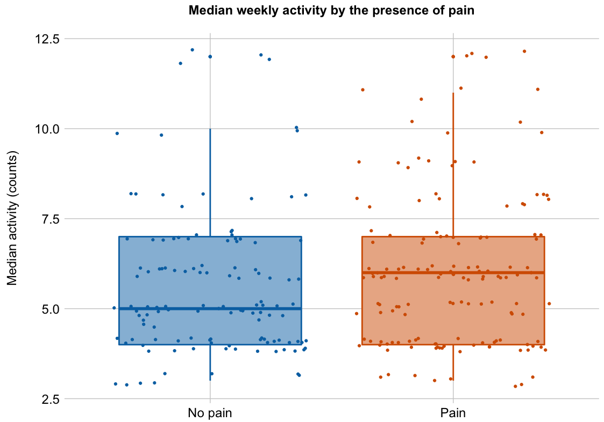<!-- -->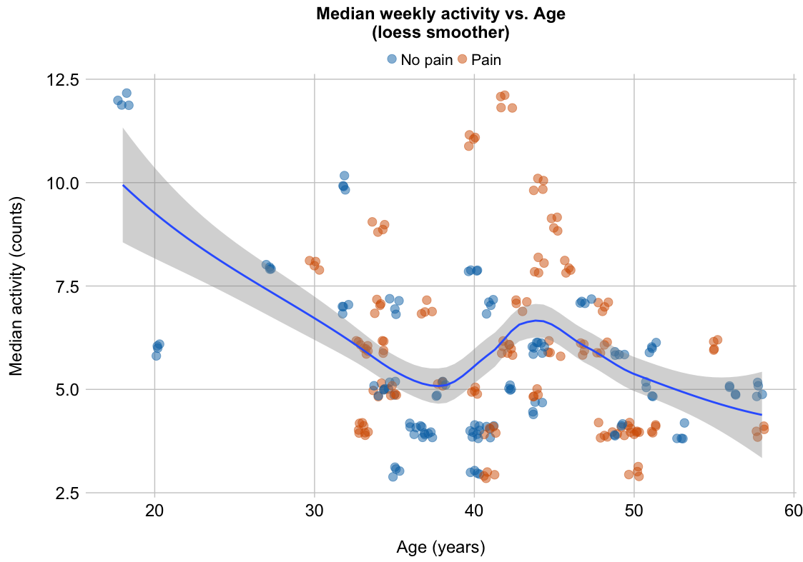<!-- -->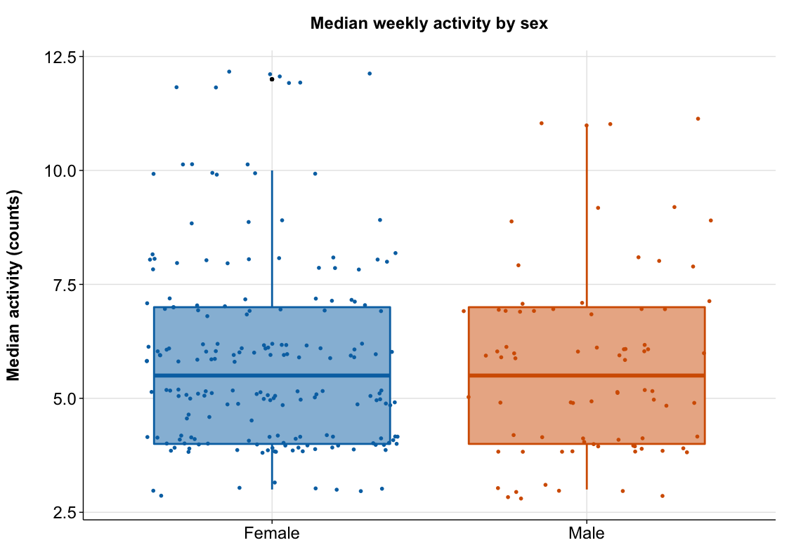<!-- -->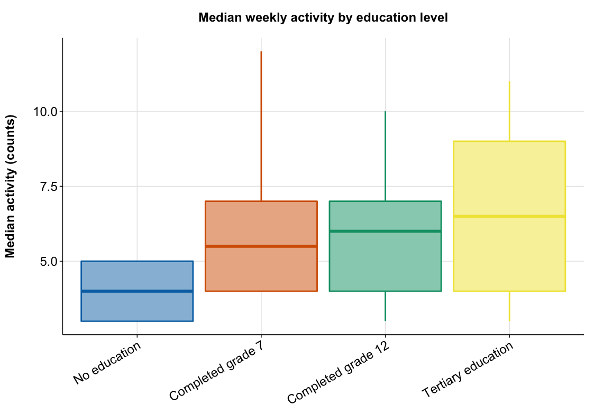<!-- -->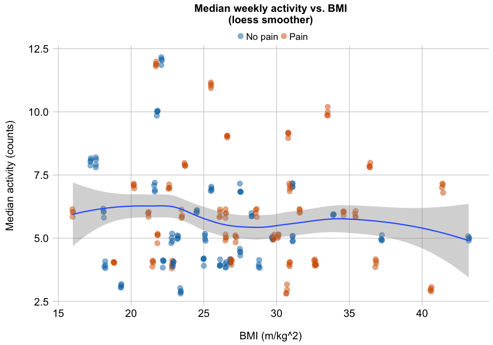<!-- -->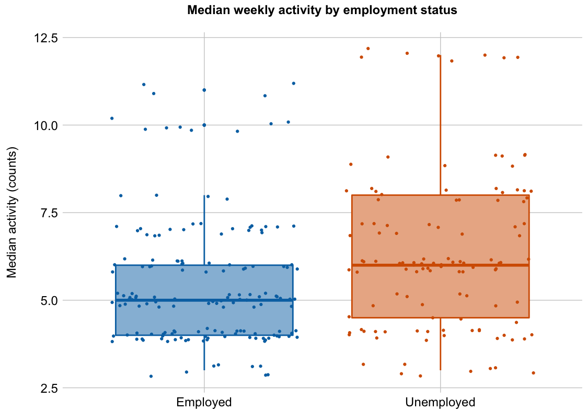<!-- -->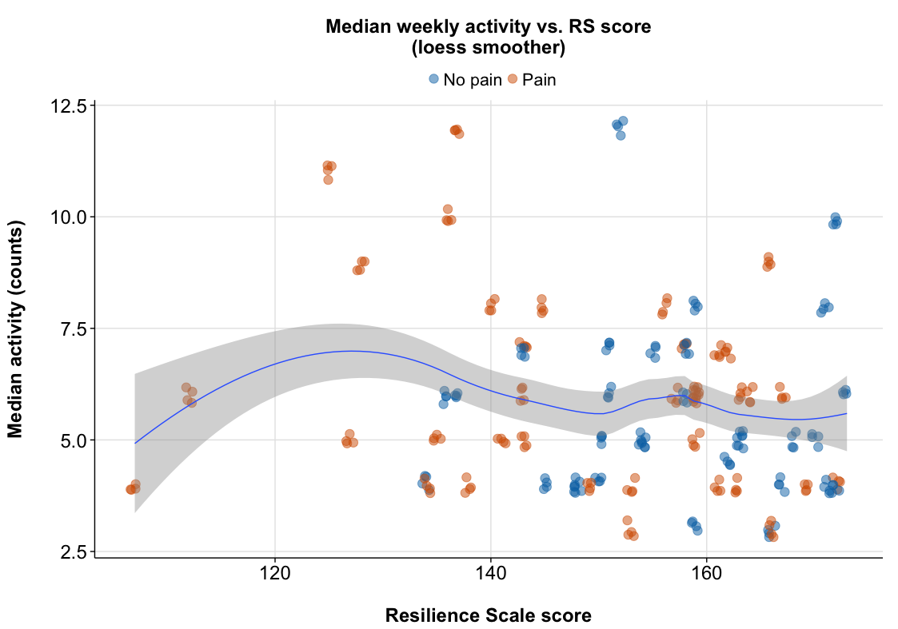<!-- -->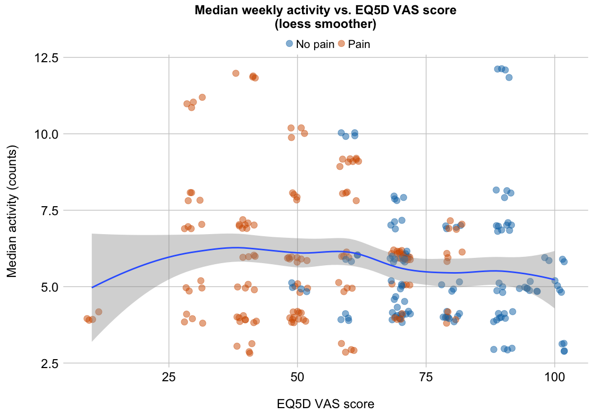<!-- -->

    ## Source: local data frame [272 x 12]
    ## Groups: ID [68]
    ## 
    ##        ID median_activity    pain   age    sex         education   bmi
    ##    (fctr)           (dbl)  (fctr) (int) (fctr)            (fctr) (dbl)
    ## 1       9               9    Pain    34   Male Completed grade 7  26.6
    ## 2       9               9    Pain    34   Male Completed grade 7  26.6
    ## 3       9               9    Pain    34   Male Completed grade 7  26.6
    ## 4       9               9    Pain    34   Male Completed grade 7  26.6
    ## 5      10               6 No pain    49 Female Completed grade 7  28.3
    ## 6      10               6 No pain    49 Female Completed grade 7  28.3
    ## 7      10               6 No pain    49 Female Completed grade 7  28.3
    ## 8      10               6 No pain    49 Female Completed grade 7  28.3
    ## 9      11               7 No pain    32 Female Completed grade 7  25.5
    ## 10     11               7 No pain    32 Female Completed grade 7  25.5
    ## ..    ...             ...     ...   ...    ...               ...   ...
    ## Variables not shown: employed (fctr), rs_score (int), eq5d_vas (int),
    ##   worries_a (fctr), rating (fctr)

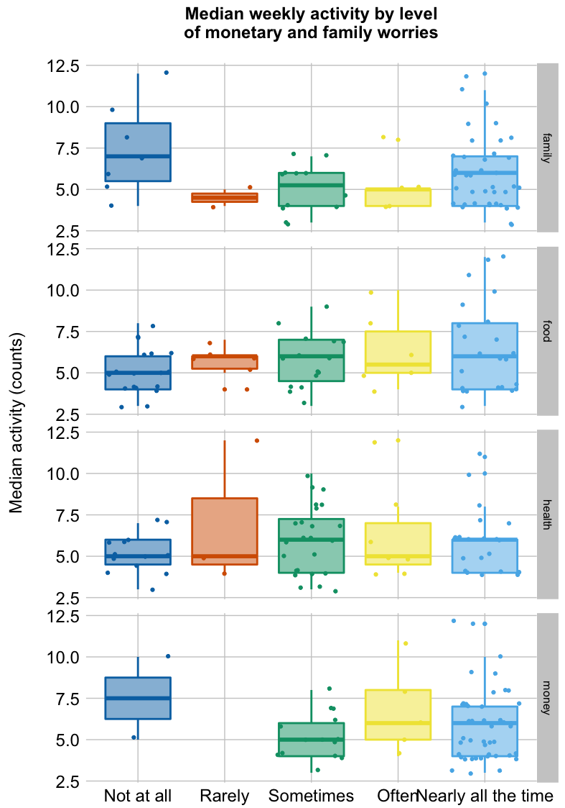<!-- -->

Session information
-------------------

    ## R version 3.2.3 (2015-12-10)
    ## Platform: x86_64-apple-darwin13.4.0 (64-bit)
    ## Running under: OS X 10.11.3 (El Capitan)
    ## 
    ## locale:
    ## [1] en_GB.UTF-8/en_GB.UTF-8/en_GB.UTF-8/C/en_GB.UTF-8/en_GB.UTF-8
    ## 
    ## attached base packages:
    ## [1] grid      stats     graphics  grDevices utils     datasets  methods  
    ## [8] base     
    ## 
    ## other attached packages:
    ## [1] cowplot_0.6.0 scales_0.4.0  ggplot2_2.1.0 tidyr_0.4.1   dplyr_0.4.3  
    ## [6] readr_0.2.2   knitr_1.12.3 
    ## 
    ## loaded via a namespace (and not attached):
    ##  [1] Rcpp_0.12.3      magrittr_1.5     munsell_0.4.3    colorspace_1.2-6
    ##  [5] R6_2.1.2         stringr_1.0.0    plyr_1.8.3       tools_3.2.3     
    ##  [9] parallel_3.2.3   gtable_0.2.0     DBI_0.3.1        htmltools_0.3   
    ## [13] yaml_2.1.13      lazyeval_0.1.10  assertthat_0.1   digest_0.6.9    
    ## [17] reshape2_1.4.1   formatR_1.2.1    evaluate_0.8     rmarkdown_0.9.5 
    ## [21] labeling_0.3     stringi_1.0-1
