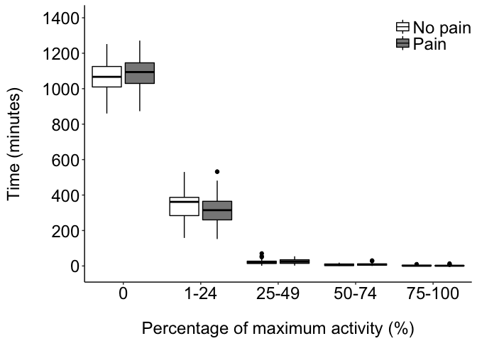

Description
-----------

This script plots a box-and-whisker plot of the time spent by HIV-positive individuals with chronic pain and without chronic pain at 0, 1-24, 25-49, 50-74 and &gt;75% of their maximum activity over a 7-day period.

Load required packages and set chunk options
--------------------------------------------

Import data
===========

These data were generated by the Rmd script, *activity.analysis.Rmd*.

``` r
q0 <- read_csv('./data/time.active.zero.csv')
q1 <- read_csv('./data/time.active.1q.csv')
q2 <- read_csv('./data/time.active.2q.csv')
q3 <- read_csv('./data/time.active.3q.csv')
q4 <- read_csv('./data/time.active.4q.csv')
```

Process data for plotting
=========================

``` r
# Create a grouping variable
group <- data.frame(quartile = c(rep(c('q0', 'q1', 'q2'), each = 68), 
                                 rep('q3', 66), # q3 only has 66 rows
                                 rep('q4', 68))) %>%
    tbl_df() # convert to tbl_df object

# Create a single dataframe with the imported data and the grouping variable
plot.data <- q0 %>%
    bind_rows(q1,q2,q3,q4) %>% # bind imported data q0 through q4 
    bind_cols(group) %>% # bind grouping variable
    select(quartile, pain, `minutes per day`) # select the columns to retain

# Quick check
glimpse(plot.data)
```

    ## Observations: 338
    ## Variables: 3
    ## $ quartile        (fctr) q0, q0, q0, q0, q0, q0, q0, q0, q0, q0, q0, q...
    ## $ pain            (chr) "pain", "no.pain", "no.pain", "no.pain", "pain...
    ## $ minutes per day (dbl) 1145.86, 1038.71, 1002.14, 1064.71, 1075.86, 1...

Create the plot
---------------

<!-- -->

Session information
-------------------

    ## R version 3.2.3 (2015-12-10)
    ## Platform: x86_64-apple-darwin13.4.0 (64-bit)
    ## Running under: OS X 10.11.3 (El Capitan)
    ## 
    ## locale:
    ## [1] en_GB.UTF-8/en_GB.UTF-8/en_GB.UTF-8/C/en_GB.UTF-8/en_GB.UTF-8
    ## 
    ## attached base packages:
    ## [1] grid      stats     graphics  grDevices utils     datasets  methods  
    ## [8] base     
    ## 
    ## other attached packages:
    ## [1] scales_0.4.0  ggplot2_2.1.0 dplyr_0.4.3   readr_0.2.2   knitr_1.12.3 
    ## 
    ## loaded via a namespace (and not attached):
    ##  [1] Rcpp_0.12.3      digest_0.6.9     assertthat_0.1   plyr_1.8.3      
    ##  [5] R6_2.1.2         gtable_0.2.0     DBI_0.3.1        formatR_1.2.1   
    ##  [9] magrittr_1.5     evaluate_0.8     stringi_1.0-1    lazyeval_0.1.10 
    ## [13] rmarkdown_0.9.5  tools_3.2.3      stringr_1.0.0    munsell_0.4.3   
    ## [17] yaml_2.1.13      parallel_3.2.3   colorspace_1.2-6 htmltools_0.3
