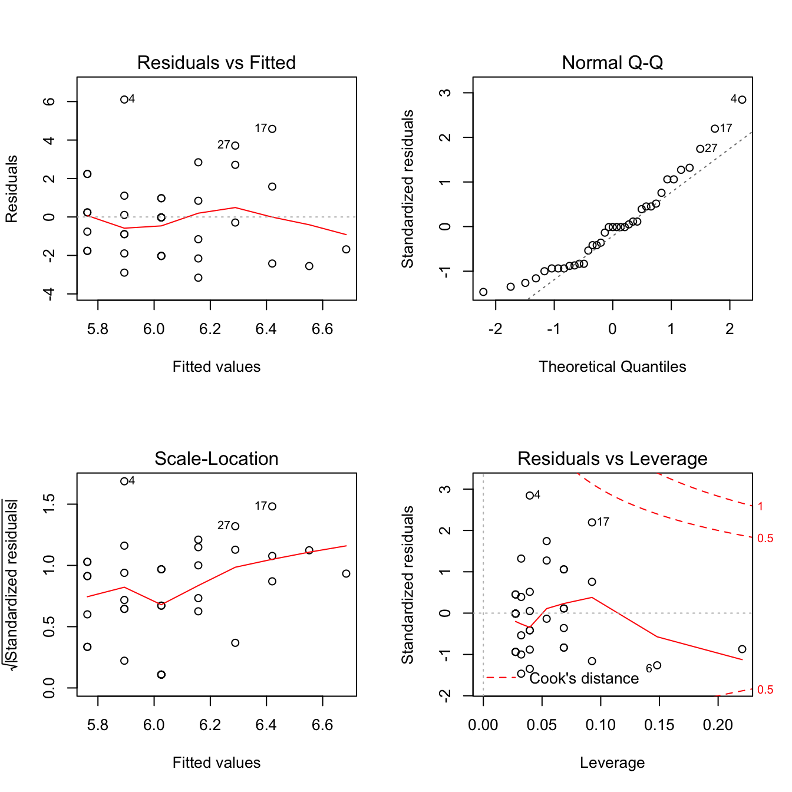
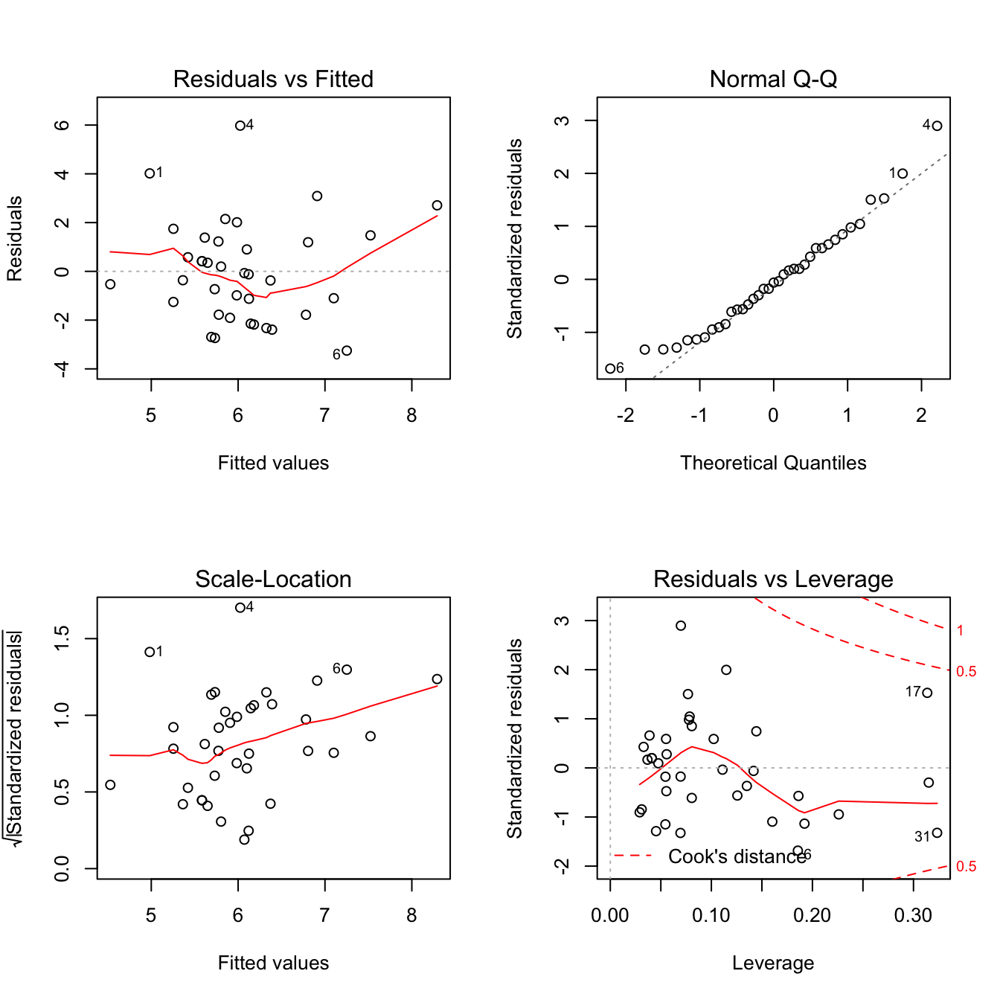
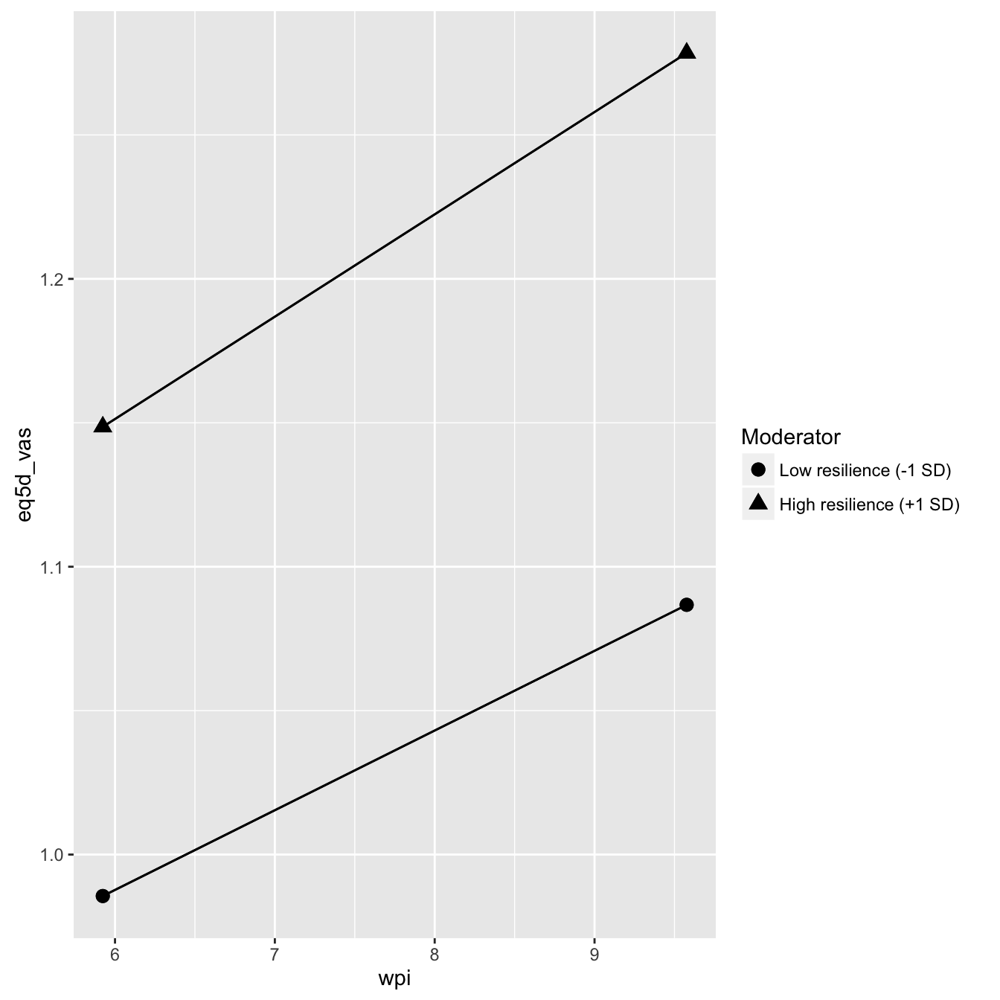

Moderator analyses
================
Peter Kamerman and Antonia Wadley
8 July 2016

-   [Session setup](#session-setup)
-   [Load data](#load-data)
-   [Quick look](#quick-look)
-   [Analysis](#analysis)
    -   [Pain vs median daily activity](#pain-vs-median-daily-activity)
        -   [Exploratory plots](#exploratory-plots)
        -   [Univariate modelling](#univariate-modelling)
        -   [Interaction modelling](#interaction-modelling)
    -   [Pain vs quality of life](#pain-vs-quality-of-life)
    -   [Process data](#process-data)
        -   [Exploratory plots](#exploratory-plots-1)
        -   [Univariate modelling](#univariate-modelling-1)
        -   [Interaction modelling](#interaction-modelling-1)
-   [Session information](#session-information)

**Last updated: July 08, 2016**

------------------------------------------------------------------------

Session setup
=============

``` r
# Load packages
library(svglite)
library(readr)
library(dplyr)
```

    ## Warning: package 'dplyr' was built under R version 3.2.5

``` r
library(tidyr)
```

    ## Warning: package 'tidyr' was built under R version 3.2.5

``` r
library(knitr)
```

    ## Warning: package 'knitr' was built under R version 3.2.5

``` r
# set seed
set.seed(1234)

# knitr chunk options
opts_chunk$set(echo = TRUE,
               warning = FALSE,
               message = FALSE,
               cache = TRUE,
               cache.extra = rand_seed,
               fig.path = './figures/',
               fig.width = 7,
               fig.height = 7,
               dev = c('png', 'svg'),
               tidy = FALSE)
```

Load data
=========

``` r
data <- read_csv('./data/data.csv')
```

Quick look
==========

``` r
dim(data)
```

    ## [1] 37  5

``` r
names(data)
```

    ## [1] "id"              "median_activity" "resilience"      "wpi"            
    ## [5] "eq5d_vas"

``` r
head(data)
```

    ## Source: local data frame [6 x 5]
    ## 
    ##      id median_activity resilience   wpi eq5d_vas
    ##   <int>           <int>      <int> <int>    <int>
    ## 1     9               9        166     7       60
    ## 2    21               5        143     3       70
    ## 3    23               6        167    10       50
    ## 4    40              12        137     9       40
    ## 5    67               6        164     8       80
    ## 6    69               4        138     4       30

``` r
tail(data)
```

    ## Source: local data frame [6 x 5]
    ## 
    ##      id median_activity resilience   wpi eq5d_vas
    ##   <int>           <int>      <int> <int>    <int>
    ## 1   161               7        161     7       30
    ## 2   163               4        134     8       40
    ## 3   164               3        166     9       60
    ## 4   165               8        156    10       50
    ## 5   167               6        159     8       40
    ## 6   168               6        159     8       70

``` r
glimpse(data)
```

    ## Observations: 37
    ## Variables: 5
    ## $ id              (int) 9, 21, 23, 40, 67, 69, 71, 72, 73, 74, 75, 76,...
    ## $ median_activity (int) 9, 5, 6, 12, 6, 4, 5, 6, 4, 3, 4, 4, 7, 4, 6, ...
    ## $ resilience      (int) 166, 143, 167, 137, 164, 138, 135, 112, 161, 1...
    ## $ wpi             (int) 7, 3, 10, 9, 8, 4, 10, 8, 7, 7, 5, 8, 8, 10, 1...
    ## $ eq5d_vas        (int) 60, 70, 50, 40, 80, 30, 60, 50, 50, 40, 50, 80...

``` r
summary(data)
```

    ##        id        median_activity    resilience         wpi        
    ##  Min.   :  9.0   Min.   : 3.000   Min.   :107.0   Min.   : 3.000  
    ##  1st Qu.: 74.0   1st Qu.: 4.000   1st Qu.:138.0   1st Qu.: 7.000  
    ##  Median :124.0   Median : 6.000   Median :153.0   Median : 8.000  
    ##  Mean   :109.5   Mean   : 6.054   Mean   :148.9   Mean   : 7.784  
    ##  3rd Qu.:141.0   3rd Qu.: 7.000   3rd Qu.:161.0   3rd Qu.: 9.000  
    ##  Max.   :168.0   Max.   :12.000   Max.   :172.0   Max.   :10.000  
    ##     eq5d_vas    
    ##  Min.   :10.00  
    ##  1st Qu.:40.00  
    ##  Median :50.00  
    ##  Mean   :51.35  
    ##  3rd Qu.:60.00  
    ##  Max.   :80.00

------------------------------------------------------------------------

Analysis
========

Pain vs median daily activity
-----------------------------

### Exploratory plots

``` r
## Distribution of median_activity (DV)
with(data, hist(median_activity))
```


``` r
## x/y plot: y = median_activity (DV), 
## x = wpi (IV - predictor)
with(data, plot(wpi, median_activity,
                  main = 'median activity (DV) vs. worst pain (IV - predictor)',
                  xlab = 'worst pain',
                  ylab = 'median activity'))
```


``` r
## x/y plot: y = median_activity (DV), 
## x = resilience (IV - moderator)
with(data, plot(resilience, median_activity,
                  main = 'median activity (DV) vs. resilience (IV - moderator)',
                  xlab = 'resilience',
                  ylab = 'median activity'))
```


``` r
## x/x plot: x1 = wpi (DV - predictor), 
## x2 = resilience (IV - moderator)
with(data, plot(wpi, median_activity,
                  main = 'worst pain (DV - predictor) vs. resilience (IV - moderator)',
                  xlab = 'worst pain',
                  ylab = 'resilience'))
```


### Univariate modelling

``` r
# Linear regression
## Median activity (DV) vs worst pain (IV - predictor)
mod1 <- lm(median_activity ~ wpi, data = data)
summary(mod1)
```

    ## 
    ## Call:
    ## lm(formula = median_activity ~ wpi, data = data)
    ## 
    ## Residuals:
    ##     Min      1Q  Median      3Q     Max 
    ## -3.1572 -1.7623 -0.0256  0.9744  6.1060 
    ## 
    ## Coefficients:
    ##             Estimate Std. Error t value Pr(>|t|)    
    ## (Intercept)   7.0786     1.6082   4.402 9.63e-05 ***
    ## wpi          -0.1316     0.2014  -0.654    0.518    
    ## ---
    ## Signif. codes:  0 '***' 0.001 '**' 0.01 '*' 0.05 '.' 0.1 ' ' 1
    ## 
    ## Residual standard error: 2.19 on 35 degrees of freedom
    ## Multiple R-squared:  0.01206,    Adjusted R-squared:  -0.01617 
    ## F-statistic: 0.4273 on 1 and 35 DF,  p-value: 0.5176

``` r
## Diagnostic plots
par(mfrow = c(2,2))
plot(mod1)
```



``` r
par(mfrow = c(1,1))

## Median activity (DV) vs resilience (IV - moderator)
mod2 <- lm(median_activity ~ resilience, data = data)
summary(mod2)
```

    ## 
    ## Call:
    ## lm(formula = median_activity ~ resilience, data = data)
    ## 
    ## Residuals:
    ##     Min      1Q  Median      3Q     Max 
    ## -3.2853 -1.6405  0.1833  1.3008  5.5959 
    ## 
    ## Coefficients:
    ##             Estimate Std. Error t value Pr(>|t|)   
    ## (Intercept) 10.42824    3.34176   3.121  0.00361 **
    ## resilience  -0.02937    0.02231  -1.316  0.19662   
    ## ---
    ## Signif. codes:  0 '***' 0.001 '**' 0.01 '*' 0.05 '.' 0.1 ' ' 1
    ## 
    ## Residual standard error: 2.151 on 35 degrees of freedom
    ## Multiple R-squared:  0.04717,    Adjusted R-squared:  0.01995 
    ## F-statistic: 1.733 on 1 and 35 DF,  p-value: 0.1966

``` r
## Diagnostic plots
par(mfrow = c(2,2))
plot(mod2)
par(mfrow = c(1,1))

## Worst pain (IV - predictor) vs resilience (IV - moderator)
### Worst pain is factor, so use clm in ordinal package
library(ordinal)
mod3 <- lm(wpi ~ resilience, data = data)
summary(mod3)
```

    ## 
    ## Call:
    ## lm(formula = wpi ~ resilience, data = data)
    ## 
    ## Residuals:
    ##     Min      1Q  Median      3Q     Max 
    ## -4.6313 -1.0951  0.1111  1.5233  2.5749 
    ## 
    ## Coefficients:
    ##             Estimate Std. Error t value Pr(>|t|)
    ## (Intercept)  3.94646    2.78093   1.419    0.165
    ## resilience   0.02577    0.01857   1.388    0.174
    ## 
    ## Residual standard error: 1.79 on 35 degrees of freedom
    ## Multiple R-squared:  0.05215,    Adjusted R-squared:  0.02507 
    ## F-statistic: 1.926 on 1 and 35 DF,  p-value: 0.174

``` r
## Diagnostic plots
par(mfrow = c(2,2))
plot(mod2)
```


``` r
par(mfrow = c(1,1))
```

### Interaction modelling

``` r
mod4 <- lm(median_activity ~ wpi * resilience,
                         data = data)
summary(mod4)
```

    ## 
    ## Call:
    ## lm(formula = median_activity ~ wpi * resilience, data = data)
    ## 
    ## Residuals:
    ##     Min      1Q  Median      3Q     Max 
    ## -3.2513 -1.7774 -0.1208  1.2267  5.9756 
    ## 
    ## Coefficients:
    ##                Estimate Std. Error t value Pr(>|t|)  
    ## (Intercept)    37.25459   18.05569   2.063    0.047 *
    ## wpi            -3.31717    2.17562  -1.525    0.137  
    ## resilience     -0.21024    0.12431  -1.691    0.100  
    ## wpi:resilience  0.02224    0.01487   1.496    0.144  
    ## ---
    ## Signif. codes:  0 '***' 0.001 '**' 0.01 '*' 0.05 '.' 0.1 ' ' 1
    ## 
    ## Residual standard error: 2.139 on 33 degrees of freedom
    ## Multiple R-squared:  0.1113, Adjusted R-squared:  0.03049 
    ## F-statistic: 1.377 on 3 and 33 DF,  p-value: 0.2668

``` r
par(mfrow = c(2,2))
plot(mod4)
```



``` r
par(mfrow = c(1,1))

# Use 'lmres' function in package pequod to look at effects 
# with centering.
library(pequod)
mod4_centered <- lmres(median_activity ~ wpi * resilience,
                         residual_centering = TRUE,
                         data = data)
summary(mod4_centered)
```

    ## Formula:
    ## median_activity ~ wpi + resilience + wpi.XX.resilience
    ## <environment: 0x7fbe74518d10>
    ## 
    ## Models
    ##          R     R^2   Adj. R^2    F     df1  df2  p.value
    ## Model 0.3336 0.1113    0.0305 1.3774 3.0000   33    0.27
    ## 
    ## Residuals
    ##    Min. 1st Qu.  Median    Mean 3rd Qu.    Max. 
    ## -3.2510 -1.7770 -0.1208  0.0000  1.2270  5.9760 
    ## 
    ## Coefficients
    ##                   Estimate   StdErr  t.value    beta p.value   
    ## (Intercept)       10.72878  3.41802  3.13888         0.00356 **
    ## wpi               -0.07615  0.20202 -0.37696 -0.0635 0.70862   
    ## resilience        -0.02741  0.02280 -1.20242 -0.2027 0.23776   
    ## wpi.XX.resilience  0.02224  0.01487  1.49616  0.2455 0.14411   
    ## ---
    ## Signif. codes:  0 '***' 0.001 '**' 0.01 '*' 0.05 '.' 0.1 ' ' 1
    ## 
    ## Collinearity
    ##                     VIF Tolerance
    ## wpi               1.055    0.9479
    ## resilience        1.055    0.9479
    ## wpi.XX.resilience 1.000    1.0000

``` r
# Examine interaction using sinmple slope analysis
mod4_centered_interaction <- simpleSlope(mod4_centered,
                                         pred = 'wpi',
                                         mod1 = 'resilience')
PlotSlope(mod4_centered_interaction)
```


------------------------------------------------------------------------

Pain vs quality of life
-----------------------

Process data
------------

``` r
# Convert eq5d_vas to a proportion for beta-distribution regression
data_1 <- data %>%
    mutate(eq5d_vas = eq5d_vas/100)
```

### Exploratory plots

``` r
## Distribution of quality of life (DV)
with(data, hist(eq5d_vas))
```


``` r
## x/y plot: y = eq5d_vas (DV), 
## x = wpi (IV - predictor)
with(data, plot(wpi, eq5d_vas,
                  main = 'quality of life (DV) vs. worst pain (IV - predictor)',
                  xlab = 'worst pain',
                  ylab = 'quality of life'))
```


``` r
## x/y plot: y = eq5d_vas (DV), 
## x = resilience (IV - moderator)
with(data, plot(resilience, eq5d_vas,
                  main = 'quality of life (DV) vs. resilience (IV - moderator)',
                  xlab = 'resilience',
                  ylab = 'quality of life'))
```


``` r
## x/x plot: x1 = wpi (DV - predictor), 
## x2 = resilience (IV - moderator)
with(data, plot(wpi, eq5d_vas,
                  main = 'worst pain (DV - predictor) vs. resilience (IV - moderator)',
                  xlab = 'worst pain',
                  ylab = 'resilience'))
```


### Univariate modelling

``` r
library(betareg)
# Linear regression
## quality of life (DV) vs worst pain (IV - predictor)
mod1 <- betareg(eq5d_vas ~ wpi, data = data_1[-31, ]) # based on Cook's D from eq5d_vas vs resilience (see mod2 below)
summary(mod1)
```

    ## 
    ## Call:
    ## betareg(formula = eq5d_vas ~ wpi, data = data_1[-31, ])
    ## 
    ## Standardized weighted residuals 2:
    ##     Min      1Q  Median      3Q     Max 
    ## -1.5483 -0.8051 -0.1729  0.6442  1.9506 
    ## 
    ## Coefficients (mean model with logit link):
    ##             Estimate Std. Error z value Pr(>|z|)
    ## (Intercept) 0.064608   0.439398   0.147    0.883
    ## wpi         0.005275   0.055229   0.096    0.924
    ## 
    ## Phi coefficients (precision model with identity link):
    ##       Estimate Std. Error z value Pr(>|z|)    
    ## (phi)   10.190      2.293   4.444 8.85e-06 ***
    ## ---
    ## Signif. codes:  0 '***' 0.001 '**' 0.01 '*' 0.05 '.' 0.1 ' ' 1 
    ## 
    ## Type of estimator: ML (maximum likelihood)
    ## Log-likelihood: 17.67 on 3 Df
    ## Pseudo R-squared: 0.0002557
    ## Number of iterations: 15 (BFGS) + 2 (Fisher scoring)

``` r
## Diagnostic plots
par(mfrow = c(2,2))
plot(mod1)
```


``` r
par(mfrow = c(1,1))

## quality of life (DV) vs resilience (IV - moderator)
mod2 <- betareg(eq5d_vas ~ resilience, data = data_1[-31, ]) # based on Cook's D from eq5d_vas vs resilience (see mod2 below)
summary(mod2)
```

    ## 
    ## Call:
    ## betareg(formula = eq5d_vas ~ resilience, data = data_1[-31, ])
    ## 
    ## Standardized weighted residuals 2:
    ##     Min      1Q  Median      3Q     Max 
    ## -1.8540 -0.7686 -0.3762  0.8930  2.0081 
    ## 
    ## Coefficients (mean model with logit link):
    ##              Estimate Std. Error z value Pr(>|z|)  
    ## (Intercept) -1.990267   0.994552  -2.001   0.0454 *
    ## resilience   0.013970   0.006599   2.117   0.0343 *
    ## 
    ## Phi coefficients (precision model with identity link):
    ##       Estimate Std. Error z value Pr(>|z|)    
    ## (phi)   11.463      2.593    4.42 9.86e-06 ***
    ## ---
    ## Signif. codes:  0 '***' 0.001 '**' 0.01 '*' 0.05 '.' 0.1 ' ' 1 
    ## 
    ## Type of estimator: ML (maximum likelihood)
    ## Log-likelihood: 19.78 on 3 Df
    ## Pseudo R-squared: 0.1114
    ## Number of iterations: 10 (BFGS) + 2 (Fisher scoring)

``` r
## Diagnostic plots
par(mfrow = c(2,2))
plot(mod2)
par(mfrow = c(1,1))

### Large Cook's D for no. 31, redo analysis with point removed
## quality of life (DV) vs resilience (IV - moderator)
mod2_update <- betareg(eq5d_vas ~ resilience, data = data_1[-31, ])
summary(mod2_update)
```

    ## 
    ## Call:
    ## betareg(formula = eq5d_vas ~ resilience, data = data_1[-31, ])
    ## 
    ## Standardized weighted residuals 2:
    ##     Min      1Q  Median      3Q     Max 
    ## -1.8540 -0.7686 -0.3762  0.8930  2.0081 
    ## 
    ## Coefficients (mean model with logit link):
    ##              Estimate Std. Error z value Pr(>|z|)  
    ## (Intercept) -1.990267   0.994552  -2.001   0.0454 *
    ## resilience   0.013970   0.006599   2.117   0.0343 *
    ## 
    ## Phi coefficients (precision model with identity link):
    ##       Estimate Std. Error z value Pr(>|z|)    
    ## (phi)   11.463      2.593    4.42 9.86e-06 ***
    ## ---
    ## Signif. codes:  0 '***' 0.001 '**' 0.01 '*' 0.05 '.' 0.1 ' ' 1 
    ## 
    ## Type of estimator: ML (maximum likelihood)
    ## Log-likelihood: 19.78 on 3 Df
    ## Pseudo R-squared: 0.1114
    ## Number of iterations: 10 (BFGS) + 2 (Fisher scoring)

``` r
## Diagnostic plots
par(mfrow = c(2,2))
plot(mod2_update)
```


``` r
par(mfrow = c(1,1))

## Worst pain (IV - predictor) vs resilience (IV - moderator)
### Worst pain is factor, so use clm in ordinal package
library(ordinal)
mod3 <- lm(wpi ~ resilience, data = data_1[-31, ])
summary(mod3)
```

    ## 
    ## Call:
    ## lm(formula = wpi ~ resilience, data = data_1[-31, ])
    ## 
    ## Residuals:
    ##     Min      1Q  Median      3Q     Max 
    ## -4.4738 -1.1756  0.0583  1.5319  2.8381 
    ## 
    ## Coefficients:
    ##             Estimate Std. Error t value Pr(>|t|)  
    ## (Intercept)  1.89830    3.06849   0.619   0.5403  
    ## resilience   0.03899    0.02035   1.916   0.0638 .
    ## ---
    ## Signif. codes:  0 '***' 0.001 '**' 0.01 '*' 0.05 '.' 0.1 ' ' 1
    ## 
    ## Residual standard error: 1.76 on 34 degrees of freedom
    ## Multiple R-squared:  0.09743,    Adjusted R-squared:  0.07089 
    ## F-statistic:  3.67 on 1 and 34 DF,  p-value: 0.06383

``` r
## Diagnostic plots
par(mfrow = c(2,2))
plot(mod2)
par(mfrow = c(1,1))
```

### Interaction modelling

``` r
mod4 <- betareg(eq5d_vas ~ wpi * resilience,
                         data = data_1[-31, ])
summary(mod4)
```

    ## 
    ## Call:
    ## betareg(formula = eq5d_vas ~ wpi * resilience, data = data_1[-31, 
    ##     ])
    ## 
    ## Standardized weighted residuals 2:
    ##     Min      1Q  Median      3Q     Max 
    ## -1.9375 -0.7992 -0.3213  0.9899  2.0447 
    ## 
    ## Coefficients (mean model with logit link):
    ##                  Estimate Std. Error z value Pr(>|z|)
    ## (Intercept)    -0.8955452  4.8774286  -0.184    0.854
    ## wpi            -0.1648903  0.6051594  -0.272    0.785
    ## resilience      0.0081877  0.0334984   0.244    0.807
    ## wpi:resilience  0.0008973  0.0041108   0.218    0.827
    ## 
    ## Phi coefficients (precision model with identity link):
    ##       Estimate Std. Error z value Pr(>|z|)    
    ## (phi)   11.597      2.625   4.418 9.96e-06 ***
    ## ---
    ## Signif. codes:  0 '***' 0.001 '**' 0.01 '*' 0.05 '.' 0.1 ' ' 1 
    ## 
    ## Type of estimator: ML (maximum likelihood)
    ## Log-likelihood: 19.98 on 5 Df
    ## Pseudo R-squared: 0.1213
    ## Number of iterations: 37 (BFGS) + 4 (Fisher scoring)

``` r
# Diagnostic plots
par(mfrow = c(2,2))
plot(mod4)
```


``` r
par(mfrow = c(1,1))

# Use 'lmres' function in package pequod to look at effects 
# with centering.
library(pequod)

# 'lmres' function only works for linear models,
# so cannot use 'betareg' function. Solution used: 
# Arcsine transform on eq5d VAS data (using package metafor).
library(metafor)

data_1_transformed <- data_1[-31, ] %>%
    mutate(eq5d_vas = transf.arcsin(.$eq5d_vas))

mod4_centered <- lmres(eq5d_vas ~ wpi * resilience,
                         residual_centering = TRUE,
                         data = data_1_transformed)

summary(mod4_centered)
```

    ## Formula:
    ## eq5d_vas ~ wpi + resilience + wpi.XX.resilience
    ## <environment: 0x7ff40244d6d8>
    ## 
    ## Models
    ##          R     R^2   Adj. R^2    F     df1  df2  p.value
    ## Model 0.3490 0.1218    0.0395 1.4795 3.0000   32    0.24
    ## 
    ## Residuals
    ##    Min. 1st Qu.  Median    Mean 3rd Qu.    Max. 
    ## -0.2770 -0.1096 -0.0467  0.0000  0.1407  0.2873 
    ## 
    ## Coefficients
    ##                   Estimate   StdErr  t.value    beta p.value  
    ## (Intercept)        0.28208  0.27425  1.02856         0.31140  
    ## wpi               -0.00870  0.01524 -0.57076 -0.0995 0.57215  
    ## resilience         0.00398  0.00190  2.09163  0.3647 0.04449 *
    ## wpi.XX.resilience  0.00027  0.00113  0.23675  0.0392 0.81436  
    ## ---
    ## Signif. codes:  0 '***' 0.001 '**' 0.01 '*' 0.05 '.' 0.1 ' ' 1
    ## 
    ## Collinearity
    ##                     VIF Tolerance
    ## wpi               1.108    0.9026
    ## resilience        1.108    0.9026
    ## wpi.XX.resilience 1.000    1.0000

``` r
# Examine interaction using sinmple slope analysis
mod4_centered_interaction <- simpleSlope(mod4_centered,
                                         pred = 'wpi',
                                         mod1 = 'resilience')
PlotSlope(mod4_centered_interaction)
```



------------------------------------------------------------------------

Session information
===================

``` r
sessionInfo()
```

    ## R version 3.2.4 (2016-03-10)
    ## Platform: x86_64-apple-darwin13.4.0 (64-bit)
    ## Running under: OS X 10.11.5 (El Capitan)
    ## 
    ## locale:
    ## [1] en_GB.UTF-8/en_GB.UTF-8/en_GB.UTF-8/C/en_GB.UTF-8/en_GB.UTF-8
    ## 
    ## attached base packages:
    ## [1] stats     graphics  grDevices utils     datasets  methods   base     
    ## 
    ## other attached packages:
    ##  [1] metafor_1.9-8     Matrix_1.2-6      betareg_3.0-5    
    ##  [4] pequod_0.0-5      car_2.1-2         ggplot2_2.1.0    
    ##  [7] ordinal_2015.6-28 knitr_1.13        tidyr_0.5.1      
    ## [10] dplyr_0.5.0       readr_0.2.2       svglite_1.1.0    
    ## 
    ## loaded via a namespace (and not attached):
    ##  [1] Rcpp_0.12.5        formatR_1.4        nloptr_1.0.4      
    ##  [4] plyr_1.8.4         tools_3.2.4        digest_0.6.9      
    ##  [7] lme4_1.1-12        evaluate_0.9       tibble_1.0        
    ## [10] gtable_0.2.0       nlme_3.1-128       lattice_0.20-33   
    ## [13] mgcv_1.8-12        ucminf_1.1-3       DBI_0.4-1         
    ## [16] yaml_2.1.13        parallel_3.2.4     SparseM_1.7       
    ## [19] stringr_1.0.0      MatrixModels_0.4-1 gdtools_0.0.7     
    ## [22] stats4_3.2.4       lmtest_0.9-34      grid_3.2.4        
    ## [25] nnet_7.3-12        R6_2.1.2           flexmix_2.3-13    
    ## [28] rmarkdown_0.9.6.14 Formula_1.2-1      minqa_1.2.4       
    ## [31] magrittr_1.5       codetools_0.2-14   modeltools_0.2-21 
    ## [34] scales_0.4.0       htmltools_0.3.5    MASS_7.3-45       
    ## [37] splines_3.2.4      assertthat_0.1     pbkrtest_0.4-6    
    ## [40] colorspace_1.2-6   labeling_0.3       quantreg_5.26     
    ## [43] sandwich_2.3-4     stringi_1.1.1      lazyeval_0.2.0    
    ## [46] munsell_0.4.3      zoo_1.7-13
