Load required packages and set chunk options
--------------------------------------------

Resilience vs activity dot-plots
--------------------------------

***68 participants, 37 with pain and 31 without pain***

### Import data

``` r
data.res <- read_csv('./data/resilience.V.endurance.csv')
```

### Quick look

    ## Source: local data frame [6 x 9]
    ## 
    ##      ID    Pain Median_activity RS_corrected Minutes_at_0_activity
    ##   (int)   (chr)           (dbl)        (int)                 (dbl)
    ## 1     9    pain               9          166               1145.86
    ## 2    10 no.pain               6          173               1038.71
    ## 3    11 no.pain               7          151               1002.14
    ## 4    13 no.pain               5          154               1064.71
    ## 5    21    pain               5          143               1075.86
    ## 6    23    pain               6          167               1064.71
    ## Variables not shown: Minutes_at_q1 (dbl), Minutes_at_q2 (dbl),
    ##   Minutes_at_q3 (dbl), Minutes_at_q4 (dbl)

    ## Source: local data frame [6 x 9]
    ## 
    ##      ID    Pain Median_activity RS_corrected Minutes_at_0_activity
    ##   (int)   (chr)           (dbl)        (int)                 (dbl)
    ## 1   165    pain               8          156               1051.57
    ## 2   167    pain               6          159                981.43
    ## 3   168    pain               6          159                911.29
    ## 4   172 no.pain               4          145                999.14
    ## 5   174 no.pain               6          151               1048.43
    ## 6   176 no.pain               6          137               1167.60
    ## Variables not shown: Minutes_at_q1 (dbl), Minutes_at_q2 (dbl),
    ##   Minutes_at_q3 (dbl), Minutes_at_q4 (dbl)

### Clean

``` r
# Process data
data.res.1 <- data.res %>%
    mutate(pain = factor(Pain, 
                         levels = c('no.pain', 'pain'),
                         labels = c('No pain', 'Pain'))) %>%
    select(-ID, -Pain) %>%
    rename(activity = Median_activity,
           rs.score = RS_corrected, 
           zero = Minutes_at_0_activity,
           q1 = Minutes_at_q1,
           q2 = Minutes_at_q2,
           q3 = Minutes_at_q3,
           q4 = Minutes_at_q4) 
```

Create resilience plots
-----------------------

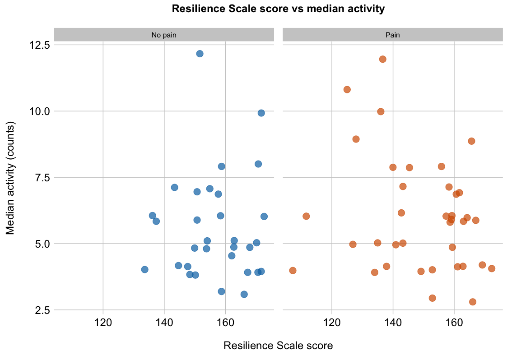<!-- -->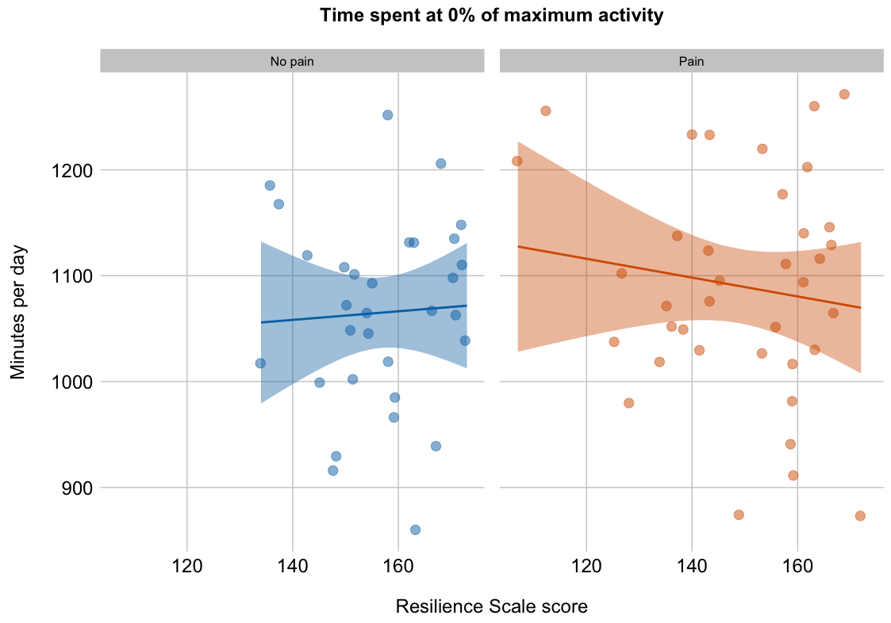<!-- -->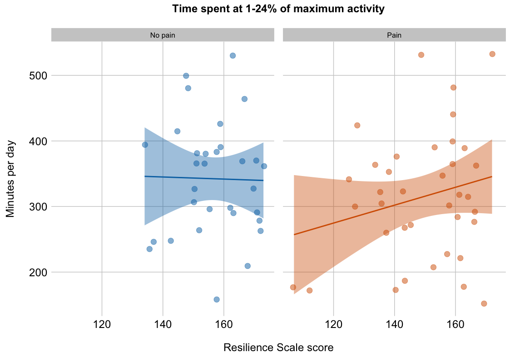<!-- -->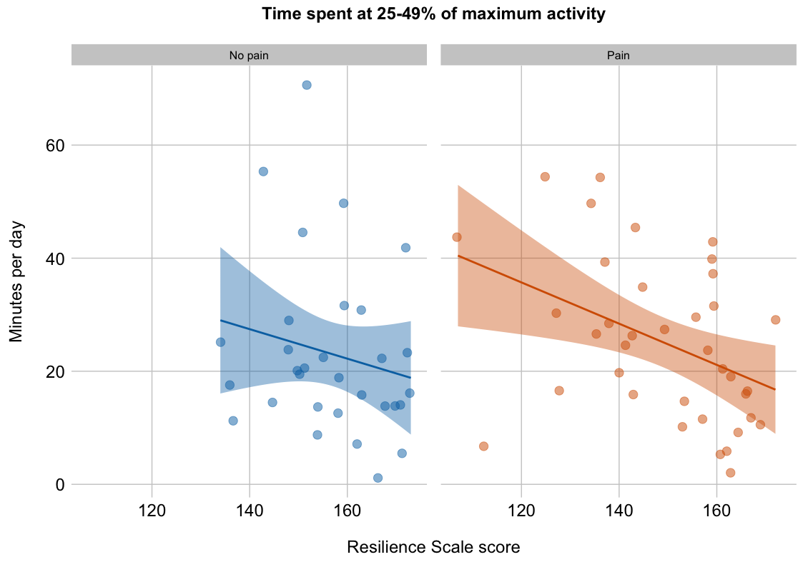<!-- -->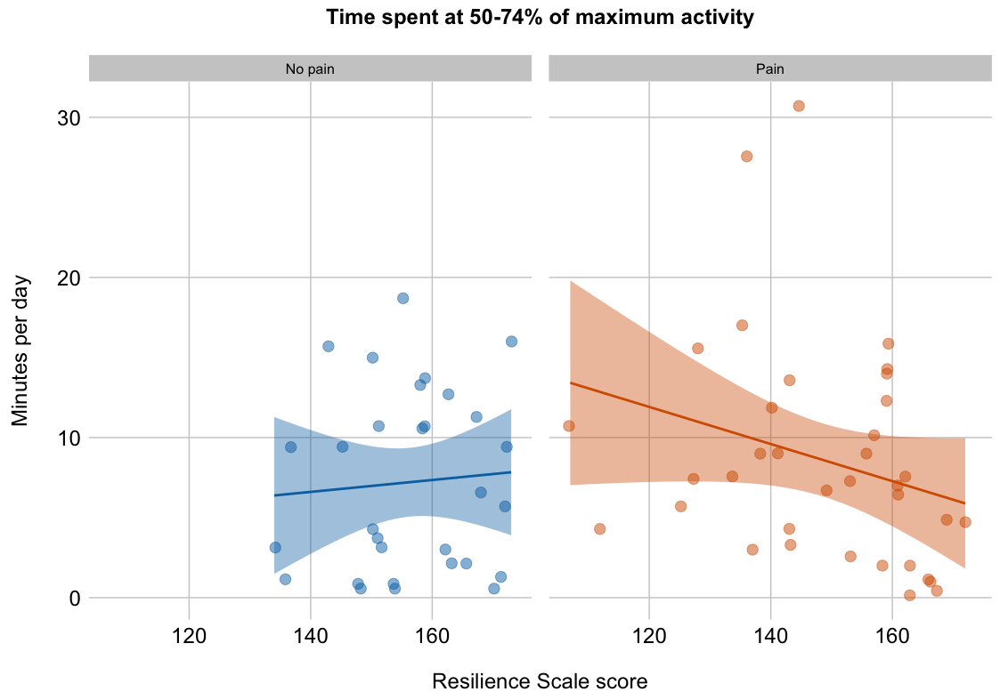<!-- -->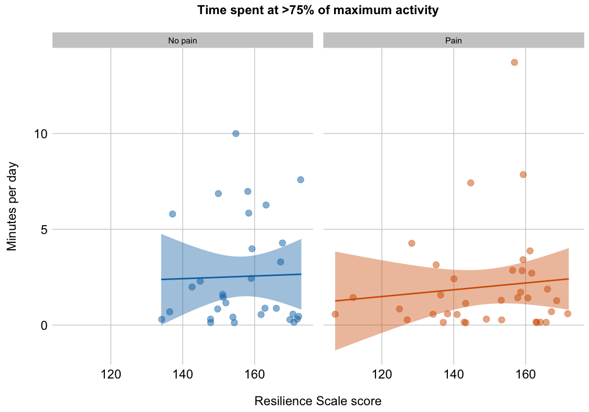<!-- -->

Brief Pain Inventory vs activity dot-plots
------------------------------------------

***37 participants with pain, only***

### Import data

``` r
data.bpi <- read_csv('./data/bpi.activity.csv')
```

### Quick look

    ## Source: local data frame [6 x 6]
    ## 
    ##      ID  Pain Median_activity BPI_interference Worst_pain Least_pain
    ##   (int) (chr)           (int)            (int)      (int)      (int)
    ## 1     9  Pain               9                6          7          2
    ## 2    21  Pain               5                4          3          0
    ## 3    23  Pain               6                8         10          4
    ## 4    40  Pain              12                7          9          6
    ## 5    67  Pain               6                3          8          0
    ## 6    69  Pain               4                4          4          2

    ## Source: local data frame [6 x 6]
    ## 
    ##      ID  Pain Median_activity BPI_interference Worst_pain Least_pain
    ##   (int) (chr)           (int)            (int)      (int)      (int)
    ## 1   161  Pain               7                4          7          5
    ## 2   163  Pain               4                6          8          4
    ## 3   164  Pain               3                8          9          3
    ## 4   165  Pain               8                6         10          5
    ## 5   167  Pain               6                4          8          2
    ## 6   168  Pain               6                5          8          3

### Clean

``` r
# Process data
data.bpi.1 <- data.bpi %>%
    mutate(pain = as.factor(Pain)) %>%
    select(-ID, -Pain) %>%
    rename(activity = Median_activity,
           bpi_interference = BPI_interference, 
           worst_pain = Worst_pain,
           least_pain = Least_pain) 
```

Create bpi plots
----------------

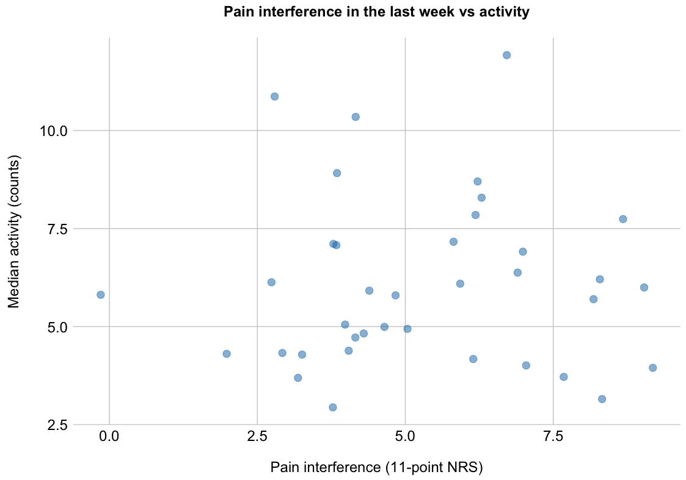<!-- -->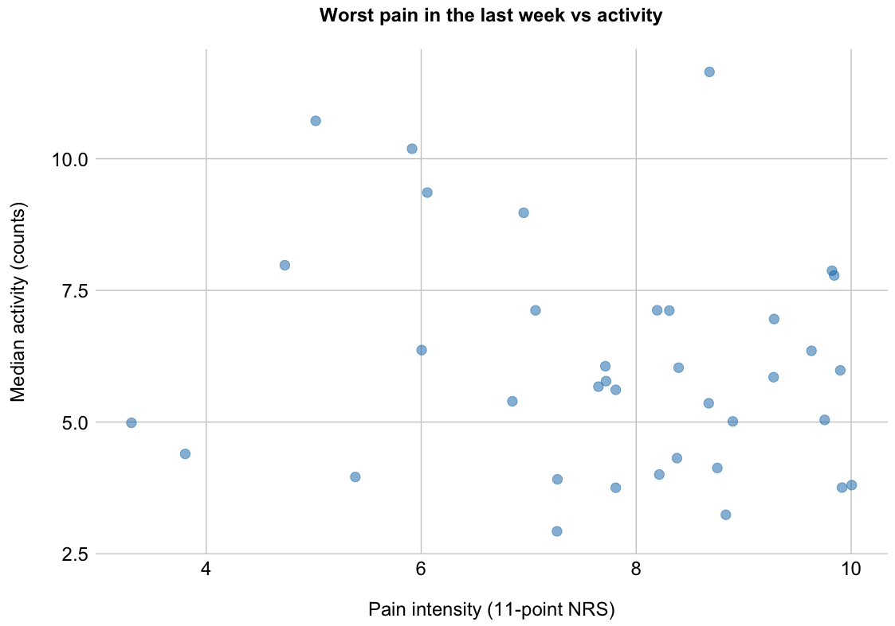<!-- -->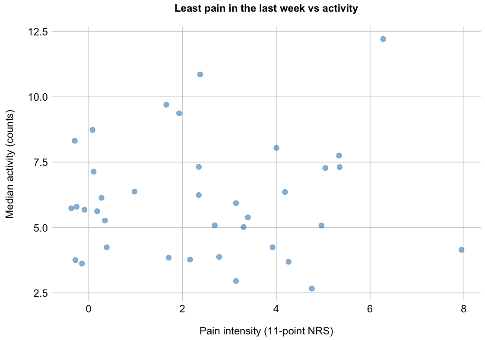<!-- -->

Activity vs predictor scatterplots
----------------------------------

***68 participants with (37) and without (31) pain***

### Import data

``` r
data.act <- read_csv('./data/activity.V.predictors.csv')
```

### Quick look

    ## Source: local data frame [6 x 14]
    ## 
    ##      ID median_activity    pain   age    sex          education   bmi
    ##   (int)           (dbl)   (chr) (int)  (chr)              (chr) (dbl)
    ## 1     9               9    Pain    34   Male  Completed grade 7  26.6
    ## 2    10               6 No pain    49 Female  Completed grade 7  28.3
    ## 3    11               7 No pain    32 Female  Completed grade 7  25.5
    ## 4    13               5 No pain    51   Male  Completed grade 7  23.2
    ## 5    21               5    Pain    34 Female Completed grade 12  30.1
    ## 6    23               6    Pain    47   Male Completed grade 12  16.0
    ## Variables not shown: employed (chr), rs_score (int), eq5d_vas (int), money
    ##   (chr), family (chr), food (chr), health (chr)

    ## Source: local data frame [6 x 14]
    ## 
    ##      ID median_activity    pain   age    sex          education   bmi
    ##   (int)           (dbl)   (chr) (int)  (chr)              (chr) (dbl)
    ## 1   165               8    Pain    46 Female Completed grade 12  36.4
    ## 2   167               6    Pain    42 Female Completed grade 12  34.6
    ## 3   168               6    Pain    45 Female  Completed grade 7  28.6
    ## 4   172               4 No pain    49 Female Completed grade 12  26.1
    ## 5   174               6 No pain    44 Female Completed grade 12  24.5
    ## 6   176               6 No pain    44   Male  Completed grade 7    NA
    ## Variables not shown: employed (chr), rs_score (int), eq5d_vas (int), money
    ##   (chr), family (chr), food (chr), health (chr)

### Clean

``` r
# Process data
data.act.1 <- data.act %>%
    mutate(ID = factor(ID),
           pain = factor(pain),
           sex = factor(sex),
           education = factor(education, 
                              levels = c('No education', 
                                         'Completed grade 7', 
                                         'Completed grade 12', 
                                         'Tertiary education'), 
                                         ordered = TRUE),
           employed = factor(employed)) %>%
    group_by(ID) %>%
    gather(key = worry_about, value = rating, money:health) %>%
    mutate(rating = factor(rating, 
                           levels = c('Not at all',
                                         'Rarely',
                                         'Sometimes', 
                                         'Often', 
                                         'Nearly all the time'), 
                                         ordered = TRUE)) %>%
    arrange(ID)
```

Create activity plots
---------------------

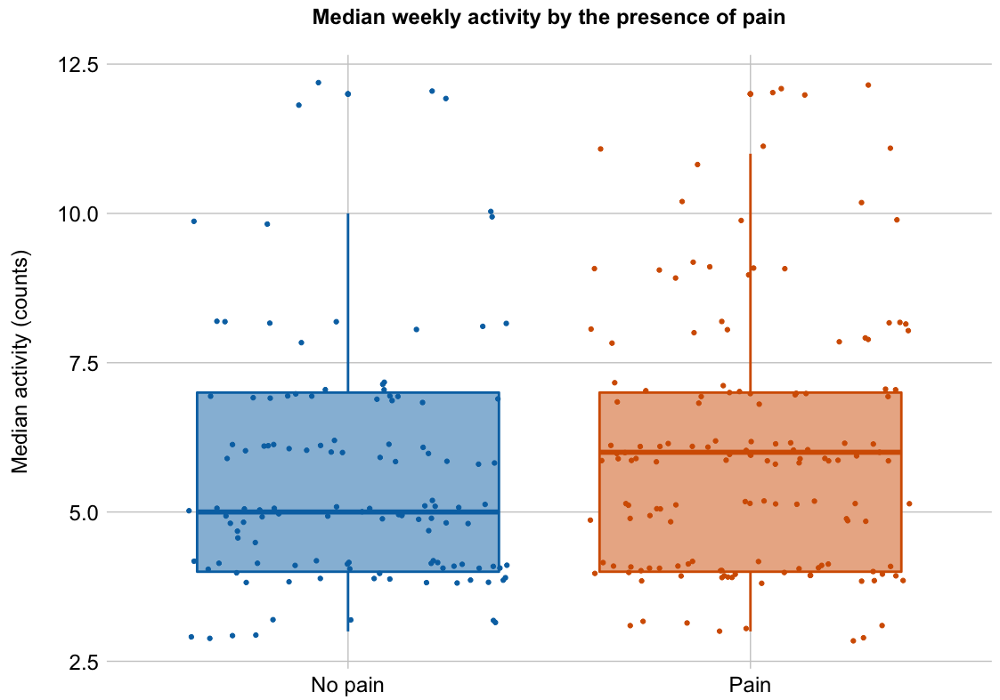<!-- -->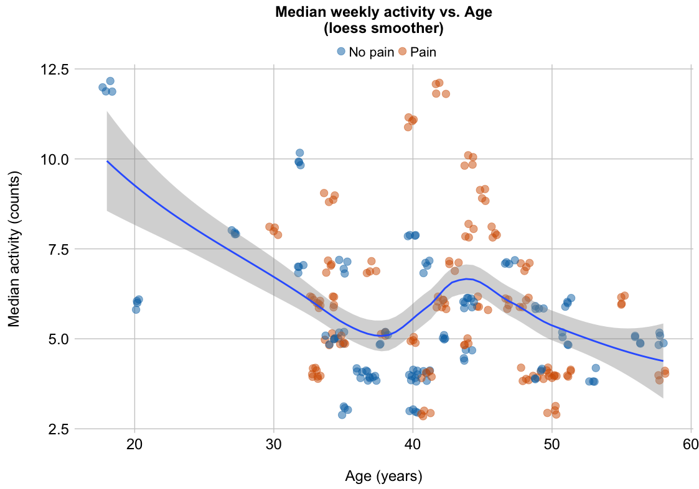<!-- -->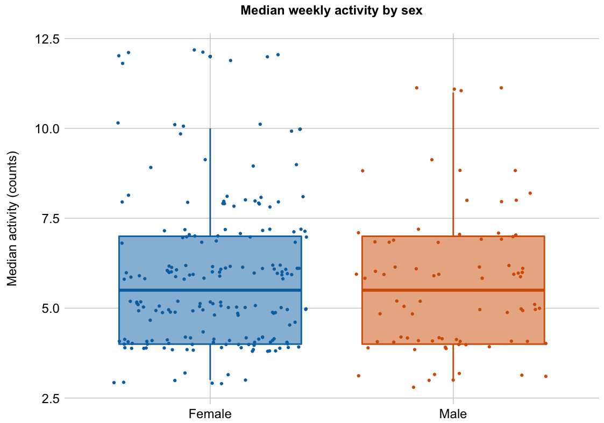<!-- -->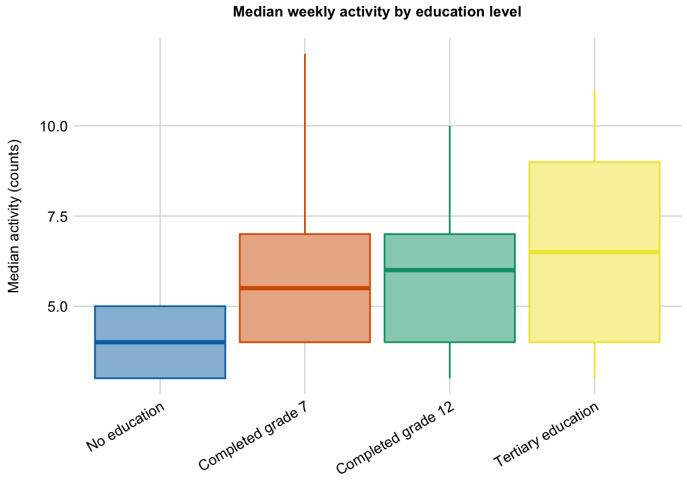<!-- -->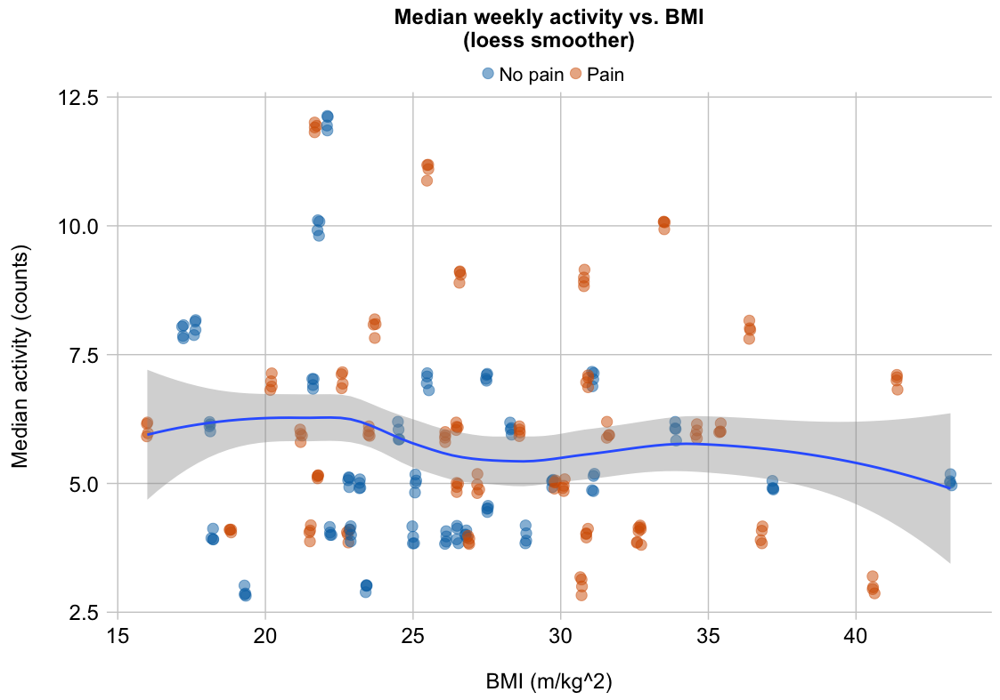<!-- -->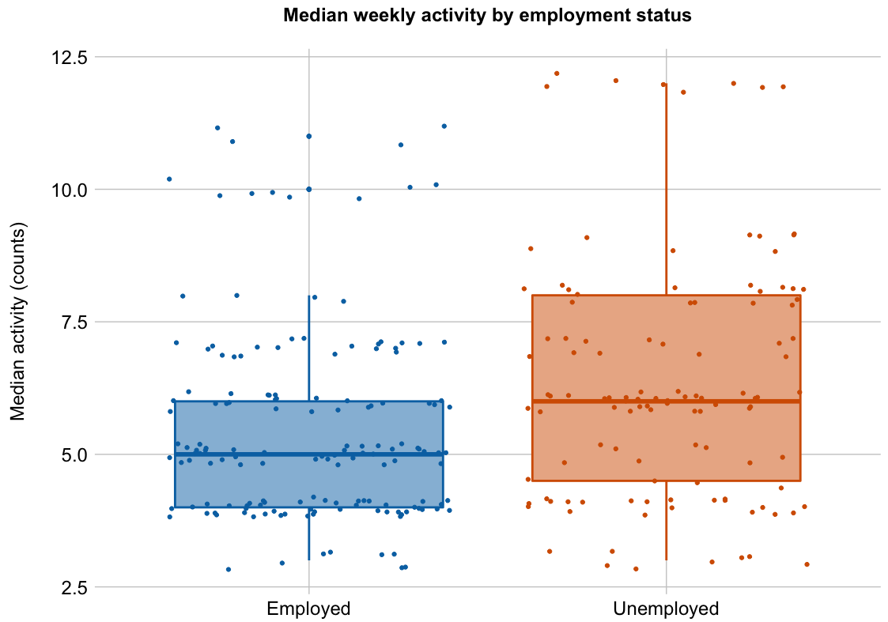<!-- -->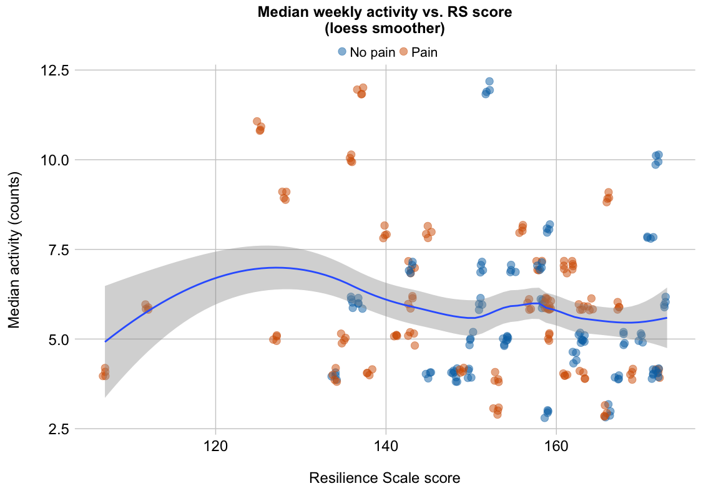<!-- -->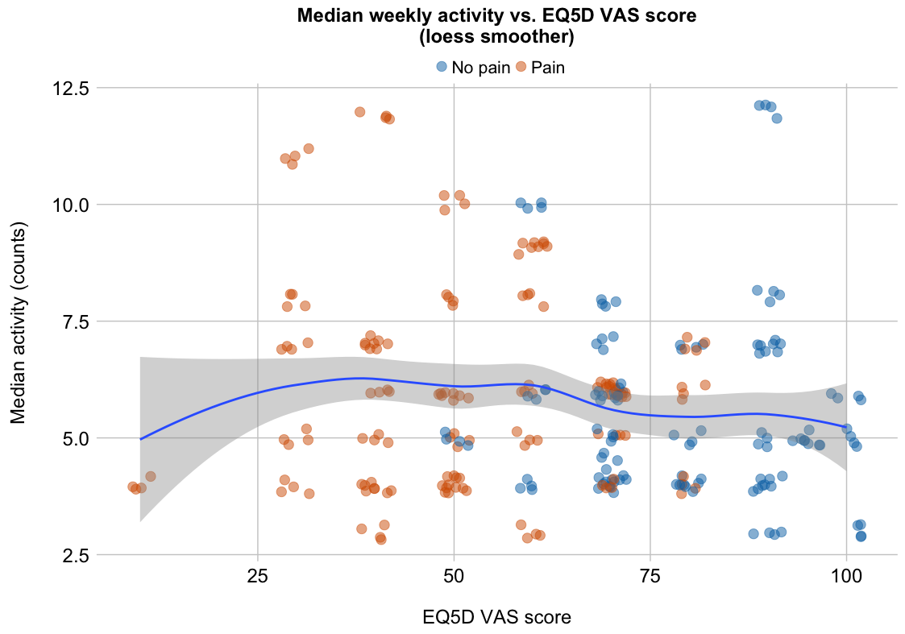<!-- -->

    ## Source: local data frame [272 x 12]
    ## Groups: ID [68]
    ## 
    ##        ID median_activity    pain   age    sex         education   bmi
    ##    (fctr)           (dbl)  (fctr) (int) (fctr)            (fctr) (dbl)
    ## 1       9               9    Pain    34   Male Completed grade 7  26.6
    ## 2       9               9    Pain    34   Male Completed grade 7  26.6
    ## 3       9               9    Pain    34   Male Completed grade 7  26.6
    ## 4       9               9    Pain    34   Male Completed grade 7  26.6
    ## 5      10               6 No pain    49 Female Completed grade 7  28.3
    ## 6      10               6 No pain    49 Female Completed grade 7  28.3
    ## 7      10               6 No pain    49 Female Completed grade 7  28.3
    ## 8      10               6 No pain    49 Female Completed grade 7  28.3
    ## 9      11               7 No pain    32 Female Completed grade 7  25.5
    ## 10     11               7 No pain    32 Female Completed grade 7  25.5
    ## ..    ...             ...     ...   ...    ...               ...   ...
    ## Variables not shown: employed (fctr), rs_score (int), eq5d_vas (int),
    ##   worries_a (fctr), rating (fctr)

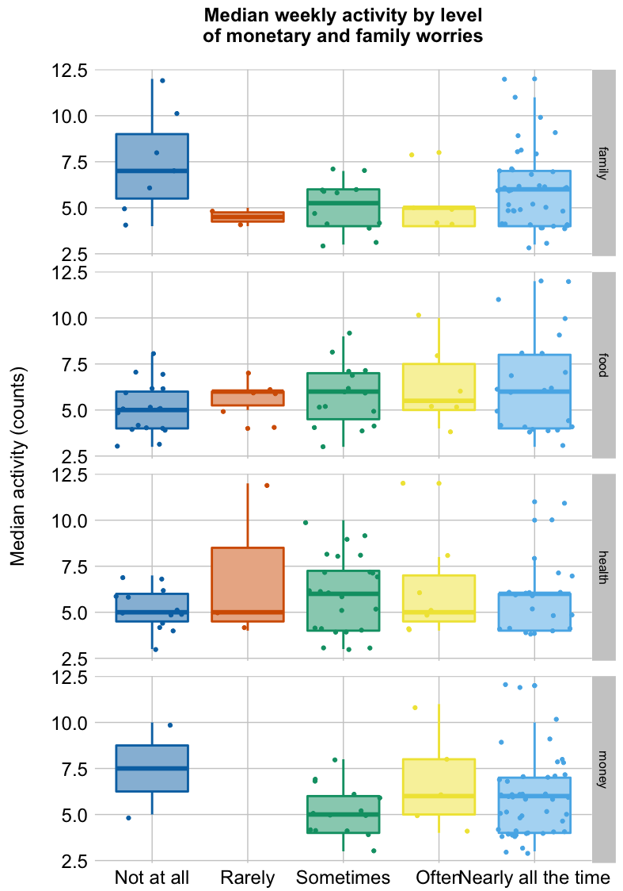<!-- -->

Session information
-------------------

    ## R version 3.2.3 (2015-12-10)
    ## Platform: x86_64-apple-darwin13.4.0 (64-bit)
    ## Running under: OS X 10.11.3 (El Capitan)
    ## 
    ## locale:
    ## [1] en_GB.UTF-8/en_GB.UTF-8/en_GB.UTF-8/C/en_GB.UTF-8/en_GB.UTF-8
    ## 
    ## attached base packages:
    ## [1] grid      stats     graphics  grDevices utils     datasets  methods  
    ## [8] base     
    ## 
    ## other attached packages:
    ## [1] cowplot_0.6.0 scales_0.4.0  ggplot2_2.1.0 tidyr_0.4.1   dplyr_0.4.3  
    ## [6] readr_0.2.2   knitr_1.12.3 
    ## 
    ## loaded via a namespace (and not attached):
    ##  [1] Rcpp_0.12.3      magrittr_1.5     munsell_0.4.3    colorspace_1.2-6
    ##  [5] R6_2.1.2         stringr_1.0.0    plyr_1.8.3       tools_3.2.3     
    ##  [9] parallel_3.2.3   gtable_0.2.0     DBI_0.3.1        htmltools_0.3   
    ## [13] yaml_2.1.13      lazyeval_0.1.10  assertthat_0.1   digest_0.6.9    
    ## [17] reshape2_1.4.1   formatR_1.2.1    evaluate_0.8     rmarkdown_0.9.5 
    ## [21] labeling_0.3     stringi_1.0-1
