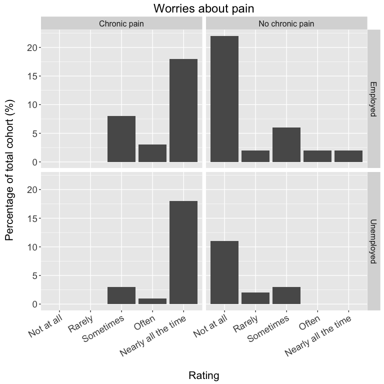
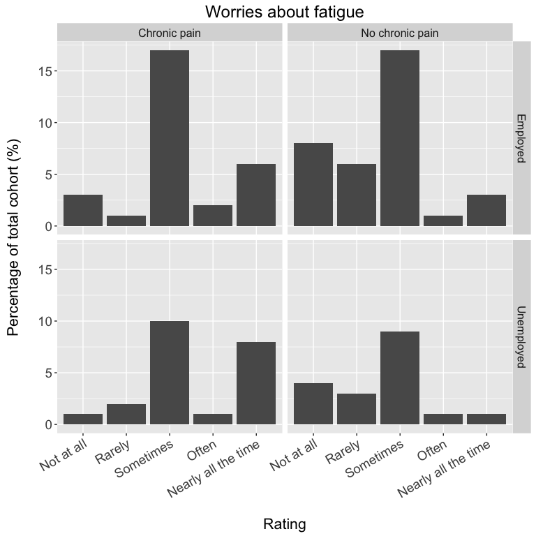
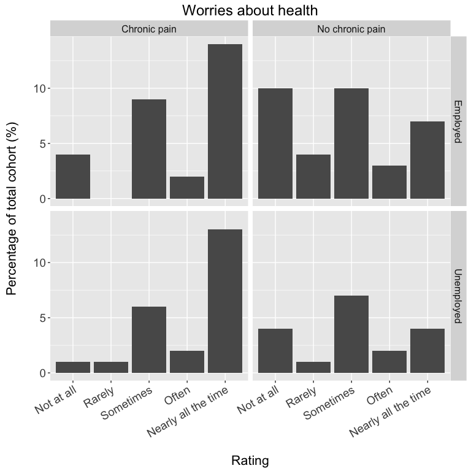
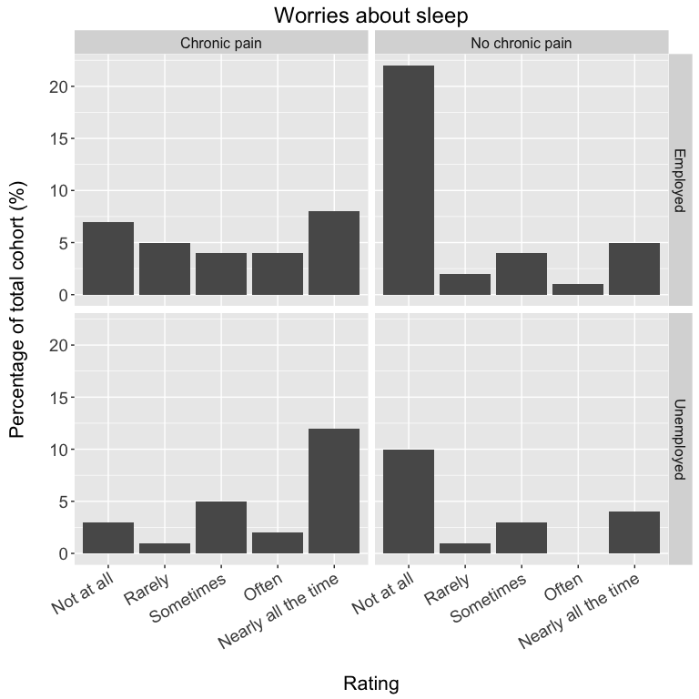
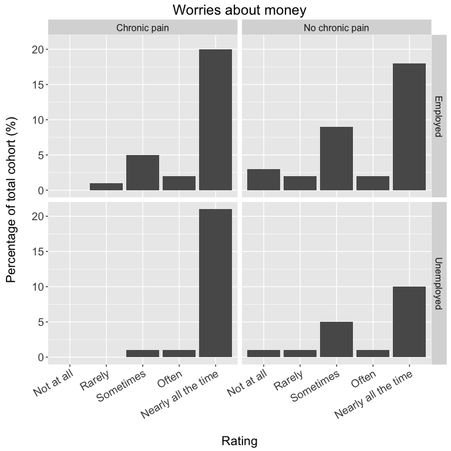
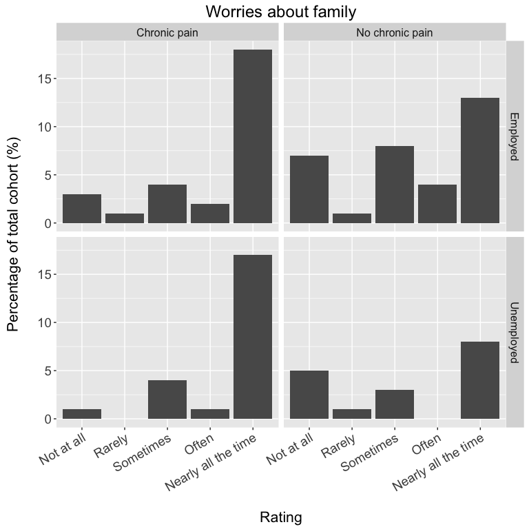
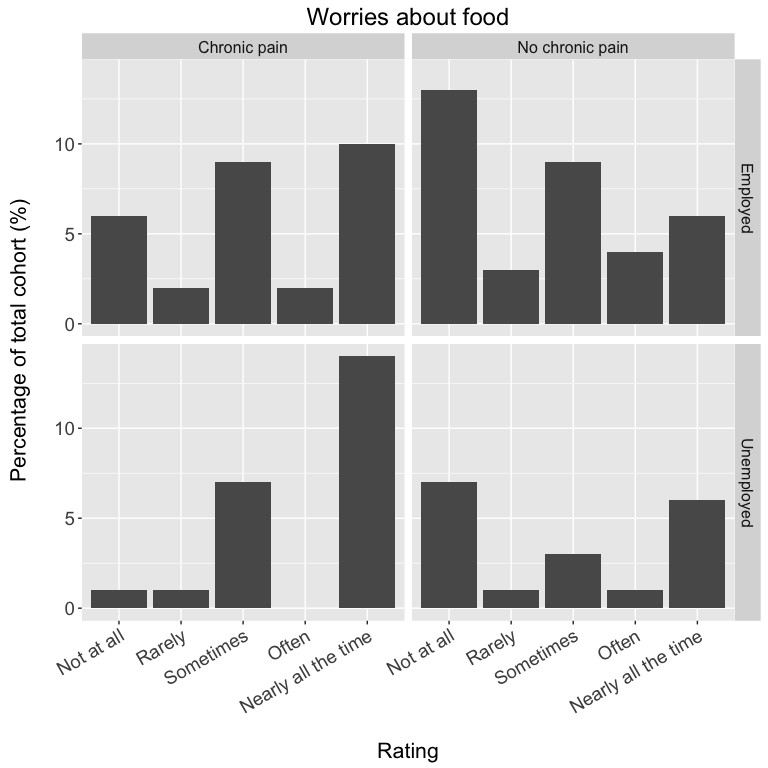

Worries data
============

Data summaries
--------------

*(raw data can be found in [worries.data.csv](./data/worries.data.csv), and the code sheet is provided [below](#code-sheet))*

Import data
-----------

``` r
data <- read_csv('./data/worries.data.csv')
```

Worries about pain
------------------

    ##                                       CHRONIC PAIN: No Yes
    ## RATING              EMPLOYMENT STATUS                     
    ## Not at all          employed                        44   0
    ##                     unemployed                      22   0
    ## Rarely              employed                         4   0
    ##                     unemployed                       4   0
    ## Sometimes           employed                        12  15
    ##                     unemployed                       6   6
    ## Often               employed                         3   5
    ##                     unemployed                       0   2
    ## Nearly all the time employed                         3  35
    ##                     unemployed                       0  36



Worries about fatigue
---------------------

    ##                                       CHRONIC PAIN: No Yes
    ## RATING              EMPLOYMENT STATUS                     
    ## Not at all          employed                        15   6
    ##                     unemployed                       8   2
    ## Rarely              employed                        11   1
    ##                     unemployed                       5   4
    ## Sometimes           employed                        33  33
    ##                     unemployed                      17  20
    ## Often               employed                         2   3
    ##                     unemployed                       1   2
    ## Nearly all the time employed                         5  12
    ##                     unemployed                       1  16



Worries about health
--------------------

    ##                                       CHRONIC PAIN: No Yes
    ## RATING              EMPLOYMENT STATUS                     
    ## Not at all          employed                        19   7
    ##                     unemployed                       7   2
    ## Rarely              employed                         8   0
    ##                     unemployed                       2   2
    ## Sometimes           employed                        20  17
    ##                     unemployed                      13  12
    ## Often               employed                         5   3
    ##                     unemployed                       3   3
    ## Nearly all the time employed                        14  28
    ##                     unemployed                       7  25



Worries about sleep
-------------------

    ##                                       CHRONIC PAIN: No Yes
    ## RATING              EMPLOYMENT STATUS                     
    ## Not at all          employed                        44  14
    ##                     unemployed                      19   6
    ## Rarely              employed                         3  10
    ##                     unemployed                       1   2
    ## Sometimes           employed                         8   8
    ##                     unemployed                       5   9
    ## Often               employed                         2   7
    ##                     unemployed                       0   4
    ## Nearly all the time employed                         9  16
    ##                     unemployed                       7  23



Worries about money
-------------------

    ##                                       CHRONIC PAIN: No Yes
    ## RATING              EMPLOYMENT STATUS                     
    ## Not at all          employed                         6   0
    ##                     unemployed                       1   0
    ## Rarely              employed                         3   1
    ##                     unemployed                       1   0
    ## Sometimes           employed                        18  10
    ##                     unemployed                       9   1
    ## Often               employed                         4   4
    ##                     unemployed                       2   1
    ## Nearly all the time employed                        35  40
    ##                     unemployed                      19  42



Worries about family
--------------------

    ##                                       CHRONIC PAIN: No Yes
    ## RATING              EMPLOYMENT STATUS                     
    ## Not at all          employed                        14   5
    ##                     unemployed                       9   2
    ## Rarely              employed                         2   2
    ##                     unemployed                       1   0
    ## Sometimes           employed                        16   8
    ##                     unemployed                       6   7
    ## Often               employed                         8   4
    ##                     unemployed                       0   1
    ## Nearly all the time employed                        26  36
    ##                     unemployed                      16  34



Worries about food
------------------

    ##                                       CHRONIC PAIN: No Yes
    ## RATING              EMPLOYMENT STATUS                     
    ## Not at all          employed                        26  12
    ##                     unemployed                      13   2
    ## Rarely              employed                         5   3
    ##                     unemployed                       1   2
    ## Sometimes           employed                        17  18
    ##                     unemployed                       6  13
    ## Often               employed                         7   3
    ##                     unemployed                       1   0
    ## Nearly all the time employed                        11  19
    ##                     unemployed                      11  27



------------------------------------------------------------------------

Code sheet
----------

**Note:** *'worries\_about\_pain'* and *'worries\_about\_sleep'* were deemed to have been assessed twice (firstly in the EQ5D subscales) and they were subcategories of *'worries\_about\_health'*, and therefore only the global concept *('worries\_about\_health')* was assessed in the manuscript.

-   **ID:** Participant id code

-   **chronic\_pain:** Had chronic pain (pain on most days for *g**e**q* 3 months) (Yes / No)

-   **actigraphy:** Took part in the actigraphy component of the study (Yes / No)

-   **worries\_about\_pain:** Do you worry about your pain? (rating scale: Not at all, Rarely, Sometimes, Often, Nearly all the time)

-   **worries\_about\_fatigue:** Do you worry about being fatigued? (rating scale: Not at all, Rarely, Sometimes, Often, Nearly all the time)

-   **worries\_about\_health:** Do you worry about your health? (rating scale: Not at all, Rarely, Sometimes, Often, Nearly all the time)

-   **worries\_about\_sleep:** Do you worry about your sleep? (rating scale: Not at all, Rarely, Sometimes, Often, Nearly all the time)

-   **worries\_about\_money:** Do you worry about money? (rating scale: Not at all, Rarely, Sometimes, Often, Nearly all the time)

-   **worries\_about\_family:** Do you worry about your pain? (rating scale: Not at all, Rarely, Sometimes, Often, Nearly all the time)

-   **worries\_about\_food:** Do you worry about your pain? (rating scale: Not at all, Rarely, Sometimes, Often, Nearly all the time)
